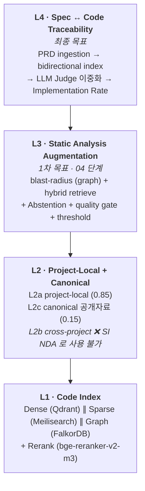
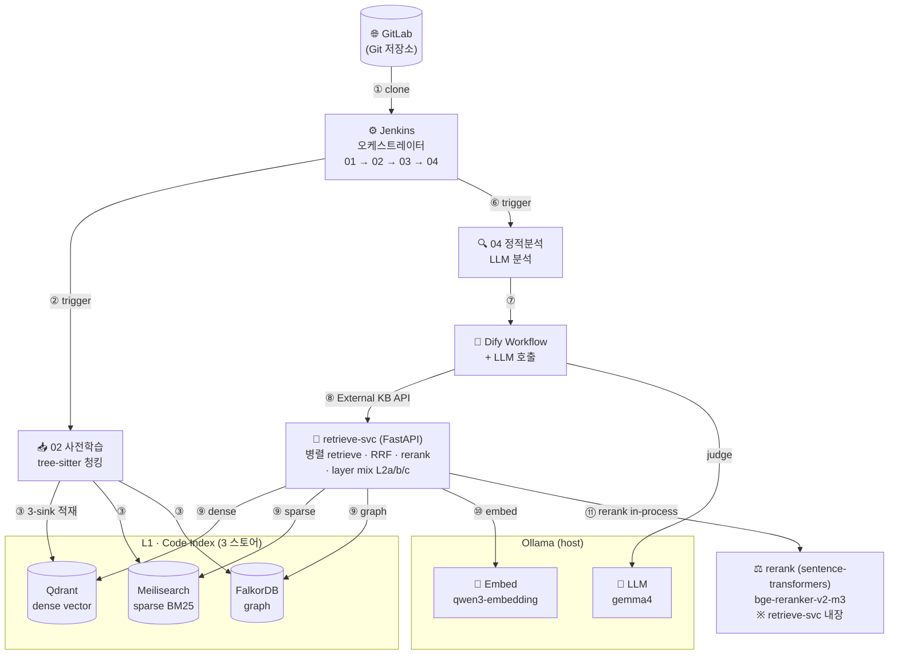
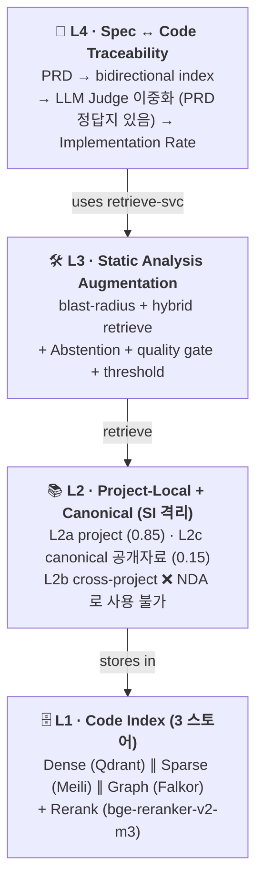
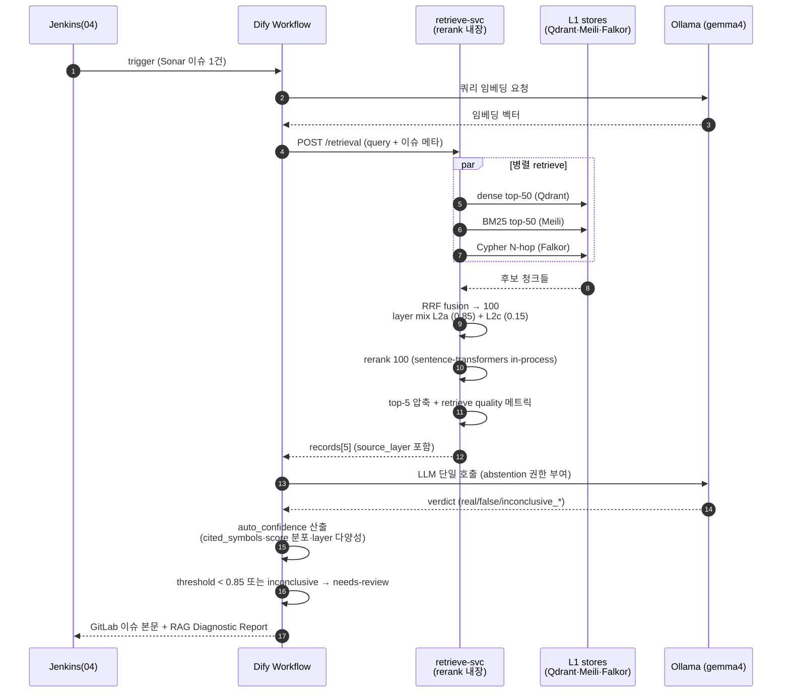
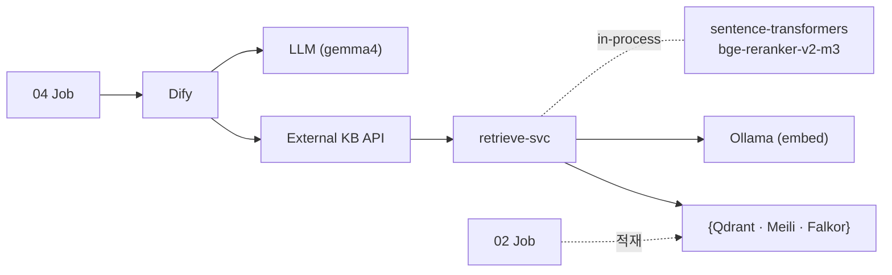

# 코드 RAG 강화 & Spec ↔ Code 추적성 — 계획·결정 로그

> **이 문서가 무엇인가**
> 02 코드 사전학습 파이프라인의 진화 방향에 대한 **살아있는 결정 로그** 다.
> 새 의사결정·실험·구현 변경은 모두 [§11 변경 이력](#11-변경-이력) 에 누적한다.
> 코드 변경은 git log 가 추적하므로, 여기에는 *왜* 와 *어떻게 결정했는가* 만 남긴다.
>
> **운영 레벨 런북** — 일자별 작업·테스트 계획·GO/NO-GO 게이트·리스크는
> [EXECUTION_PLAN.md](EXECUTION_PLAN.md) 참조 (본 문서가 *무엇* 이라면, EXECUTION 은 *언제·어떻게*).
>
> **PM·이해관계자 안내서** — 본 시스템이 PM 측면에 제공하는 핵심 가치 (요구사항 구현율 측정) 의
> *원리·근거·한계* 를 비개발자도 이해할 수 있도록 정리:
> [IMPLEMENTATION_RATE_PM_GUIDE.md](IMPLEMENTATION_RATE_PM_GUIDE.md).
>
> **세션 의사결정 통합** — 세션 전체의 결정·정정·산출물을 한 곳에 정리한 스냅샷:
> [SESSION_DECISIONS_2026-04-26.md](SESSION_DECISIONS_2026-04-26.md). 새로 합류한 동료에게
> 현재 상태를 한 페이지로 전달하기 위한 진입점.

> ## ⚠️ 절대 전제 — 폐쇄망 (airgap) SI 환경
>
> 본 시스템 (airgap-test-toolchain) 은 **폐쇄망 SI 환경의 테스트자동화 + 코드 기반 측정 솔루션**
> 이다. 다음을 *어떤 단계·어떤 컴포넌트·어떤 fallback 에서도* 깨지 않는다:
>
> 1. **외부 API 호출 0** — Codestral / Voyage / Claude API / Gemini API / OpenAI API / Jina API 등
>    *원격 endpoint 에 의존하는 모델·서비스는 1순위/대안/fallback 어디에도 채택하지 않는다*.
> 2. **모든 모델·binary·plugin 은 외부망 빌드 시점에 1 회 다운로드 → 이미지에 통합 → 폐쇄망에서는
>    `docker load` + `~/.ollama` 복원만**.
> 3. **런타임 인터넷 의존성 0** — `HF_HUB_OFFLINE=1` / `TRANSFORMERS_OFFLINE=1` / Ollama host
>    native serving / Dify External KB API → retrieve-svc 모두 internal endpoint.
> 4. **고객사 NDA 격리** — L2b cross-project 영구 제외, dataset 명명·purge 정책 의무 (§6.4).
>
> 이 전제를 위반하는 도구는 **§4 도구 매트릭스의 "사용 불가" 컬럼** 에 명시한다 — 일순간이라도
> 1순위에 둬선 안 된다.

## 한 페이지 요약 (TL;DR)

- **무엇을 하는가** — 02 가 만든 코드 청크를 **Dense·Sparse·Graph** 3 스토어에 동시 적재해두고,
  04 가 이슈를 분석할 때 자체 `retrieve-svc` 가 3축 병렬 retrieve → 리랭크 → top-5 를 Dify 의 LLM
  에 넘긴다.
- **왜** — 임베딩만으론 *"이 함수의 호출자 / 인터페이스 구현체 / 요구사항의 구현 위치"* 를 못 찾는다.
  구조 신호(graph) 가 별도 retrieve 경로로 필요하다.
- **무엇이 바뀌나** — 04 의 **layer-별 citation rate** 가 분리 측정되고, 이후 PRD ↔ 코드 매핑으로
  확장돼 **Implementation Rate** (요구사항 구현률) 까지 자동 측정된다.
- **운영 환경** — 폐쇄망 단일 머신. **1차 검증 = Intel 185H + RTX 4070 8GB / WSL2**, 이후 동일
  설치방법으로 M4 Pro 48GB 머신 이식. 외부 API 호출 0.
- **양 머신 동일 원칙 (2026-04-26 강화)** — 구성 (모델·인덱스·서비스) 과 설치방법 (스크립트·시퀀스·
  포트·볼륨) 모두 동일. 머신별 차이는 **arch (arm64/amd64) + 런타임 환경변수 1 개
  (`OLLAMA_NUM_PARALLEL`)** 만 허용. 그 외 어떤 분기도 두지 않는다.
- **모델 (2026-04 검증)** — LLM `gemma4:e4b` (Ollama 기본 quantization Q4. **on-disk ~9.6 GB**
  = 멀티모달 manifest 합계 (text decoder + vision + audio); **VRAM 실사용은 ~3~5 GB**
  — 텍스트 추론 시 text decoder weights + KV cache 만 로드), 임베딩 `qwen3-embedding:0.6b`,
  리랭커 `bge-reranker-v2-m3`. 26b 등 *큰 모델 옵션은 영구 비채택* (양 머신 동일 원칙).
- **언제 끝나나** — 1차 목표 (정적분석 보조 RAG) **3~4 주**, 최종 목표 (Spec↔Code 추적성) **약 3 개월**.

---

## 목차

1. [목표](#1-목표)
2. [현재 상태 진단](#2-현재-상태-진단-2026-04-26-기준)
3. [4-Layer 아키텍처 (제안)](#3-4-layer-아키텍처-제안)
4. [3.5 시스템 다이어그램 (다중 뷰)](#35-시스템-다이어그램-다중-뷰) — **시각으로 이해하기**
5. [도구 매트릭스](#4-도구-매트릭스)
6. [단계적 마이그레이션 로드맵](#5-단계적-마이그레이션-로드맵)
7. [폐쇄망 단일머신 상세 구성 (Dify 통합)](#6-폐쇄망-단일머신-상세-구성-dify-통합)
8. [미해결 / 결정 필요 항목](#7-미해결--결정-필요-항목)
9. [참고 문헌](#8-참고-문헌-research-근거)
10. [용어집](#9-용어집)
11. [구축 절차 (step-by-step)](#10-구축-절차-step-by-step) — **실제로 짓는 순서**
12. [변경 이력](#11-변경-이력)

> 운영 레벨 런북 — [EXECUTION_PLAN.md](EXECUTION_PLAN.md) (Day-0 점검 / 일자 캘린더 / 4-레이어 테스트 /
> GO·NO-GO 게이트 / 리스크 레지스터).

---

## 1. 목표

두 단계 목표가 있다 — **1차** 는 지금 굴러가는 정적분석을 더 똑똑하게, **최종** 은 PRD 가 실제로
얼마나 구현됐는지 자동 측정.

### 1차 목표 — 정적분석 보조 강화

> 코드를 RAG 화하여, 04 가 이슈 1건을 LLM 으로 분석할 때 *호출자·구현체·유사 패턴* 까지 컨텍스트로
> 받게 한다.

**측정 KPI**:

| KPI | 의미 |
|---|---|
| layer-별 citation rate | LLM 답변이 어느 KB layer (project / cross / canonical) 의 청크를 인용했는지 |
| false-positive 강등률 | LLM 이 "이건 오탐" 으로 강등시킨 이슈 비율 |
| partial_citation 강등률 | 인용은 있지만 50% 미만이라 confidence 강등된 비율 |

### 최종 목표 — 요구사항 구현률 자동 측정

> PRD / 기능 명세 / acceptance criteria 의 각 요구사항이 코드 어디에 구현돼 있는지 (또는 빠져 있는지)
> 자동 매핑하고, 빌드마다 **Implementation Rate** 를 갱신한다.

**측정 KPI**:

| KPI | 의미 |
|---|---|
| Implementation Rate | 전체 요구사항 중 `implemented / partial / not / n/a / needs-review` 분포 |
| 사람 검수 일치율 | 자동 판정과 사람의 ground truth 가 얼마나 맞아떨어지나 |

---

## 2. 현재 상태 진단 (2026-04-26 기준)

> **TL;DR** — 02 사전학습은 *2024 초기형 RAG* 에 머물러 있다. 5개 축에서 2026 SOTA 와 격차가 명확.

### 2.1 현재 구성 (`02 코드 사전학습.jenkinsPipeline`)

| 단계 | 동작 | 도구 |
|---|---|---|
| 청킹 | Git clone → 함수/메서드 단위 AST 청킹 | tree-sitter (`repo_context_builder.py`, 2,400+ lines) |
| 의미 보강 (옵션) | 청크 요약을 본문 앞에 prepend | `gemma4:e4b` enricher |
| 적재 | 단일 Dify Dataset (full 모드는 `--purge` 후 재업로드) | Dify Knowledge Base |
| 인덱싱 | 임베딩 + 벡터 색인 | bge-m3 (범용) → Qdrant |
| 리포트 | PM 친화 HTML (TL;DR / verdict / 8 카드) | publishHTML |

### 2.2 SOTA 와의 격차 5축

| 축 | 현재 | 2026 SOTA | 격차가 만드는 결과 |
|---|---|---|---|
| **임베딩** | 범용 `bge-m3` | 코드 특화 오픈 모델 (`qwen3-embedding`, Qodo-Embed) — *폐쇄망 호환만 채택*. Codestral Embed / Voyage / Gemini Embedding 은 API 의존 → 본 시스템에서 사용 불가 | 코드 retrieval 정확도 ↓ |
| **Retrieve 경로** | 단일 dense | Hybrid (BM25 + dense + rerank) | 심볼·고유식별자 정확 매칭 실패 |
| **구조 신호** | 청크 footer 텍스트 | Code Property Graph / Cypher 쿼리 | "호출자·구현체·writer" 관계 질의 불가 |
| **다중 프로젝트** | 없음 (purge 로 우회) | 다층 KB (project / cross / canonical) | "다른 서비스 패턴 인용" 불가 |
| **측정** | 단일 citation rate 75% | layer 별 인용 분리 | 어느 KB 가 실효적인지 모름 |

### 2.3 핵심 통찰

> **"의미상 비슷한 것"** 과 **"구조상 연결된 것"** 은 다르다.
>
> 임베딩만으론 *"이 함수의 호출자 / 이 인터페이스의 구현체 / 이 요구사항의 구현 위치"* 를 못 찾는다.
> 그래프 retrieve 경로가 별도로 필요한 이유다.

비유로 보면 — 도서관에서 *"비슷한 주제의 책"* 을 찾는 것 (임베딩) 과 *"이 책을 인용한 다른 책들"*
을 찾는 것 (그래프) 은 다른 기능이다. 정적분석 보조에는 *후자* 가 더 자주 필요하다 (이슈 함수의
영향 반경 파악).

---

## 3. 4-Layer 아키텍처 (제안)

> **TL;DR** — 4 층 구조로 쌓는다. 아래에서 위로 의존: L1 (저장소) → L2 (다층 KB) → L3 (정적분석
> 강화) → L4 (구현률 측정).
>
> *왜 4 층인가* — 한 층이 한 가지만 책임지게 하면, 위 층을 추가/제거할 때 아래 층은 흔들리지 않는다.



각 층은 *역할 / 핵심 결정 / 비유* 3종으로 정리한다.

### L1 · Code Index — 트리플 스토어

| | |
|---|---|
| **역할** | 02 가 만든 코드 청크를 **3가지 다른 시각** 으로 동시 저장 — 의미·키워드·관계. |
| **핵심 결정** | Dense (의미) · Sparse (키워드) · Graph (관계) 를 병렬 retrieve 후 cross-encoder 로 top-5 압축. |
| **비유** | 도서관의 *주제별 분류* (의미) + *제목 색인* (키워드) + *인용 네트워크* (관계). 셋 다 있어야 책을 빨리 찾는다. |

| 컴포넌트 | 도구 | 책임 |
|---|---|---|
| Dense vector | Qdrant (Dify 내장) + `qwen3-embedding` | "이 함수와 의미상 비슷한 함수" |
| Sparse BM25 | Meilisearch | "이 심볼명·고유 식별자가 등장하는 청크" |
| Graph | FalkorDB (Cypher) | "이 함수의 호출자·구현체·테스트" |
| Rerank | retrieve-svc 내장 sentence-transformers + `bge-reranker-v2-m3` | top-100 후보 중 진짜 관련 top-5 골라내기 |

### L2 · Project-Local KB + Canonical Reference — 2 층 (SI 제약)

> **SI 환경 제약 (2026-04-26 정정)** — 본 시스템은 SI 프로젝트 컨텍스트로, 고객사 코드/문서는
> **다른 고객의 분석에 retrieve 되어선 안 된다** (NDA/계약상 절대 제약). 따라서 `L2b cross-project`
> (사내 유사 도메인 레포) 는 **사용 불가**.
>
> L2 는 **L2a (현재 분석 대상 한 프로젝트) + L2c (고객사-무관 공개 자료)** 2 층으로 단순화한다.

| | |
|---|---|
| **역할** | 분석 대상 1 프로젝트의 코드 + 고객사-무관 공개 표준만 묶어 retrieve. |
| **핵심 결정** | dataset 을 customer/프로젝트별로 **완전 격리**. 빌드 종료 시 또는 빌드 시작 시 purge. |
| **비유** | 의사가 *환자 본인 차트* (L2a) + *공개 의학 교과서* (L2c) 만 본다. 다른 환자 차트 절대 금지. |

| Layer | 내용 | 가중치 | 격리 정책 |
|---|---|---|---|
| **L2a · project-local** | 분석 대상 프로젝트 (현재 빌드 1회 한정) | 0.85 | dataset per project, 다음 customer 분석 전 purge 의무 |
| ~~L2b · cross-project~~ | ~~사내 유사 도메인 레포~~ | — | **❌ 사용 불가 (SI NDA)** |
| **L2c · canonical** | 프레임워크 공식 docs · OWASP / CWE · PEP · design pattern 카탈로그 · 사내 코딩 표준 (고객사-무관) | 0.15 | 정적·공유 OK |

> **L2c 에서 절대 들어가면 안 되는 것**: 고객사 commit 이력 / 고객사 issue 트래커 / 고객사 PR 코멘트
> / 고객사 도메인 모델 / 고객사 fix commit. CodeCureAgent 가 fix commit 으로 96.8% plausible fix
> 를 만든 패턴은 매력적이지만, SI 환경에선 **그 commit 들의 출처가 customer-agnostic 인지 검증
> 가능한 경우만** 채택. (예: 오픈소스 프레임워크 GitHub issue 는 OK, 고객사 GitLab 은 NO.)

**기존 단일 dataset + 매 빌드 `--purge` 의 재해석**: *multi-tenant 부재의 우회로* 가 아니라 **SI
정책상 필수 격리 메커니즘** 이었다. 02 jenkinsfile 의 `--purge` 는 그대로 유지·강화.

**격차 보상**: L2b 부재로 *"다른 서비스 패턴 인용"* 이 불가능해진 만큼, L1 의 그래프 retrieve
(blast-radius) 와 L2c (공개 표준) 비중을 더 키워 컨텍스트 양을 보충해야 한다.

### L3 · Static Analysis Augmentation — 04 강화

| | |
|---|---|
| **역할** | Sonar 가 만든 이슈 1 건을 LLM 이 판정할 때, 그래프와 KB 에서 컨텍스트를 끌어옴. |
| **핵심 결정** | LLM 한 번 호출 + **자기 판정에 신뢰도 calibration** (이중 Judge 가 아님 — 데이터 한정 시 효과 작음). |
| **비유** | 의사가 진단할 때 *"이건 자신 있다 / 이건 자료 부족이라 모르겠다"* 를 스스로 표시하게 한다. 세컨드 오피니언 부르는 비용 대신 *abstention* (판정 거부) 권한을 줌. |

#### 처리 흐름

1. **Blast-radius 추출** — 이슈 함수 → 그래프에서 N-hop 호출자 + 도메인 객체 + 연관 테스트.
2. **Hybrid retrieve** — L2a (0.85) + L2c (0.15) 가중치로 mix. SI 격리로 cross-project 없음.
   `fail-soft` (일부 layer 비어도 통과).
3. **LLM 단일 호출 + abstention 권한 부여**
   - 프롬프트가 LLM 에게 4 가지 선택지를 명시: `real_issue / false_positive / inconclusive_low_context / inconclusive_ambiguous_rule`.
   - LLM 이 *컨텍스트 부족* 을 직접 인식하고 `inconclusive` 를 선택할 수 있게 함.
4. **Retrieve quality gate** — 자동 메트릭으로 신뢰도 보정:
   - cited symbols 수 (1 개 이하면 ↓)
   - retrieve top-5 의 score 분포 (1 위 score 가 임계 미만이면 ↓)
   - source_layer 다양성 (dense/sparse/graph 중 1 개만 hit 시 ↓)
   - 결과: `auto_confidence ∈ [0, 1]`
5. **Conservative threshold** — `auto_confidence < 0.85` 또는 LLM 자체가 `inconclusive_*` 반환 시
   **무조건 needs-review** 큐로. 통과한 케이스만 자동 마감.
6. **측정** — citation rate 를 L2a / L2c **layer 별로 분리**. 추가로 `inconclusive 비율` 을 KPI 로
   추가 (이 비율이 낮을수록 컨텍스트가 충분하다는 신호).

#### 왜 이중 Judge 를 빼는가 (정직)

| 시나리오 | 이중 Judge 효과 |
|---|---|
| 컨텍스트 풍부 + 명확한 케이스 | 거의 무의미 (둘 다 정답 합의). 시간만 2 배. |
| 컨텍스트 풍부 + 애매한 케이스 | 효과 큼. 합의/불일치가 진짜 신호. |
| **컨텍스트 빈약** (SI 환경 흔함) | **효과 제한적.** 둘 다 같은 빈약한 추측. False positive 위험 ↑. |
| 컨텍스트 거의 없음 | 무용. LLM 이 hallucinate 하면 사이좋게 같이 hallucinate. |

게다가 단일 머신 + `OLLAMA_MAX_LOADED_MODELS=1` 환경에서 다른 LLM 으로 이중화 시 model swap
발생 → 시간 2 배보다 더 걸림. **Abstention + quality gate + conservative threshold** 가 SI 환경
(데이터 한정 + 단일 머신) 에 더 적합.

> **여전히 이중 Judge 가 필요한 시점**: Phase 7 (Spec↔Code 추적성) 의 `Implementation Rate` 판정.
> 거기는 PRD 라는 "정답지" 가 있어 합의/불일치 신호가 강하므로 이중 Judge 가 가치 있음. L3 (이슈
> 판정) 에선 빼고, L4 (구현률) 에서만 사용 — §10 Phase 7 참조.

### L4 · Spec ↔ Code Traceability — 최종 목표

| | |
|---|---|
| **역할** | PRD 의 N 개 요구사항이 코드 어디에 구현돼 있는지 자동 매핑하고, 빌드마다 구현률 갱신. |
| **핵심 결정** | requirement 단위 청킹 + bidirectional 매핑 + LLM-as-Judge 3-state. |
| **비유** | 시험지 (PRD) 와 답안 (코드) 를 자동 채점. *맞음 / 부분점수 / 백지 / 채점불가* 4가지로 분류. |

**근거** — 자동차 도메인의 RAG 기반 trace link recovery 가 validation 99% / recovery 85.5% 를 보고했다.
Implementation Rate 메트릭이 2025~26 표준화 추세.

**파이프라인 6 단계**:

| # | 단계 | 산출물 |
|---|---|---|
| 1 | **Spec ingestion** — PRD 를 atomic requirement 단위로 청킹. ID (REQ-AUTH-003) / category / acceptance criteria. 가능 시 BDD Gherkin 변환. | `spec-kb-<project>` dataset |
| 2 | **Bidirectional index** — `req → code` (정방향) + `code → req` (역방향, 매핑 없는 게 정상) | 2개 인덱스 |
| 3 | **LLM-as-Judge (3-state)** — `{implemented \| partial \| not \| n/a}` + cited symbols + 신뢰도 | 판정 JSON |
| 4 | **Self-verification** — 다른 모델/프롬프트로 재판정. 일치 시 마감, 불일치는 `needs-review` | 판정 확정 또는 큐 |
| 5 | **Implementation Rate 리포트** — N/M/P/Q/R 분포 + 카테고리별 + 트레이스 매트릭스 | HTML 리포트 |
| 6 | **Drift 감지** — 다음 빌드에서 동일 PRD 재실행 → 변화 (회귀/신규) 알림 | diff 알림 |

**현실적 한계 — 정직하게**:

- *모호한 요구사항* (`"빠르게 동작해야 함"`) 은 자동 판정 불가. ingestion 단계에서 testable 여부
  분류 후, non-testable 은 별도 버킷으로 격리.
- 첫 측정치는 ground truth 와 **50~70% 일치도** 가 현실적 기대. 사람 검수 루프 필수.
- 임계값 튜닝 후 70%+ 도달이 목표.

---

## 3.5 시스템 다이어그램 (다중 뷰)

> **TL;DR** — 한 다이어그램으론 전체가 안 보인다. 4 가지 시각으로 본다 — *흐름 / 논리 / 배치 / 시간*.
> 각 다이어그램은 *답하는 질문* 이 다르다.

| 뷰 | 답하는 질문 | 어디 보면 됨 |
|---|---|---|
| 1. 데이터 흐름 | "뭐가 어디로 흘러가나" | §3.5.1 |
| 2. 논리 레이어 | "각 층 책임이 뭐고 누가 누구를 쓰나" | §3 + §3.5.2 |
| 3. 물리 배치 | "단일 머신 어디에 뭐가 뜨나" | §3.5.3 (요약) + §6.5 (정본) |
| 4. 런타임 시퀀스 | "이슈 1건 분석 시 시간 순서로 뭐가 일어나나" | §3.5.4 |

### 3.5.1 뷰 1 — 데이터 흐름

> 02 가 만든 청크가 3 스토어로 흘러가고, 04 가 그걸 hybrid 로 retrieve 해서 LLM 에 넘긴다.



**번호 흐름**: ① 사용자 트리거 → ② 02 시작 → ③ 청크 3-sink 적재 → (대기) → ⑥ 04 시작 → ⑦ Dify
호출 → ⑧ External KB API → ⑨ 병렬 retrieve → ⑩ 쿼리 임베딩 / ⑪ 리랭크 → LLM 판정 → GitLab 이슈 본문.

### 3.5.2 뷰 2 — 4-Layer 논리

> 위 층은 아래 층을 쓴다. 한 층씩 따로 만들 수 있도록 책임이 분리돼 있다.



### 3.5.3 뷰 3 — 물리 배치 (요약)

> 정본은 §6.5. 여기는 시각적 한 컷.

> **양 머신 동일 구성·동일 설치방법** (2026-04-27 확정 + 2026-04-26 재확인). 차이는 *런타임 환경변수
> 1 개* (`OLLAMA_NUM_PARALLEL`) + *호스트 native arch* (arm64/amd64) **뿐**. 설치 스크립트·시퀀스·
> 포트·볼륨·이미지 내용물 전부 동일.

#### 1순위 — Intel 185H · 64GB RAM · RTX 4070 8GB VRAM (WSL2, 1차 검증 머신)

```mermaid
flowchart TB
    subgraph VRAM["🎮 VRAM 8 GB"]
        OllamaG["Ollama (host WSL2, CUDA)<br/>━━━━━━━━━━━━━━━━━━━━━<br/>· gemma4:e4b VRAM ~3~5GB Q4 (분석+enricher 공유)<br/>· qwen3-embedding:0.6b CPU<br/>OLLAMA_NUM_PARALLEL=1 (직렬)"]
    end

    subgraph RAM["💾 시스템 RAM 64 GB (사용 ~22 GB)"]
        OS["Linux + Docker · 7 GB"]
        Existing2["ttc-allinone (단일 컨테이너, ~11 GB)<br/>Dify · PG · Redis · Qdrant · Jenkins<br/>+ Meili :7700 · Falkor :6380 · retrieve-svc :9100"]
        Embed2["qwen3-embedding:0.6b CPU · 0.6 GB"]
    end

    OllamaG -.host.docker.internal:11434.-> Existing2
```

> **여유**: VRAM ~3~5 GB · RAM 42 GB. 1차 검증 머신 — 모든 Phase 0~7 의 GO/NO-GO 판정은 본 환경 기준.

#### 2순위 — M4 Pro 48GB unified memory (macOS, Apple Silicon, 이식 머신)

```mermaid
flowchart TB
    subgraph Host["🍎 macOS host (Metal 가속)"]
        Ollama["Ollama (host native)<br/>━━━━━━━━━━━━━━━━━━━━━━<br/>· gemma4:e4b VRAM ~3~5GB Q4 (분석+enricher 공유)<br/>· qwen3-embedding:0.6b<br/>OLLAMA_NUM_PARALLEL=3 (동시 처리)"]
    end

    subgraph Docker["🐳 Docker Desktop"]
        Existing1["ttc-allinone (단일 컨테이너, ~11 GB)<br/>Dify · PG · Redis · Qdrant · Jenkins<br/>+ Meili · Falkor · retrieve-svc"]
    end

    Ollama -.host.docker.internal:11434.-> Existing1
```

> **합계**: macOS 8 + Docker VM 3 + 컨테이너 11 + Ollama 6 (KV cache 포함) ≈ **28 GB / 48 GB**.
> **여유 ~20 GB** — `OLLAMA_NUM_PARALLEL=3` 으로 throughput 향상 (RTX 대비 ~3배). 결과 일관성은 동일
> 모델·동일 quantization 으로 보장. *큰 모델 (26b 등) 옵션은 영구 비채택* — 양 머신 동일 원칙.

### 3.5.4 뷰 4 — 04 분석 1 사이클 시퀀스

> 이슈 1 건 분석에 ~15~25 초 (RTX e4b 기준). 절반 이상은 LLM 2 회 호출.



**시간 분포** (1차 검증 머신 RTX 4070 + gemma4:e4b 기준, abstention + quality gate 단일 호출):

| 구간 | 소요 |
|---|---|
| retrieve 단계 | ~1~2 초 |
| LLM 단일 판정 | ~5~10 초 |
| auto_confidence 산출 + threshold | ~0.1 초 |
| **합계** | **~7~12 초** (M4 Pro `OLLAMA_NUM_PARALLEL=3` 시 throughput 3 배) |

> 이중 Judge 였던 이전 설계 (15~25 초) 대비 약 2 배 빠름. 단일 머신 직렬 처리에서 시간 절감 효과 큼.

### 3.5.5 의존성 한 줄 요약



---

## 4. 도구 매트릭스

> **선정 기준 (절대)** — 폐쇄망 (airgap) 호환. 외부 API 호출이 발생하는 도구는 *어떤 컬럼에도*
> 1순위/대안으로 두지 않는다. 본 매트릭스의 모든 "1순위 / 대안" 은 *폐쇄망에서 100% 자급 가능*
> 하다. 참고용으로만 비교되는 외부 API 솔루션은 **"❌ 사용 불가 (airgap)"** 컬럼에 격리 표시.

| 컴포넌트 | 1순위 (폐쇄망 채택) | 대안 (폐쇄망 호환) | ❌ 사용 불가 (airgap) | 비고 |
|---|---|---|---|---|
| **코드 임베딩** | `qwen3-embedding:0.6b` (Ollama, Apache 2.0) | `Qodo-Embed-1-1.5B` (오픈 weight) · `bge-m3` (현행, 범용) | Codestral Embed · Voyage code-3 · Gemini Embedding · OpenAI text-embedding-3 | 모두 *원격 API 의존* → airgap 불가. §6.4 결정. |
| **리랭커** | `bge-reranker-v2-m3` (BAAI, Apache 2.0, 568M) | `bge-reranker-large` (오픈) · `Jina Reranker v2` *오픈 weight 만 사용 시* | Jina Reranker API (cloud) · Cohere Rerank API | sentence-transformers `CrossEncoder` 로 in-process 추론. weight 는 외부망 1 회 다운로드. |
| **Vector DB** | Qdrant (현행 유지, Apache 2.0) | — | Pinecone · Weaviate Cloud · Vertex Vector Search | Dify 내장. 폐쇄망 self-hosted. |
| **Graph DB** | FalkorDB (Redis module, Apache 2.0) | Neo4j Community (GPL) | Neo4j Aura · Memgraph Cloud · Amazon Neptune | FalkorDB 가 RAG 워크로드에 가벼움. 본 통합은 multi-stage 로 .so 만 추출. |
| **CPG 빌더** | tree-sitter (Phase 0~5 한정, MIT) + **Joern (Phase 8 정식 채택, Apache 2.0)** | — (단일 트랙) | — | Phase 0~7 은 tree-sitter 기반 경량 호출그래프로 진행. Phase 8 부터 Joern CPG (AST + CFG + DDG + PDG + Call Graph 통합) 정식 도입 — taint·reaching-def·data flow 질의 활성화. *야간 batch 분리 + 02 와 시간 격리* (§10 Phase 8). |
| **Sparse 인덱스** | Meilisearch (오픈 binary, MIT, v1.42) | OpenSearch BM25 (Apache 2.0, +2GB 메모리) · Elasticsearch (Elastic License v2) | Algolia · ElasticCloud · Pinecone Sparse | 한국어 토크나이저 한계 시 OpenSearch + nori. §6.11. |
| **LLM (분석 + Judge)** | `gemma4:e4b` (Ollama 라이브러리, 양 머신 동일) | `qwen2.5-coder:7b` 또는 다른 오픈 GGUF | Claude API · Gemini API · OpenAI API · Anthropic Bedrock | 26b 등 큰 모델은 양 머신 동일 원칙으로 비채택 (§6.4 4.3). |
| **Spec ingestion** | 자체 LLM 파이프라인 (host Ollama + 자체 prompt) | `unstructured-io/unstructured` *오픈 lib + offline 옵션 한정* (cloud SaaS 모드 금지) | LangExtract API · unstructured.io SaaS · LlamaParse API | 본 시스템은 자체 파이프라인 채택. PRD 포맷별 자체 파서 (Markdown / Confluence export). |
| **Trace LLM 패턴** | TraceLLM *패턴 차용* (자체 구현, host Ollama) | — | Claude self-verification · Gemini self-verification · OpenAI o1 self-reflection | 프레임워크 의존 X — *패턴만* 채택. self-verification 도 host Ollama (gemma4:e4b ×2 prompts) 로 구현. |
| **측정** | 자체 Implementation Rate + LLM-as-Judge (host Ollama) | — | DeepEval (cloud LLM 백엔드 시) · OpenAI Evals · Promptfoo cloud | DeepEval 은 *Ollama 백엔드 한정* 으로는 사용 가능하나, 본 시스템은 자체 구현이 단순하고 의존 0. |
| **Reranker 라이선스** | bge-reranker-v2-m3 (Apache 2.0, 상용 자유) | bge-reranker-large (Apache 2.0) | jina-reranker-v3 (CC-BY-NC 4.0, 비상용 한정) | jina-v3 는 *비상용* 만 가능 — 사내 R&D 한정 사용 가능 여부는 §7 결정 항목. |

> **검증 절차** — 본 매트릭스의 어떤 항목이라도 추가/변경 시 다음을 확인한다:
> 1. Weight·binary 가 외부망 1 회 다운로드로 *완전히 자급* 되는가?
> 2. 런타임에 인터넷 endpoint 호출이 필요한가? (있으면 부적격.)
> 3. 라이선스가 *상용 SI 환경 사용* 을 허용하는가?
> 4. 모델 manifest / weight 가 `~/.ollama` 또는 이미지 안 `/opt/` 경로에 사전 배치 가능한가?
>
> 위 4 가지 모두 ✅ 이어야 채택. 1 개라도 ❌ 이면 "사용 불가" 컬럼 격리.

---

## 5. 단계적 마이그레이션 로드맵

| 단계 | 기간 | 작업 | 검증 KPI |
|---|---|---|---|
| **P1.6 (단기 임베딩)** | 1~2 주 | bge-m3 → `qwen3-embedding:0.6b` 교체 (Ollama 정식, Apache 2.0). bge-reranker-v2-m3 도입 (CrossEncoder). *Codestral / Voyage 등 API 의존 모델은 영구 제외 — 폐쇄망 전제.* | 04 citation rate Δ, top-1 hit rate |
| **P2 (Hybrid 도입)** | 2~3 주 | BM25 sparse 경로 추가. RRF/weighted fusion. Dify 외부 hybrid layer. | 심볼 정확 매칭 hit rate |
| **P3 (Graph 도입)** | 3~4 주 | Neo4j 또는 FalkorDB 도입. tree-sitter 산출물을 정식 노드/엣지로 정규화. structural retrieve 경로 02→04 통합. | "callers of X" 류 쿼리 정확도 |
| **P3.5 (Cross-project)** | 1~2 주 | L2b 1개 reference repo 추가. 가중치 mix 실험. | layer별 citation rate 분리 |
| **P4 (Spec traceability)** | 4~6 주 | PRD ingestion + bidirectional index + LLM-as-Judge + Implementation Rate 리포트. ground truth 확보 후 정확도 측정. | 사람 검수 일치율 |

---

## 6. 폐쇄망 단일머신 상세 구성 (Dify 통합)

> **TL;DR** — 폐쇄망 + 단일 머신에서 §3 의 4-Layer 를 실제로 어떻게 띄울지 다룬다. 핵심은 **Dify 의
> retrieve 단계를 자체 `retrieve-svc` 로 교체** 하는 것 (Dify Workflow / LLM 은 그대로 활용).

### 대상 하드웨어 (양 머신 동일 구성·설치, 우선순위만 차등)

| 우선순위 | 머신 | 사양 | OS |
|---|---|---|---|
| **1차 (검증 기준)** | Intel Core Ultra 9 185H · 64GB RAM · RTX 4070 Laptop 8GB VRAM | WSL2 (Ubuntu) on Windows 11 |
| **2차 (이식)** | MacBook Pro M4 Pro · 48GB unified memory | macOS, Apple Silicon |

### 6.1 핵심 통합 전략 — Dify External Knowledge API

> Dify 의 retrieve 만 교체하고, 나머지 (Workflow · LLM · prompt 관리) 는 손대지 않는다.

**작동 원리**:

Dify 0.15+ 는 *External Knowledge API* 를 정식 지원한다. Workflow 의 Knowledge Retrieval 노드가
외부 HTTP 엔드포인트 (`POST /retrieval`) 를 호출해 검색 결과를 받아오는 구조다.

자체 서비스 **`retrieve-svc`** (FastAPI, 단일 컨테이너) 를 띄우고, 그 안에서 Qdrant + Meilisearch +
FalkorDB 를 hybrid 호출 → 리랭크 → 결과 반환을 처리한다. Dify 입장에서는 *외부 KB 1개* 로 보일
뿐이다.

**이 방식의 장점**:

| 장점 | 의미 |
|---|---|
| Dify 학습곡선 0 | Workflow / LLM / prompt 관리 그대로 |
| 점진적 적용 | retrieve-svc 죽으면 Dify 가 기존 내장 retrieve 로 fallback 가능 |
| 유연성 | 우리 마음대로 hybrid · graph · layer-mix 조합 |
| 02 흐름 유지 | Dify Dataset (= Qdrant) 적재 그대로 + Meili / Falkor sink 만 추가 |

### 6.2 시스템 다이어그램

```
                       ┌──────────────────────────────┐
                       │  Jenkins (기존)               │
                       │   02 사전학습 / 03 정적 / 04  │
                       └──────────────────────────────┘
                                  │
                ┌─────────────────┼──────────────────┐
                │ (02 적재)       │ (04 분석 호출)   │
                ▼                 ▼                  ▼
        ┌──────────────┐  ┌──────────────┐   ┌────────────────────┐
        │ Qdrant       │  │ Meilisearch  │   │ FalkorDB (graph)   │
        │ (Dify 내장)  │  │ (BM25 sparse)│   │ Cypher subset      │
        │ dense vector │  │ keyword      │   │ Function/Class/    │
        │              │  │ inverted idx │   │ CALLS/INHERITS/... │
        └──────────────┘  └──────────────┘   └────────────────────┘
                ▲                 ▲                  ▲
                └─────────┬───────┴────────┬─────────┘
                          │ (hybrid retrieve)
                          ▼
                ┌──────────────────────────────────────┐
                │  retrieve-svc (FastAPI, supervisor)  │
                │   POST /retrieval                    │  ← Dify External KB API
                │   ├ dense   (Qdrant)                 │
                │   ├ sparse  (Meilisearch)            │
                │   ├ graph   (FalkorDB)               │
                │   ├ RRF fusion → top-100             │
                │   ├ rerank (in-process)              │ ← sentence-transformers
                │   │   bge-reranker-v2-m3 → top-5     │   CrossEncoder
                │   └ layer mix L2a/L2c                │
                └──────────────────────────────────────┘
                          ▲
                          │ (같은 컨테이너 안 127.0.0.1:9100)
                ┌─────────────────┐
                │ Dify (기존)     │
                │ Workflow + LLM  │
                │ orchestration   │
                └─────────────────┘
                          │
                          ▼
                ┌─────────────────────────────────────┐
                │ Ollama (host) — LLM + 임베딩 통합   │
                │  • gemma4:e4b                       │
                │      (Ollama 기본 quantization,     │
                │       분석 + enricher 공유,          │
                │       양 머신 동일)                  │
                │  • qwen3-embedding:0.6b             │
                │                                     │
                │  ※ 26b 등 큰 모델은 영구 비채택      │
                │    — 양 머신 동일 원칙 준수          │
                └─────────────────────────────────────┘
```

핵심 포인트:

- **단일 이미지 안 supervisor program** 으로 통합 — Meili / Falkor / retrieve-svc 4 개 (TEI 는
  retrieve-svc 안 sentence-transformers 로 흡수).
- **Ollama 1개로 LLM + 임베딩 통합** 서빙. host native — WSL2 환경은 CUDA, macOS 는 Metal.
  설치 명령은 *공식 Linux installer 한 줄* (양 머신 동일 패턴 — §6.9 참조).
- **현행 자산 존중**: 02 enricher 의 `gemma4:e4b` 그대로. 04 분석도 동일 모델 양 머신 공유.

### 6.3 컴포넌트 명세

| 컴포넌트 | 통합 방식 | 평상시 RAM | 피크 RAM | 포트 | 역할 |
|---|---|---|---|---|---|
| Dify (api+worker+nginx) | 기존 all-in-one | 4 GB | 6 GB | 5001 | Workflow + LLM orch |
| Postgres | 기존 | 0.5 GB | 1 GB | 5432 | Dify metadata |
| Redis | 기존 | 0.3 GB | 0.5 GB | 6379 | Dify queue |
| Qdrant | 기존 | 1 GB | 2 GB | 6333 | Dense vectors (L1·dense) |
| Jenkins | 기존 | 1 GB | 2 GB | 28080 | Pipeline runner |
| **Meilisearch** | binary + supervisor | 0.4 GB | 1 GB | 7700 (내부) | BM25 sparse (L1·sparse) |
| **FalkorDB** | redis module + supervisor | 0.5 GB | 2 GB | 6380 (내부) | Code KG (L1·graph) |
| **retrieve-svc** | venv `/opt/retrieve-svc/.venv` + supervisor + 내장 sentence-transformers (bge-reranker-v2-m3) | 1.5 GB | 2 GB | 9100 (내부, SonarQube :9000 충돌 회피) | hybrid retrieve + Dify Ext KB API + rerank |
| (임베딩) | host Ollama (`qwen3-embedding:0.6b`) | 0.6 GB | — | 11434 (host) | host Ollama 와 공유 |
| Ollama | host native (Mac Metal) / container CUDA (RTX) | 1 GB | 1.5 GB | 11434 (host) | LLM + 임베딩 통합 serving |

**굵게** 표시한 3개가 신규 supervisor program (TEI 별도 program 제거). retrieve-svc 의 RAM 1.5 GB 는
sentence-transformers + bge-reranker-v2-m3 (568M) 모델 로드 포함.

### 6.4 모델 선정 — 양 머신 통일 (운영 표준화)

> **TL;DR (2026-04-27 정정 + 2026-04-26 재확인)** — RTX 4070 (1차 검증) 와 M4 Pro (2차 이식) 는
> **모든 컴포넌트를 동일하게** 가져간다. 디버그 패턴 공유, 측정 비교 가능, 인력 학습 곡선 1 회의
> 운영 가치가 *큰 모델 활용* 보다 우선. **양 머신 동일 원칙은 절대 깨지 않는다.**

**원칙**:

1. **양 머신 동일 구성** — LLM·임베딩·리랭커·컨테이너 모두 동일.
2. **양 머신 동일 설치방법** — 동일 스크립트 (`scripts/build-{wsl2,mac}.sh` 는 arch tag 외 동일),
   동일 supervisord 설정, 동일 entrypoint 시퀀스, 동일 포트·볼륨.
3. **2026-04 검증된 오픈 모델만** (API 의존 X).
4. **현행 자산 (`gemma4:e4b`) 100% 재활용** — 재반입·재검증 비용 0.
5. 머신별 차이는 **arch (arm64/amd64)** 와 **`OLLAMA_NUM_PARALLEL`** 1 개 환경변수에 한정.

#### 4.1 통합 모델 라인업

| 컴포넌트 | 모델 (양 머신 동일) | 메모리 | 비고 |
|---|---|---|---|
| **분석 LLM** (04 단계) | `gemma4:e4b` (Ollama 기본 quantization Q4) | on-disk ~9.6 GB (멀티모달 manifest 합) · **VRAM 실사용 ~3~5 GB** (text decoder Q4 ~2.5~3 GB + KV cache @ num_ctx=4096) | 현행 enricher 와 통합. RTX 4070 8GB VRAM 에 여유 있게 fit |
| **Enricher LLM** (02 단계) | `gemma4:e4b` | (분석과 공유) | `OLLAMA_MAX_LOADED_MODELS=1` 로 swap 방지 |
| **임베딩** | `qwen3-embedding:0.6b` | ~0.6 GB | Ollama 라이브러리 정식 (`ollama.com/library/qwen3-embedding:0.6b`). MTEB Code 우위 |
| **리랭커** | `bge-reranker-v2-m3` (Apache 2.0) | ~1.1 GB | `BAAI/bge-reranker-v2-m3` HF · retrieve-svc 안 sentence-transformers `CrossEncoder` 로 in-process |

> **모델 태그 주의 (2026-04-26 확인)** — Ollama 표준 태그는 `gemma4:e4b` (suffix 없음). 과거
> 본 문서가 사용했던 `gemma4:e4b-it-q4_K_M` 표기는 Ollama 라이브러리 공식 태그가 아니다 →
> 모든 문서·스크립트에서 plain `gemma4:e4b` 로 통일 (2026-04-26 정정).

#### 4.2 양 머신 차이는 단 둘 — arch + Throughput 환경변수

| 항목 | RTX 4070 8GB (1차) | M4 Pro 48GB (2차 이식) | 효과 |
|---|---|---|---|
| 호스트 arch | `linux/amd64` | `linux/arm64` | 빌드 컨텍스트 동일, native 빌드만 다름 |
| `OLLAMA_NUM_PARALLEL` | **1** | **3** | RTX 직렬, M4 Pro 동시 3 이슈 |
| `OLLAMA_MAX_LOADED_MODELS` | 1 | 1 | swap 방지 (양 머신 동일) |
| KV cache (`num_ctx`) | 4096 | 4096 | 동일 — 결과 일관성 위해 (8GB VRAM 에 맞춰 4096 으로 통일) |
| 그 외 (모델·이미지·supervisord·entrypoint·포트·볼륨·스크립트 흐름) | 전부 동일 | — | — |

> **결과는 같고 throughput 만 다르다**. 100 이슈 처리: RTX ~20 분, M4 Pro `parallel=3` 시 ~7 분.

#### 4.3 큰 모델 (gemma4:26b 등) 영구 비채택 — 양 머신 동일 원칙

옵션 비교 (2026-04-27 검토 + 2026-04-26 재확인):

| 옵션 | 양쪽 동일성 | RTX 4070 fit | M4 Pro 활용 | 채택? |
|---|---|---|---|---|
| **A. e4b 통일** | ✅ 완전 동일 | ✅ VRAM 실사용 ~3~5GB (8GB 여유 fit) | ✅ 메모리 여유 → parallel=3 | **✅ 채택** |
| B. 26b 통일 | ✅ 동일 | ❌ Q4 weights ~10GB > 8GB → CPU offload 5~10 tok/s | ✅ Metal 풀 활용 | ❌ RTX 사용 불가 |
| C. 중간 family 전환 (`qwen2.5-coder:7b`) | ✅ 동일 | ✅ fit | ⚠️ 여유 | ❌ gemma4 자산 폐기 비용 |
| ~~D. e4b 통일 + M4 Pro 야간 batch 만 26b~~ | ❌ 양쪽 분기 발생 | ✅ | ✅ batch 만 활용 | **❌ 영구 비채택 (2026-04-26 정정)** |

**채택**: A 단독. 인터랙티브 04 + Phase 7 batch 모두 양쪽 `gemma4:e4b`. 옵션 D 는 *양 머신 동일
원칙* 을 깨뜨리므로 폐기 (이전 문서가 "M4 Pro 야간 batch 만 26b" 옵션을 열어뒀던 것을 정정).

#### 4.4 검토 후 보류된 대안

- `qwen3-coder-next`: SWE-bench 58.7% (오픈 1위) 이지만 24GB GPU 권장 → 양 머신 무리.
- `gemma4:26b-a4b` (MoE 활성 4B): RTX VRAM 안 맞음.
- `gemma3:12b` (Q4 ~7.5GB): RTX 8GB 에 빡빡 (KV cache 포함 9~10GB).
- `qwen3-embedding:4b/8b`: MTEB Code 더 높지만 0.6B 도 충분 + 메모리 절감.
- `voyage-code-3` / `Codestral Embed`: API 의존, airgap 불가.

#### 4.5 한눈 요약

```text
양 머신 동일 (구성 + 설치방법):
  LLM      : gemma4:e4b              (분석 + enricher 공유, Ollama 기본 quantization)
  Embed    : qwen3-embedding:0.6b
  Rerank   : bge-reranker-v2-m3      (retrieve-svc 안 sentence-transformers in-process)
  Stores   : Qdrant + Meilisearch + FalkorDB
  Service  : retrieve-svc (FastAPI)
  Image    : ttc-allinone (단일 이미지, supervisor 15+ program)
  Scripts  : download-plugins.sh → build-{wsl2,mac}.sh → run-{wsl2,mac}.sh (arch 라벨 외 동일 흐름)
  Ports    : 28080 / 28081 / 29000 / 50002 / 28090 / 28022 (양 머신 동일)
  Volumes  : /data/{pg,redis,qdrant,jenkins,dify,meili,falkor,logs,knowledges,secrets} (동일)

차이 (단 2 가지):
  arch              : RTX 4070 = linux/amd64, M4 Pro = linux/arm64 (native 빌드 산물)
  OLLAMA_NUM_PARALLEL : RTX 4070 = 1 (직렬), M4 Pro = 3 (동시 처리, throughput 만)

영구 비채택:
  gemma4:26b 등 큰 모델 옵션 — 양 머신 동일 원칙 보존을 위해 (2026-04-26 정정).
```

### 6.5 하드웨어별 메모리 배분

> **순서 주의 (2026-04-26 정정)** — 1차 검증 머신 = WSL2/RTX 4070 → 정본. M4 Pro 는 동일 설치방법
> 으로 이식. 양 머신 메모리 배분 합계는 모두 안전 범위 안.

#### A. (1차 검증 머신) Intel 185H + RTX 4070 Laptop 8GB / 64GB RAM (WSL2)

**제약**: VRAM 8GB. gemma4:e4b 텍스트 추론 시 VRAM 실사용은 ~3~5GB (text decoder Q4 + KV cache)
로 8GB 에 여유 있게 fit. on-disk 9.6GB 는 멀티모달 manifest (vision + audio 인코더 포함) 합계로,
텍스트 전용 추론에서는 디스크에서만 차지하고 VRAM 에 올라가지 않는다. 임베딩·리랭커는 CPU.
시스템 RAM 64GB 풍족.

| 분류 | 항목 | 위치 | RAM | VRAM |
|---|---|---|---|---|
| OS | Windows + WSL2 + 백그라운드 | host | 6 GB | — |
| Docker | Docker Desktop (WSL2 backend) 또는 dockerd in WSL2 | host | 1 GB | — |
| 컨테이너 (ttc-allinone 단일 이미지) | Dify 스택 + PG + Redis + Qdrant + Jenkins + Meili + Falkor + retrieve-svc (rerank 내장) | 단일 컨테이너 | 11 GB | — |
| 임베딩 | `qwen3-embedding:0.6b` (CPU, host Ollama) | WSL2 host | 0.6 GB | 0 |
| LLM (분석 + enricher 공유) | `gemma4:e4b` text decoder Q4 + KV cache (CUDA) | WSL2 host (Ollama Linux installer) | 1 GB | ~3~5 GB |
| 버퍼 | | — | 45 GB | 3~5 GB |
| **합계** | | | **~19.6 / 64 GB · 44 GB 여유** | **~3~5 / 8 GB · 3~5 GB 여유** |

핵심 결정:
- **gemma4:e4b text decoder Q4 가 VRAM 에 여유 fit** — Ollama 기본 quantization 으로 weights ~2.5~3 GB,
  KV cache @ `num_ctx=4096` 추가 ~0.5~1.5 GB → 합 ~3~5 GB. on-disk 9.6 GB 는 멀티모달 manifest 합
  (vision + audio 인코더 등 포함) 이지만 텍스트 전용 추론 시 VRAM 미적재. `num_ctx=4096` 양 머신 통일.
- **26b 등 큰 모델은 영구 비채택** — gemma4:26b 의 weights 자체가 Q4 ~10 GB 로 8GB VRAM 초과 →
  CPU offload 발생 (5~10 tok/s). 분석·enricher 모두 `gemma4:e4b` 로 통합.
  작은 모델의 약점은 RAG 컨텍스트 강화 (hybrid + graph + rerank) 로 보완.
- **GPU 는 LLM 전담.** 임베딩 (0.6B) · 리랭커 (568M) 는 16-core CPU 로 충분 (각 100~200ms/요청).
- **Ollama 는 WSL2 host native 설치** — 공식 Linux installer (`curl -fsSL https://ollama.com/install.sh | sh`).
  Docker 안에 nvidia-docker 로 띄우는 옵션도 있으나 *양 머신 동일 패턴* (host native) 을 우선.
- **`.wslconfig` 메모리 한도 최소 56GB** (`[wsl2] memory=56GB`). 미설정 시 WSL2 기본 50% 한도로
  CPU 추론 OOM 가능.
- 64GB 시스템 RAM 의 여유가 커, 향후 캔퍼니컬 KB (L2c) 적재 확장에 유리.

#### B. (2차 이식 머신) M4 Pro 48GB unified memory (macOS)

**제약**: macOS 의 Docker Desktop 은 Linux VM 안에서 동작. **컨테이너에서 Apple Silicon GPU(Metal)
가속을 못 씀.** GPU 가속이 중요한 서비스는 host native 로 띄워야 한다 (Ollama).

| 분류 | 항목 | 위치 | RAM |
|---|---|---|---|
| OS | macOS + 백그라운드 | host | 8 GB |
| Docker | Docker Desktop VM | host | 3 GB |
| 컨테이너 (ttc-allinone 단일 이미지) | Dify api/worker/nginx + Postgres + Redis + Qdrant + Jenkins + Meili + Falkor + retrieve-svc (rerank 내장) | 단일 컨테이너 | 11 GB |
| 임베딩 | `qwen3-embedding:0.6b` (Ollama 통합) | host native | 0.6 GB |
| LLM (분석 + enricher 공유) | `gemma4:e4b` text decoder Q4 + KV cache (Metal) | **host native** | ~3~5 GB |
| 버퍼 (parallel=3 시 KV cache ×3) | KV cache 추가 | — | ~3 GB |
| 사용 합계 | | | **~28 / 48 GB** |
| **여유** | | | **~20 GB** |

핵심 결정 (RTX 머신과 동일 — 차이는 *throughput 환경변수* 만):

- **양 머신 동일 모델** — `gemma4:e4b` 한 개로 분석·enricher 통합. RTX 머신과 결과 일관성 보장.
- **Ollama 는 host native** 설치 — 공식 가이드 (`brew install ollama` 또는 ollama.com 의 `.dmg`).
  Docker 안에선 Metal 가속 불가. 컨테이너에서는 `host.docker.internal:11434` 로 접근 (RTX 머신과
  동일 호출 패턴).
- **임베딩은 Ollama 통합** — `qwen3-embedding:0.6b` 도 host Ollama 가 서빙 (RTX 와 동일).
- **리랭커는 retrieve-svc 안 sentence-transformers** — RTX 와 동일 (in-process).
- **`OLLAMA_NUM_PARALLEL=3`**: M4 Pro 의 여유 메모리를 활용해 동시 이슈 3 건 처리 (throughput ↑,
  결과는 RTX 와 동일).
- **`OLLAMA_MAX_LOADED_MODELS=1`**: e4b 한 개만 로드 (분석·enricher 공유라 swap 없음).

**피크 시나리오** (04 인터랙티브, parallel=3):

- 컨테이너 11 GB (rerank 내장) + LLM (text decoder + KV ×3) ~6 GB + embed 0.6 GB + OS/Docker 11 GB ≈ **~28 GB**
- 48 GB 안에 ~20 GB 여유 — 안전

### 6.6 02 단계 (사전학습) 변경 사항

기존: tree-sitter 청킹 → Dify Dataset 1개 (Qdrant 인덱스).
신규: tree-sitter 청킹 → **3개 sink 동시 적재**.

`pipeline-scripts/repo_context_builder.py` 에 sink writer 3개 추가:

1. **`write_dify_dataset(...)`** — 현재 `doc_processor.py upload` 흐름 그대로 (Qdrant L1·dense).
2. **`write_meilisearch(chunks, index_name)`** — 신규. 청크 본문 + 메타 (path/symbol/lang/kind/
   callers/callees/endpoint/decorators) 를 단일 batch put. 자동 stemming + lang-aware 토크나이징.
3. **`write_falkordb_graph(chunks, graph_name)`** — 신규. 노드/엣지 일괄 생성:
   - 노드: `Module(path)`, `Function(symbol, path, lang, is_test)`, `Class(symbol, path)`,
     `Endpoint(method, path)`, `Domain(name)`.
   - 엣지: `(:Function)-[:CALLS]->(:Function)`,
     `(:Function)-[:HANDLES]->(:Endpoint)`,
     `(:Class)-[:INHERITS_FROM]->(:Class)`,
     `(:Function)-[:DEFINED_IN]->(:Module)`,
     `(:Function)-[:TESTS]->(:Function)`.
   - 기존 `_kb_intelligence.json` 사이드카가 노드/엣지 생성의 *정답* 으로 사용된다.

세 sink 는 **독립 실패 가능** (graceful — Dify 적재만 성공해도 파이프라인 통과). FalkorDB/Meilisearch
적재 실패 시 retrieve-svc 가 해당 path 만 비활성화하고 dense-only 로 fallback (§6.10 참조).

### 6.7 04 단계 (정적분석) 변경 사항

기존: Dify Workflow → Knowledge Retrieval 노드 (Dify 내장 dense) → LLM.
신규: Dify Workflow → **Knowledge Retrieval 노드를 External Knowledge 로 전환** → retrieve-svc 호출.

retrieve-svc 의 `POST /retrieval` 처리:

1. Dify 가 표준 포맷으로 query 송신 (knowledge_id, query, retrieval_setting, metadata).
2. `metadata` 에 04 가 추가 주입한 *이슈 메타* (이슈 함수의 path/symbol, severity, rule_id) 활용.
3. 병렬 실행:
   - Qdrant (dense top-50)
   - Meilisearch (sparse top-50)
   - FalkorDB Cypher (이슈 함수의 N-hop callers/callees/test_for, top-30)
4. **RRF fusion** (Reciprocal Rank Fusion, k=60) → 후보 ~100개로 합침.
5. **rerank** (retrieve-svc 안 sentence-transformers CrossEncoder + bge-reranker-v2-m3) → top-5 압축.
6. Dify External KB API 응답 형식 (`records: [{content, score, title, metadata}]`) 으로 반환.
7. 각 record 의 `metadata.source_layer` 에 `dense | sparse | graph | l2b | l2c` 표시 →
   04 의 citation 측정 시 layer 분리 가능.

### 6.8 배포 — 단일 이미지 통합 (ttc-allinone)

> **운영 모델 (절대 보존, 2026-04-27 정정)** — 본 시스템은 **단일 이미지 `ttc-allinone:<tag>`** +
> supervisor 11+ 프로세스 + `docker save` → `.tar.gz` → 폐쇄망 `offline-load.sh` 패턴으로 운영된다.
> 신규 컴포넌트는 *별도 컨테이너* 가 아니라 **이 단일 이미지 안의 supervisor program 으로 통합**.

#### 6.8.1 신규 컴포넌트 통합 매트릭스 (2026-04-27 밤 검증 후 보강)

| 컴포넌트 | 통합 방식 | 위치 | autostart |
|---|---|---|---|
| **Meilisearch** | 단일 Rust binary 다운로드 후 `/usr/local/bin/meilisearch` | supervisor `[program:meilisearch]` (priority 100, storage 그룹) | `true` (storage) |
| **FalkorDB** | Redis module (`falkordb.so`) — *별도 redis 인스턴스* (포트 6380) | supervisor `[program:falkordb]` (priority 100) | `true` (storage) |
| **retrieve-svc** | 별도 venv (`/opt/retrieve-svc/.venv`) + uvicorn. **bge-reranker-v2-m3 를 sentence-transformers 로 내장** (TEI 별도 program 불필요) | supervisor `[program:retrieve-svc]` (priority 400) | `false` (entrypoint 명시 start) |
| **spec-svc** (Phase 7) | 별도 venv (`/opt/spec-svc/.venv`) + uvicorn | supervisor `[program:spec-svc]` (priority 500) | `false` |

> **변경 (2026-04-27 검증)**: TEI 별도 program 제거. TEI 는 prebuilt binary 미제공 + arm64 multi-arch
> 보장 X 라 통합 불안정. bge-reranker-v2-m3 (568M) 를 **retrieve-svc 안에서 sentence-transformers
> CrossEncoder 로 직접 import**. Python 추론 ~100~200 ms/배치 — 본 워크로드에 충분.
>
> 결과: 신규 supervisor program **5 → 4 개** (Meili / Falkor / retrieve-svc / [Phase 7] spec-svc).

**포트 정책**:
- 신규 7700 / 6380 / 9100 / 9101 모두 **컨테이너 내부 전용** (`127.0.0.1`). 9100/9101 은
  SonarQube 의 컨테이너 내부 :9000 점유 회피 + 향후 spec-svc (Phase 7) 까지 9100 대역 묶음.
- 호스트 노출은 기존 28080 (Jenkins) / 28081 (Dify gateway) / 29000 (SonarQube) 만.

#### 6.8.2 Dockerfile 추가 (발췌)

기존 [Dockerfile](../Dockerfile) 의 Stage 3 (런타임) 안에 추가:

```dockerfile
# ─────────────────────────────────────────────────────────────
# Meilisearch (단일 binary, BM25 sparse 인덱스) — 폐쇄망 패턴
# 외부망에서 사전 다운로드한 binary 를 COPY (curl-during-build X).
# 각 머신은 자기 native arch 의 binary 한 개만 보유 → glob 으로 단일 매칭.
# ─────────────────────────────────────────────────────────────
COPY offline-assets/meilisearch/meilisearch-linux-* /usr/local/bin/meilisearch
RUN chmod +x /usr/local/bin/meilisearch && /usr/local/bin/meilisearch --version

# ─────────────────────────────────────────────────────────────
# FalkorDB (Redis module) — multi-stage COPY (Debian 호환 binary 보장)
# GitHub releases 는 alpine/amazonlinux/arm64v8 binary 만 제공 → Debian 호환 X.
# 따라서 Dify/SonarQube 와 동일 패턴으로 공식 Docker 이미지에서 .so 추출.
# 별도 redis 인스턴스 (포트 6380) 로 운영하여 Dify redis(6379) 와 데이터 격리.
# ─────────────────────────────────────────────────────────────
# (Stage 1 영역에 추가 — dify-api-src 등과 같은 위치)
# FROM falkordb/falkordb:latest AS falkordb-src

# (Stage 3 런타임 안에서)
COPY --from=falkordb-src /var/lib/falkordb/bin/falkordb.so /usr/local/lib/falkordb.so
RUN apt-get update && apt-get install -y --no-install-recommends libgomp1 && \
    rm -rf /var/lib/apt/lists/*

# ─────────────────────────────────────────────────────────────
# bge-reranker-v2-m3 모델 weight (sentence-transformers 가 retrieve-svc 안에서 로드)
# 빌드 컨텍스트의 offline-assets/rerank-models/ 에 사전 다운로드된 weight 필요
# ─────────────────────────────────────────────────────────────
COPY offline-assets/rerank-models/bge-reranker-v2-m3 /opt/rerank-models/bge-reranker-v2-m3

# ─────────────────────────────────────────────────────────────
# retrieve-svc (FastAPI) — Dify External KB API 어댑터 + 내장 rerank
# 별도 venv 로 dify-api 와 의존성 격리 (dify-api 가 /opt/dify-api/api/.venv 쓰는 패턴 동일)
# ─────────────────────────────────────────────────────────────
COPY retrieve-svc /opt/retrieve-svc
RUN /usr/local/bin/python3 -m venv /opt/retrieve-svc/.venv && \
    /opt/retrieve-svc/.venv/bin/pip install --no-cache-dir \
        -r /opt/retrieve-svc/requirements.txt

# (Phase 7 활성화 시) spec-svc — Spec ↔ Code Traceability (별도 venv)
# COPY spec-svc /opt/spec-svc
# RUN /usr/local/bin/python3 -m venv /opt/spec-svc/.venv && \
#     /opt/spec-svc/.venv/bin/pip install --no-cache-dir \
#         -r /opt/spec-svc/requirements.txt
```

> **TEI 제거 사유** (2026-04-27 검증) — HuggingFace TEI 는 prebuilt standalone binary 를 제공하지
> 않는다 ([GitHub Issue #769](https://github.com/huggingface/text-embeddings-inference/issues/769)).
> Docker 이미지 또는 source build (Rust toolchain) 만 가능. arm64 multi-arch 정식 보장도 없음.
> bge-reranker-v2-m3 (568M) 는 sentence-transformers `CrossEncoder` 로 100~200 ms/배치 추론
> 가능 — retrieve-svc 안에 내장하는 게 깔끔하다.

#### 6.8.3 supervisord.conf 추가 (발췌)

기존 [supervisord.conf](../scripts/supervisord.conf) 의 priority 100 그룹과 priority 400 (nginx)
사이에 program 4 개 추가 (TEI 별도 program 없음 — retrieve-svc 안에 내장):

```ini
; ────────────────────────────────────────────────────────────
; Meilisearch (priority 100 — storage 그룹)
; ────────────────────────────────────────────────────────────
[program:meilisearch]
; MEILI_MASTER_KEY 는 entrypoint 가 /data/secrets/meili-key 에 generate-once
; (Dify SECRET_KEY 패턴과 동일) 후 export. supervisord 가 그 값을 받는다.
command=/usr/local/bin/meilisearch
    --db-path /data/meili
    --http-addr 127.0.0.1:7700
    --env production
    --no-analytics
    --master-key %(ENV_MEILI_MASTER_KEY)s
priority=100
autostart=true
autorestart=unexpected
stdout_logfile=/data/logs/meilisearch.log
stderr_logfile=/data/logs/meilisearch.err.log

; ────────────────────────────────────────────────────────────
; FalkorDB — 별도 redis 인스턴스 (6380) + falkordb.so 모듈
; ────────────────────────────────────────────────────────────
[program:falkordb]
command=/usr/bin/redis-server
    --dir /data/falkor
    --bind 127.0.0.1
    --port 6380
    --loadmodule /usr/local/lib/falkordb.so
    --appendonly yes
    --dbfilename falkor.rdb
user=redis
priority=100
autostart=true
autorestart=unexpected
stdout_logfile=/data/logs/falkordb.log
stderr_logfile=/data/logs/falkordb.err.log

; ────────────────────────────────────────────────────────────
; retrieve-svc (priority 400) — Dify External KB API 어댑터 + 내장 rerank
; bge-reranker-v2-m3 를 sentence-transformers 로 import (별도 program 없음)
; entrypoint 가 storage 헬스체크 후 명시 start (dify-api 패턴 동일)
; ────────────────────────────────────────────────────────────
[program:retrieve-svc]
command=/opt/retrieve-svc/.venv/bin/uvicorn app.main:app
    --host 127.0.0.1
    --port 9100
    --workers 2
directory=/opt/retrieve-svc
priority=400
autostart=false
autorestart=unexpected
startsecs=15
environment=
    PYTHONPATH="/opt/retrieve-svc",
    QDRANT_URL="http://127.0.0.1:6333",
    MEILI_URL="http://127.0.0.1:7700",
    MEILI_KEY="%(ENV_MEILI_MASTER_KEY)s",
    FALKOR_URL="redis://127.0.0.1:6380",
    OLLAMA_URL="http://host.docker.internal:11434",
    OLLAMA_EMBED_MODEL="qwen3-embedding:0.6b",
    RERANK_MODEL_PATH="/opt/rerank-models/bge-reranker-v2-m3",
    LAYER_WEIGHTS="l2a=0.85,l2c=0.15",
    RRF_K="60",
    TOP_N_PER_PATH="50",
    TOP_K_FINAL="5",
    HF_HUB_OFFLINE="1",
    TRANSFORMERS_OFFLINE="1"
stdout_logfile=/data/logs/retrieve-svc.log
stderr_logfile=/data/logs/retrieve-svc.err.log

; (Phase 7 활성화 시) spec-svc — priority 500
; [program:spec-svc]
; command=/opt/spec-svc/.venv/bin/uvicorn app.main:app --host 127.0.0.1 --port 9101
; directory=/opt/spec-svc
; autostart=false  ; entrypoint 명시 start
; environment=
;     PYTHONPATH="/opt/spec-svc",
;     RETRIEVE_SVC_URL="http://127.0.0.1:9100",
;     OLLAMA_URL="http://host.docker.internal:11434",
;     ...
```

#### 6.8.4 entrypoint.sh 보강

기존 [entrypoint.sh](../scripts/entrypoint.sh) 가 storage 헬스체크 후 dify-api 를 명시 start 하는
패턴에, **MEILI 키 generate-once + retrieve-svc 명시 start** 추가:

```bash
# entrypoint.sh 추가 부분 (발췌)

# (1) MEILI_MASTER_KEY generate-once (Dify SECRET_KEY 패턴 동일)
mkdir -p /data/secrets
if [ ! -s /data/secrets/meili-key ]; then
    head -c 32 /dev/urandom | base64 | tr -d '/+=\n' > /data/secrets/meili-key
fi
export MEILI_MASTER_KEY="$(cat /data/secrets/meili-key)"

# (2) Storage 헬스체크 (priority=100 autostart 됐음)
wait_for_url "http://127.0.0.1:7700/health" 60 "meilisearch"
redis-cli -p 6380 ping > /dev/null   # FalkorDB

# (3) retrieve-svc 시작 (sentence-transformers 모델 로드 ~10~20 초)
supervisorctl -c /etc/supervisor/supervisord.conf start retrieve-svc
wait_for_url "http://127.0.0.1:9100/health" 60 "retrieve-svc"

# (4) 이후 dify-plugin-daemon → dify-api 기존 시퀀스 진행

# (Phase 7 활성화 시) spec-svc 시작
# supervisorctl start spec-svc
# wait_for_url "http://127.0.0.1:9101/health" 30 "spec-svc"
```

#### 6.8.5 데이터 디렉터리 (볼륨)

기존 `/data` 볼륨에 신규 디렉터리만 추가:

```text
/data/
├── pg/                  (기존)
├── redis/               (기존)
├── qdrant/              (기존)
├── jenkins/, dify/      (기존)
├── logs/                (기존, supervisor 로그 + 신규 5 개 추가)
├── meili/               ← 신규 (Meilisearch DB)
├── falkor/              ← 신규 (FalkorDB AOF/RDB)
└── knowledges/          (기존)
```

**bge-reranker-v2-m3 weight (`/opt/rerank-models/`) 는 이미지에 포함** → 컨테이너 재시작 후에도
그대로. retrieve-svc 가 sentence-transformers 로 직접 import. 별도 볼륨 불필요.

**MEILI_MASTER_KEY 는 `/data/secrets/meili-key`** 에 entrypoint 가 generate-once. 첫 빌드 후 첫
부팅에서 자동 생성, 이후 빌드는 그대로 재사용. 운영 중 변경 시 파일 삭제 → 재기동.

#### 6.8.6 빌드 → tar → 반입 흐름 (변경 없음)

```text
[외부망]
  scripts/download-plugins.sh           ← Jenkins / Dify plugin (기존)
  scripts/offline-prefetch.sh (보강)     ← bge-reranker-v2-m3 weight 다운로드 (Meili/Falkor binary 는 Dockerfile RUN curl 이 받음)
  scripts/build-{mac,wsl2}.sh            ← 단일 이미지 빌드
  docker save ttc-allinone:<tag> | gzip > ttc-allinone.tar.gz
        ↓ 사내 보안 절차로 반입
[폐쇄망]
  scripts/offline-load.sh                ← docker load
  scripts/run-{mac,wsl2}.sh              ← 단일 컨테이너 기동
        ↓
  ttc-allinone 컨테이너 1 개 — 15 프로세스 (기존 11 + 신규 4) 가 supervisor 로 운영
```

추가 컨테이너 0. 추가 docker-compose 서비스 0.

### 6.9 외부망 빌드 + 폐쇄망 반입 절차

> **운영 모델** — *모든 binary·모델·코드는 이미지 빌드 시점에 통합* 된다. 폐쇄망에서는 `docker load`
> + 컨테이너 기동만. 별도 마운트·다운로드 0.

#### 6.9.1 외부망 PC — 빌드 컨텍스트 준비

```bash
cd code-AI-quality-allinone/

# (1) Jenkins / Dify plugin (기존)
bash scripts/download-plugins.sh

# (2) 신규 — bge-reranker-v2-m3 weight 사전 다운로드 (retrieve-svc 안 sentence-transformers 가 로드)
mkdir -p offline-assets/rerank-models
huggingface-cli download BAAI/bge-reranker-v2-m3 \
  --local-dir offline-assets/rerank-models/bge-reranker-v2-m3

# (3) Ollama 모델 — host 측. 빌드 컨텍스트와 무관, 별도 반입. 양 머신 동일 모델.
ollama pull gemma4:e4b
ollama pull qwen3-embedding:0.6b
# 26b 등 큰 모델은 영구 비채택 — 양 머신 동일 원칙 (§6.4 결정).

# (4) Ollama 모델 export (호스트로 반입할 디렉터리)
mkdir -p offline-assets/ollama-models
cp -r ~/.ollama/models/{blobs,manifests} offline-assets/ollama-models/
```

> Meilisearch / FalkorDB 의 *binary* 는 Dockerfile 의 `RUN curl` 이 빌드 시점에 받음. 인터넷 접근
> 가능한 외부망 PC 에서 빌드. 폐쇄망에선 *완성된 이미지* 만 사용. bge-reranker-v2-m3 모델 weight 는
> P0.2 에서 다운로드한 디렉터리를 Dockerfile 이 `COPY`.

#### 6.9.2 외부망 PC — 이미지 빌드 (양 머신 동일 흐름, arch 라벨만 다름)

```bash
# (1차 검증 머신, WSL2/amd64)
bash scripts/build-wsl2.sh       # 결과: ttc-allinone:wsl2-dev (linux/amd64)
docker save ttc-allinone:wsl2-dev | gzip > offline-assets/amd64/ttc-allinone.tar.gz

# (2차 이식 머신, macOS/arm64) — 동일 절차, 스크립트 이름만 다름
bash scripts/build-mac.sh        # 결과: ttc-allinone:mac-dev (linux/arm64)
docker save ttc-allinone:mac-dev | gzip > offline-assets/arm64/ttc-allinone.tar.gz
```

> **두 빌드 스크립트는 arch tag 와 image tag 외 동일** ([build-wsl2.sh](../scripts/build-wsl2.sh) /
> [build-mac.sh](../scripts/build-mac.sh) 비교). 사용 Dockerfile / requirements / pipeline-scripts /
> jenkins-init 모두 단일 소스.

이미지 크기 예상: 7~9 GB → **8.5~10.5 GB** (bge-reranker weight 1.1GB + Meili/Falkor binary +
sentence-transformers + retrieve-svc venv 추가). TEI 별도 binary 제거로 ~150MB 절감.

#### 6.9.3 사내 반입

| 산출물 | 크기 | 반입 방법 |
|---|---|---|
| `ttc-allinone-{arch}.tar.gz` | ~9~11 GB | USB / 사내 파일 서버 |
| `gitlab-ce-{arch}.tar.gz` | ~5 GB (기존) | 동일 |
| `dify-sandbox-{arch}.tar.gz` | ~1 GB (기존) | 동일 |
| `ollama-models/` | ~6~10 GB | 동일 (host 측 적용) |

#### 6.9.4 폐쇄망 머신 — 적용 (양 머신 동일 시퀀스, arch 만 다름)

```bash
cd code-AI-quality-allinone/

# (1) 이미지 로드 (양 머신 동일 스크립트, --arch 인자만 다름)
# 1차 검증 머신 (WSL2):
bash scripts/offline-load.sh --arch amd64
# 2차 이식 머신 (M4 Pro):  bash scripts/offline-load.sh --arch arm64

# (2) Ollama 모델 적용 (host 측, 양 머신 동일)
mkdir -p ~/.ollama
cp -r offline-assets/ollama-models/* ~/.ollama/models/
ollama list   # gemma4:e4b, qwen3-embedding:0.6b 확인

# (3) Ollama 환경변수 (양 머신 공통 1 + 차이 1)
export OLLAMA_MAX_LOADED_MODELS=1   # 공통
# 1차 (RTX 4070) :  export OLLAMA_NUM_PARALLEL=1
# 2차 (M4 Pro)   :  export OLLAMA_NUM_PARALLEL=3

# (4) 컨테이너 기동 (양 머신 동일 흐름, 스크립트 이름만 다름)
# 1차 (WSL2):
bash scripts/run-wsl2.sh
# 2차 (M4 Pro):    bash scripts/run-mac.sh
```

#### 6.9.5 Ollama 호스트 설치 — 양 머신 모두 *공식 가이드 그대로*

| 머신 | 공식 설치 명령 | 검증 |
|---|---|---|
| **1차 (WSL2 Ubuntu)** | `curl -fsSL https://ollama.com/install.sh \| sh` ([Ollama Linux](https://ollama.com/download/linux)) | `ollama --version`, `nvidia-smi` 가 RTX 4070 인식 |
| **2차 (M4 Pro)** | `brew install ollama` 또는 [ollama.com 공식 .dmg](https://ollama.com/download/mac) | `ollama --version` |

> **공통점**: 양쪽 다 *호스트 native* 로 띄움 (Docker 컨테이너 안에 두지 않음). 컨테이너 → 호스트
> 호출은 `host.docker.internal:11434` 로 통일 (양 머신 동일 — compose `extra_hosts` 가 WSL2 에서
> `host-gateway` 매핑을 자동 추가).

#### 6.9.6 검증 (양 머신 동일 명령)

```bash
# LLM 호출 (호스트 Ollama 직접)
curl http://localhost:11434/api/generate -d '{
  "model": "gemma4:e4b",
  "prompt": "Explain Python decorators in 3 sentences."
}'

# 임베딩 호출
curl http://localhost:11434/api/embeddings -d '{
  "model": "qwen3-embedding:0.6b",
  "prompt": "def authenticate(user, password):"
}'

# 리랭커는 retrieve-svc 안에 in-process 라 별도 endpoint 없음. retrieve-svc /retrieval 호출 시
# 자동으로 rerank 가 적용된다. 단독 검증은 retrieve-svc 의 디버그 endpoint /rerank-debug 로
# (config.DEBUG=true 시만 노출).

# retrieve-svc 검증 (컨테이너 안)
docker exec ttc-allinone curl -X POST http://127.0.0.1:9100/retrieval \
  -H "Content-Type: application/json" \
  -d '{"knowledge_id":"code-kb-test","query":"login","retrieval_setting":{"top_k":3}}'
```

> 양 머신에서 **3 개 응답이 동일 스키마** 여야 함. 결과 값 자체는 양자화 ε 수준 차이만.

### 6.10 폴백·축소 시나리오 (degradation)

부하·메모리 압박·서비스 장애 시 retrieve-svc 의 환경변수 토글로 단계적 축소:

| 레벨 | 조치 | 효과 |
|---|---|---|
| L1 | `LAYER_WEIGHTS=l2a=1.0` (canonical off) | L2c 무시. 초기 단계 기본값. ※ L2b 는 SI 격리로 *항상* off. (`supervisorctl restart retrieve-svc`) |
| L2 | `DISABLE_GRAPH=1` retrieve-svc env + `supervisorctl stop falkordb` | 구조 신호 손실. dense+sparse 만. |
| L3 | `DISABLE_RERANK=1` retrieve-svc env (in-process rerank skip) | RRF top-K 직접 사용. 정밀도 ↓. |
| L4 | LLM 모델 다운그레이드 (host Ollama Modelfile 교체) | e4b → 더 작은 모델. 추론 속도 ↑, 품질 ↓. |
| L5 | `DISABLE_SPARSE=1` retrieve-svc env + `supervisorctl stop meilisearch` | dense only. 현재 구조와 동급. |
| L6 | `supervisorctl stop retrieve-svc` → Dify Workflow 가 기존 내장 retrieve 로 fallback | "최후의 보루". 청크 인덱싱은 Dify Dataset 에 그대로 있음. |

각 레벨은 *독립적 ON/OFF*. 즉 L3 만 끄고 L2 는 살릴 수 있음.

### 6.11 운영 한계 — 정직한 평가

- **02 ↔ 04 동시 구동 영구 차단 (2026-04-26 결정)**: host Ollama 는 *단일 LLM bus* —
  `OLLAMA_MAX_LOADED_MODELS=1` 가정 하에 02 (enricher) 와 04 (분석 LLM) 가 동시 호출되면 모델 swap /
  KV cache 경합 / OOM 위험 발생. **두 파이프라인은 어떤 경우에도 시간이 겹쳐선 안 된다.**
  - **차단 메커니즘**: Lockable Resources 플러그인 (`lockable-resources:latest` in `.plugins.txt`).
    02·04 jenkinsfile 의 `options` 블록에 `disableConcurrentBuilds()` + `lock(resource: 'ttc-llm-bus')`
    을 명시. 양쪽 모두 동일 lock resource 를 잡으므로 OS 가 mutex 처럼 직렬화한다.
  - **lock 적용 범위**: 02 / 04 / *향후* 06 (Phase 7 구현률 측정 batch) — LLM 을 호출하는 모든
    파이프라인. 03 (Sonar 정적분석) 은 LLM 미호출이라 lock 미적용.
  - **lock 미점유 케이스**: 01 (chain Job) 자체는 lock 없음 — 01 은 02→03→04 를 *순차* 호출만 하고,
    각 단계가 자신의 lock 을 따로 잡는다 (01 이 lock 잡으면 03 이 LLM 미사용인데도 LLM bus 점유).
  - **Phase 7 신규 Job 추가 시**: 06 (06-구현률-측정) jenkinsfile 에도 같은 `options` 블록 추가 의무
    — §10 Phase 7 산출물 작성 단계에 잊지 말 것.
- **다중 프로젝트 동시 분석 불가**: 단일 머신 메모리 한계로 04 가 동시에 두 레포 분석 시 LLM swap
  발생. **직렬 처리 권장**. 동시 실행은 위 `ttc-llm-bus` lock + Jenkins build queue 로 자연 직렬화.
- **LLM 응답 속도** (양 머신 동일 모델 `gemma4:e4b` 기준):
  - 1차 RTX 4070 CUDA: 70~100 tok/s · 1 이슈 분석 (~1500 토큰) ≈ 15~25초 (`OLLAMA_NUM_PARALLEL=1`).
  - 2차 M4 Pro Metal: 80~120 tok/s · 직렬 12~18초 / `OLLAMA_NUM_PARALLEL=3` 시 평균 4~6초.
  - 대량 이슈 (100+) 처리: RTX 25~40분 / M4 Pro `parallel=3` 7~10분 (모델 동일, throughput 만 차이).
- **VRAM 사용 (1차 머신)**: gemma4:e4b 텍스트 추론 시 VRAM 실사용 ~3~5 GB (text decoder Q4 weights
  ~2.5~3 GB + KV cache @ `num_ctx=4096` ~0.5~1.5 GB) — RTX 4070 8GB 에 여유 fit. on-disk 9.6 GB 는
  멀티모달 manifest 합으로 VRAM 과 무관. `num_ctx=4096` 양 머신 통일로 결과 일관성 보장.
- **graph DB 한계**: FalkorDB 는 Cypher subset (대부분의 OpenCypher 지원, 일부 고급 패턴 미지원).
  변수 길이 path (`*1..N`) 같은 패턴은 Neo4j Community 가 더 안정. 필요 시 마이그레이션 가능.
- **Meilisearch 의 한계**: 한국어 형태소 분석 기본 미지원 (lang detect 만). 한글 청크 비중이 큰
  레포에서는 정확도 ↓. 대안: `kuromoji-ko` 플러그인 가능한 OpenSearch (단, 메모리 +2GB).
- **PRD 큰 경우 (L4)**: spec ingestion 이 LLM 호출 다수 → 100+ requirements PRD 는 batch 시간이
  길어짐. RTX e4b 기준 25~40분 / M4 Pro `parallel=3` ~12~15분. 정확도 70% 미달 시는 *모델 업그레이드*
  대신 *self-consistency 다수결* (e4b ×3 sampling) 으로 우회 — 양 머신 동일 원칙 보존.
- **sentence-transformers 폐쇄망 첫 로드**: retrieve-svc 의 `HF_HUB_OFFLINE=1` /
  `TRANSFORMERS_OFFLINE=1` 환경변수가 supervisord.conf 에 명시되어 있어 metadata 조회 시도 차단.
  모델 weight 는 이미지 안 `/opt/rerank-models/bge-reranker-v2-m3` 에 사전 적재.

### 6.12 즉시 점검 체크리스트 (Phase 0 착수 전)

> **순서 (2026-04-26 정정)** — 1차 검증 머신 (WSL2/RTX 4070) 기준. 2차 (M4 Pro) 도 동일 항목,
> arch 라벨만 amd64 → arm64 로 치환.

**1차 검증 머신 (WSL2/RTX 4070) 사전 점검**:

- [ ] **WSL2 메모리 한도** — `%USERPROFILE%\.wslconfig` 에 `[wsl2]` 섹션 + `memory=56GB`,
      `processors=12` (Intel 185H 의 P 코어 기준), `swap=0`. WSL 재시작 (`wsl --shutdown`) 후 적용.
- [ ] **Docker Desktop**: WSL2 backend 활성 (`Settings → Resources → WSL Integration`). 또는
      WSL2 안 dockerd 직접 실행.
- [ ] **NVIDIA CUDA passthrough**: `nvidia-smi` 가 WSL2 셸에서 RTX 4070 인식 (드라이버 버전 ≥
      535 권장).

**2차 머신 (M4 Pro) 사전 점검** (이식 단계 진입 시):

- [ ] **Docker Desktop memory**: `Settings → Resources → Memory` *최소 24GB* 할당.

**외부망 빌드 단계 (양 머신 공통)**:

- [ ] **`scripts/download-plugins.sh` 정상 동작** (Jenkins / Dify plugin — 기존).
- [ ] **신규 binary 도달성** (외부망에서 한 번 확인):
      - **Meilisearch v1.42** (2026-04-14 release) — `linux-amd64` (1차) / `linux-aarch64` (2차).
      - **FalkorDB** — 공식 Docker 이미지 `falkordb/falkordb:latest` (Redis 7.4 기반, Browser 포함).
        가벼운 변형 `falkordb/falkordb-server:latest` 도 사용 가능 — 본 통합은 multi-stage 로 .so
        만 추출하므로 어느 쪽이든 OK.
- [ ] **bge-reranker-v2-m3 weight 사전 다운로드**: `offline-assets/rerank-models/bge-reranker-v2-m3`
      디렉터리 확보 (sentence-transformers 가 retrieve-svc 안에서 import).
- [ ] **Ollama 모델 export**: `gemma4:e4b`, `qwen3-embedding:0.6b` (host 측). 26b 등 큰 모델은
      받지 않음 (양 머신 동일 원칙).
- [ ] **이미지 빌드 (양 머신 동일 흐름)**:
      - 1차: `bash scripts/build-wsl2.sh` → `ttc-allinone:wsl2-dev` (~9~11 GB, linux/amd64).
      - 2차: `bash scripts/build-mac.sh` → `ttc-allinone:mac-dev` (~9~11 GB, linux/arm64).
- [ ] **tar export**: `docker save | gzip > offline-assets/{amd64|arm64}/ttc-allinone.tar.gz`

**폐쇄망 적용 단계 (양 머신 동일 흐름)**:

- [ ] **이미지 로드**: `bash scripts/offline-load.sh --arch {amd64|arm64}`
- [ ] **Ollama host 설치 + 모델 적용**:
      - 1차 (WSL2): `curl -fsSL https://ollama.com/install.sh | sh`
      - 2차 (M4 Pro): `brew install ollama`
      - 모델: `cp -r offline-assets/ollama-models/* ~/.ollama/models/` + `ollama list` 확인.
- [ ] **환경변수** (공통 1 + 차이 1):
      - 공통: `OLLAMA_MAX_LOADED_MODELS=1` (host).
      - 1차 (RTX 4070): `OLLAMA_NUM_PARALLEL=1`.
      - 2차 (M4 Pro): `OLLAMA_NUM_PARALLEL=3`.
- [ ] **컨테이너 기동** (양 머신 동일 흐름, 스크립트 이름만 다름):
      - 1차: `bash scripts/run-wsl2.sh`. 2차: `bash scripts/run-mac.sh`.
- [ ] **컨테이너 내부 healthcheck** (양 머신 동일):
      - `docker exec ttc-allinone curl -s http://127.0.0.1:7700/health` (Meilisearch).
      - `docker exec ttc-allinone redis-cli -p 6380 ping` (FalkorDB).
      - `docker exec ttc-allinone curl -s http://127.0.0.1:9100/health` (retrieve-svc).
      - `docker exec ttc-allinone supervisorctl status retrieve-svc` (RUNNING + rerank 모델 로드 OK).
- [ ] **Ollama host 호출 (컨테이너 → 호스트, 양 머신 동일)**:
      `docker exec ttc-allinone curl -s http://host.docker.internal:11434/api/tags`.
- [ ] **Dify 버전**: External Knowledge API 지원 0.15+ (현재 1.13.3 OK).
- [ ] **리랭커 라이선스 결정** (§7): bge (Apache 2.0) vs jina-v3 (CC-BY-NC, 비상용).

---

## 7. 미해결 / 결정 필요 항목

- [x] ~~**L2b cross-project KB 가능 여부**~~ → **불가 결정 (2026-04-26 후속 정정)**: SI 프로젝트
      특성상 고객사 코드는 다른 고객 분석에 retrieve 될 수 없음 (NDA/계약 절대 제약). L2b 항목 영구
      삭제. L2c 도 *고객사-무관 공개 자료* (프레임워크 docs / OWASP / PEP / 사내 코딩 표준) 만 허용.
- [ ] **L2c canonical 자료 큐레이션** (신규): 어떤 자료가 *고객사-무관* 인지 1차 검증 절차 정립.
      예시 후보: 프레임워크 공식 docs, OWASP Top 10 / CWE, PEP, design pattern 카탈로그, 사내 코딩
      표준 (단 고객사 도메인 언급 없는 것). **결정자**: 사용자 + 컴플라이언스.
- [ ] **고객사 데이터 격리 운영 절차** (신규): dataset/index 명명 규칙 (`code-kb-<customer>-<project>`),
      빌드 종료 시 또는 다음 customer 분석 진입 시 purge 의무, retrieve-svc 호출 시 customer_id
      header 검증, 로그에서 customer 식별자 마스킹 등. **결정자**: 사용자.
- [x] ~~**임베딩 모델 라이선스·airgap 호환**~~ → **해소 (2026-04-26 저녁 정정)**: Codestral Embed
      / Voyage code-3 / Gemini Embedding 모두 API 의존 → 후보 제외. 오픈 SOTA `qwen3-embedding`
      family 채택 (Apache 2.0, Ollama 정식). M4 Pro `:4b`, RTX 4070 `:0.6b`.
- [ ] **리랭커 라이선스 정책 결정** (신규): `bge-reranker-v2-m3` (Apache 2.0, 상용 자유) 가 안전 default.
      `jina-reranker-v3` (CC-BY-NC 4.0, 비상용 한정, 성능 우위) 채택 가능 여부는 본 시스템의 사용
      범위 (사내 R&D / 제품 임베드) 에 따라 결정. **결정자**: 사용자.
- [~] **Graph DB 선정**: §6 에서 **FalkorDB 잠정 채택** (Redis 기반 경량). Cypher subset 한계
      (변수 길이 path 등) 발견 시 Neo4j Community 마이그레이션 옵션 명기. PoC 결과 후 확정.
- [x] ~~**OpenSearch 자산 유무**~~ → **우회 결정 (2026-04-26 오후)**: §6 에서 **Meilisearch 채택**
      (경량, 단일 머신 친화). 한국어 형태소 분석 한계는 §6.11 에 명시 — 한글 청크 비중 큰 레포에서
      정확도 ↓ 확인 시 OpenSearch + kuromoji-ko 마이그레이션 검토.
- [ ] **PRD 포맷 표준화**: 측정 대상 PRD/기획서의 포맷이 통일돼 있는가? Confluence / Markdown /
      Word 혼재 시 ingestion 코스트 ↑.
- [ ] **Ground truth 확보 전략**: L4 정확도 측정용 라벨링된 (요구사항 ↔ 코드) 매핑 데이터셋
      확보 방법. 1차로 작은 사내 프로젝트 1~2개로 시작 권장.
- [ ] **02 의 정체성 재정의**: 현 "사전학습" 명명은 misleading. "코드 인덱싱" 또는 "코드 지식화"
      로 리브랜딩 시점·범위.

---

## 8. 참고 문헌 (research 근거)

### Code RAG / Repository-level retrieval
- [Retrieval-Augmented Code Generation: A Survey with Focus on Repository-Level Approaches (arXiv:2510.04905)](https://arxiv.org/abs/2510.04905)
- [CodeRAG: Finding Relevant and Necessary Knowledge for Retrieval-Augmented Repository-Level Code Completion (arXiv:2509.16112)](https://arxiv.org/abs/2509.16112)
- [CodeRAG-Bench](https://code-rag-bench.github.io/)
- [Practical Code RAG at Scale (arXiv:2510.20609)](https://arxiv.org/html/2510.20609)

### Code embedding models (2026)
- [Codestral Embed | Mistral AI](https://mistral.ai/news/codestral-embed)
- [State-of-the-Art Code Retrieval with Qodo-Embed-1](https://www.qodo.ai/blog/qodo-embed-1-code-embedding-code-retrieval/)
- [6 Best Code Embedding Models Compared (Modal)](https://modal.com/blog/6-best-code-embedding-models-compared)

### Graph-based code RAG / CPG
- [Code Property Graph Specification 1.1 (Joern)](https://cpg.joern.io/)
- [Joern Code Property Graph Documentation](https://docs.joern.io/code-property-graph/)
- [Building a Graph-Augmented RAG System for Code Intelligence (CodeGraph CLI)](https://medium.com/@muhammadalinasir00786/building-a-graph-augmented-rag-system-for-code-intelligence-lessons-from-codegraph-cli-21da25553ee7)
- [Graph RAG for Code: How Knowledge Graphs Fix AI Code Generation](https://cerebrolabs.tech/blog/graphrag-code-knowledge-graph/)
- [code-review-graph (6.8× fewer tokens)](https://github.com/tirth8205/code-review-graph)

### Hybrid retrieval / Reranking
- [Hybrid Search for RAG: BM25, SPLADE, Vector (PremAI)](https://blog.premai.io/hybrid-search-for-rag-bm25-splade-and-vector-search-combined/)
- [Production Retrievers in RAG: Hybrid Search + Reranking](https://machine-mind-ml.medium.com/production-rag-that-works-hybrid-search-re-ranking-colbert-splade-e5-bge-624e9703fa2b)

### Static analysis + LLM
- [CodeCureAgent: Automatic Classification and Repair of Static Analysis Warnings (arXiv:2509.11787)](https://arxiv.org/pdf/2509.11787)
- [SonarQube 2026.2 Release: Unified Security & Reporting](https://www.sonarsource.com/products/sonarqube/whats-new/2026-2/)
- [LLMs vs Static Code Analysis Tools: Systematic Benchmark (arXiv:2508.04448)](https://arxiv.org/html/2508.04448v1)

### Multi-repo code intelligence
- [Sourcegraph Cody — How Cody provides remote repository awareness](https://sourcegraph.com/blog/how-cody-provides-remote-repository-context)
- [Cross-repository code navigation (Sourcegraph)](https://sourcegraph.com/blog/cross-repository-code-navigation)
- [Repository Intelligence in AI Coding Tools (2026)](https://www.buildmvpfast.com/blog/repository-intelligence-ai-coding-codebase-understanding-2026)

### Spec ↔ Code Traceability
- [TraceLLM: LLM Traceability Framework](https://www.emergentmind.com/topics/tracellm)
- [Embedding Traceability in LLM Code Generation (FSE 2025)](https://dl.acm.org/doi/10.1145/3696630.3730569)
- [Evaluating LLMs for Documentation-to-Code Traceability (arXiv:2506.16440)](https://arxiv.org/html/2506.16440v1)
- [Requirements-to-Code Traceability Link Recovery](https://www.emergentmind.com/topics/requirements-to-code-traceability-link-recovery-tlr)
- [CoverUp: Coverage-Guided LLM-Based Test Generation (arXiv:2403.16218)](https://arxiv.org/html/2403.16218v3)
- [How to write a good spec for AI agents (Addy Osmani)](https://addyosmani.com/blog/good-spec/)
- [Behavior-Driven Requirements Traceability via Automated Acceptance Tests](https://webspace.science.uu.nl/~dalpi001/papers/luca-dalp-werf-brin-zowg-17-jitre.pdf)

---

## 9. 용어집

- **CPG (Code Property Graph)**: AST + CFG (Control Flow) + DDG (Data Dependence) 를 단일
  property graph 로 통합한 표현. Joern 이 표준화.
- **Hybrid retrieve**: sparse (BM25) + dense (embedding) 병렬 retrieve 후 fusion. 코드처럼 정확
  심볼 매칭이 중요한 도메인에서 dense 단독보다 우위.
- **Cross-encoder reranker**: query·document 쌍을 함께 인코딩해 단일 score 산출. dense retrieve
  의 top-N 을 압축하는 데 쓰임 (top-50 → top-5 표준).
- **Implementation Rate**: 요구사항 N개 중 LLM-as-Judge 가 implemented 로 마감한 비율. spec
  coverage 의 정량 지표.
- **L2a / L2b / L2c**: 본 문서의 다층 KB 구분 — project-local / cross-project / canonical.

---

## 10. 구축 절차 (step-by-step)

> **TL;DR** — §3 + §6 을 *실제로 짓는 순서* 8 단계 (Phase 0~7). 각 Phase 는 **산출물 / 검증 기준 /
> 롤백 방법** 을 명시 — 어디서 멈춰도 운영 가능.
>
> Phase 1~5 가 **1차 목표 (정적분석 보조 RAG)**, Phase 6~7 이 **최종 목표 (Spec↔Code 추적성)**.

**전제**: §6.12 체크리스트 (Docker memory, 포트, Ollama, Dify 버전) 모두 OK.

### Phase 별 한눈에

| Phase | 기간 | 핵심 산출물 |
|---|---|---|
| 0 · 사전 준비 (외부망) | 0.5~1일 | `bundle/` (모델·이미지·wheels) |
| 1 · 인프라 기동 | 0.5일 | Meili + Falkor + retrieve-svc (rerank 내장) healthy |
| 2 · retrieve-svc 구현 | 3~5일 | FastAPI `/retrieval` + RRF + rerank |
| 3 · 02 파이프라인 확장 | 2~3일 | Meili / Falkor sink 2 개 |
| 4 · Dify Workflow 전환 | 1~2일 | External KB 등록 + datasource 교체 |
| 5 · 측정·튜닝 | 1~2주 | A/B 회귀 비교 리포트 |
| 6 · Cross-project (선택) | 1~2주 | L2b/L2c layer mix 활성화 |
| 7 · Spec↔Code 추적성 | 4~6주 | Implementation Rate 리포트 |
| **8 · Joern CPG 정식 도입** | **3~4주** | **CPG batch (야간) + taint·reaching-def 질의 활성화** |

---

### Phase 0 — 외부망 빌드 컨텍스트 + 단일 이미지 빌드 [1~2일]

> **단일 이미지 패턴** — 모든 binary·모델·코드는 *이미지 빌드 시점에 통합*. 폐쇄망에선 `docker load`
> 하나로 끝. 별도 컨테이너 / 마운트 / 다운로드 0.

**P0.1 신규 컴포넌트 도달성 검증**

Meilisearch 는 GitHub releases 의 binary 직접 다운로드, FalkorDB 는 공식 Docker 이미지에서 .so 추출
(multi-stage). 두 가지 모두 외부망에서 도달 가능한지:

```bash
# Meilisearch (직접 binary)
curl -fIs https://github.com/meilisearch/meilisearch/releases/download/v1.42/meilisearch-linux-amd64

# FalkorDB Docker 이미지 (multi-stage 차용)
docker pull falkordb/falkordb:latest

# bge-reranker-v2-m3 (HuggingFace)
huggingface-cli login    # 토큰 필요할 경우
huggingface-cli download BAAI/bge-reranker-v2-m3 --revision main --local-dir /tmp/test-rerank
```

**P0.2 bge-reranker-v2-m3 weight 사전 다운로드** (retrieve-svc 안 sentence-transformers 가 import,
이미지에 COPY)

```bash
cd code-AI-quality-allinone/
mkdir -p offline-assets/rerank-models
huggingface-cli download BAAI/bge-reranker-v2-m3 \
  --local-dir offline-assets/rerank-models/bge-reranker-v2-m3
```

**P0.3 Ollama 모델 export** (host 측, 이미지와 분리)

```bash
ollama pull gemma4:e4b
ollama pull qwen3-embedding:0.6b
# 26b 등 큰 모델은 영구 비채택 — 양 머신 동일 원칙 (§6.4).

mkdir -p offline-assets/ollama-models
cp -r ~/.ollama/models/{blobs,manifests} offline-assets/ollama-models/
```

**P0.4 retrieve-svc 코드 작성** (Phase 2 와 병렬)

빌드 컨텍스트의 `retrieve-svc/` 디렉터리에 FastAPI 소스 추가. Dockerfile 이 이를 `/opt/retrieve-svc/`
에 COPY 한다.

**P0.5 Dockerfile + supervisord.conf 보강**

§6.8.2 의 RUN curl 5개 + COPY 1개를 Dockerfile 에, §6.8.3 의 program 5개를 supervisord.conf 에 추가.

**P0.6 단일 이미지 빌드 + tar export** (1차 검증 머신 = WSL2 부터)

```bash
# 1차 검증 머신 (WSL2/amd64) — 이 흐름이 정본
bash scripts/build-wsl2.sh

# 외부망 검증 (1 회 기동 + 헬스체크)
bash scripts/run-wsl2.sh
docker exec ttc-allinone supervisorctl status   # 16 프로세스 RUNNING
docker exec ttc-allinone curl -s http://127.0.0.1:7700/health
docker exec ttc-allinone curl -s http://127.0.0.1:9100/health

# tar export
docker save ttc-allinone:wsl2-dev | gzip > offline-assets/amd64/ttc-allinone.tar.gz

# 2차 머신 (M4 Pro/arm64) — 동일 절차, 스크립트 이름·tag·디렉터리만 치환
# bash scripts/build-mac.sh
# bash scripts/run-mac.sh
# docker save ttc-allinone:mac-dev | gzip > offline-assets/arm64/ttc-allinone.tar.gz
```

- **산출물**: `offline-assets/{amd64,arm64}/ttc-allinone.tar.gz` (~9~11 GB) + `offline-assets/ollama-models/`.
- **검증**: 외부망 기동 시 supervisor 모든 program RUNNING + 신규 5 health 모두 200.
- **롤백**: 외부망 작업이라 무영향. 빌드 실패 시 `docker rmi ttc-allinone:wsl2-dev` (또는 mac-dev).

---

### Phase 1 — 폐쇄망 반입 + 단일 컨테이너 기동 [0.5일]

> tar 1 개 + ollama-models 디렉터리만 가져가서 기동. 신규 컨테이너 추가 0.
> **양 머신 동일 시퀀스** — arch 라벨과 스크립트 이름만 다름 (1차 = WSL2, 2차 = M4 Pro).

**P1.1 사내 반입 + 적용 (1차 검증 머신 = WSL2 기준)**

```bash
cd code-AI-quality-allinone/

# (1) 이미지 로드 (양 머신 동일 스크립트, --arch 만 다름)
bash scripts/offline-load.sh --arch amd64       # 1차 (WSL2). 2차는 --arch arm64.

# (2) Ollama host 설치 (한 번)
# 1차 (WSL2):  curl -fsSL https://ollama.com/install.sh | sh
# 2차 (M4 Pro): brew install ollama

# (3) Ollama 모델 적용 (host 측, 양 머신 동일)
mkdir -p ~/.ollama
cp -r offline-assets/ollama-models/* ~/.ollama/models/
ollama list   # gemma4:e4b, qwen3-embedding:0.6b 확인

# (4) Ollama 환경변수 (공통 1 + 차이 1)
export OLLAMA_MAX_LOADED_MODELS=1               # 양 머신 공통
# 1차 (RTX 4070):  export OLLAMA_NUM_PARALLEL=1
# 2차 (M4 Pro):    export OLLAMA_NUM_PARALLEL=3

# (5) 단일 컨테이너 기동 (양 머신 동일 흐름, 스크립트 이름만 다름)
bash scripts/run-wsl2.sh        # 1차. 2차: bash scripts/run-mac.sh
```

**P1.2 컨테이너 내부 헬스체크**

```bash
# supervisor 16 프로세스 모두 RUNNING 확인
docker exec ttc-allinone supervisorctl status

# 신규 5 program 헬스
docker exec ttc-allinone curl -s http://127.0.0.1:7700/health         # Meilisearch
docker exec ttc-allinone redis-cli -p 6380 ping                        # FalkorDB
docker exec ttc-allinone supervisorctl status retrieve-svc             # rerank 내장 RUNNING
docker exec ttc-allinone curl -s http://127.0.0.1:9100/health          # retrieve-svc
docker exec ttc-allinone curl -s http://host.docker.internal:11434/api/tags   # Ollama (host)
```

- **산출물**: ttc-allinone 컨테이너 1 개 healthy + supervisor 16 프로세스 RUNNING.
- **검증**: 위 5 개 curl 모두 정상 응답.
- **롤백**: `docker stop ttc-allinone && docker run -d <이전-tag>` (이전 이미지로 즉시 복귀).

---

### Phase 2 — `retrieve-svc` 구현 [3~5일]

> Dify External Knowledge API 호환 FastAPI 서비스 (~400 LOC). 4 backend 호출 → RRF → rerank 의
> 단일 책임. Phase 3 과 **병렬 진행 가능** (독립 코드베이스).

**P2.1 디렉터리 구조** (빌드 컨텍스트 안에 배치 — Dockerfile 이 `/opt/retrieve-svc/` 로 COPY)

```text
code-AI-quality-allinone/retrieve-svc/
├── requirements.txt          # fastapi, uvicorn, httpx, redis, qdrant-client,
│                             # meilisearch, sentence-transformers, torch (cpu)
├── app/
│   ├── main.py               # FastAPI app + /retrieval 엔드포인트
│   ├── config.py             # 환경변수 파싱 (supervisord 가 주입)
│   ├── backends/
│   │   ├── qdrant.py         # dense retrieve
│   │   ├── meilisearch.py    # sparse retrieve
│   │   ├── falkor.py         # graph cypher retrieve
│   │   ├── ollama_embed.py   # 쿼리 임베딩 호출 (host.docker.internal:11434)
│   │   └── rerank.py         # sentence-transformers CrossEncoder
│   │                         # (bge-reranker-v2-m3 in-process)
│   ├── fusion.py             # RRF + layer weighting + rerank
│   └── schema.py             # Dify External KB API 응답 모델
└── tests/
    ├── test_fusion.py
    └── test_dify_api.py
```

> **운영 모델 — 단일 이미지 통합**: 별도 Dockerfile 없음. 본 디렉터리는 빌드 컨텍스트의 일부로
> ttc-allinone 이미지 안 `/opt/retrieve-svc/` 에 COPY 되고, supervisor 의 `[program:retrieve-svc]`
> 가 uvicorn 기동.

**P2.2 Dify External KB API 스키마 (schema.py)**

Dify 가 보내는 요청:

```json
POST /retrieval
{
  "knowledge_id": "code-kb-realworld",
  "query": "user authentication flow",
  "retrieval_setting": {"top_k": 5, "score_threshold": 0.25},
  "metadata_condition": {...}
}
```

응답 (Dify 가 기대하는 형식):

```json
{
  "records": [
    {
      "content": "def authenticate(user, password): ...",
      "score": 0.87,
      "title": "src/auth/login.py::authenticate",
      "metadata": {
        "path": "src/auth/login.py",
        "symbol": "authenticate",
        "source_layer": "graph",
        "match_reason": "1-hop caller of issue function"
      }
    }
  ]
}
```

> **Dify 응답 schema 제약 (2026-04-27 검증)**:
> - 각 record 의 `content` 와 `score` 필드는 **반드시 존재** 해야 한다.
> - `metadata` 필드는 **반드시 object** 여야 한다 (`null` 금지). 메타가 없으면 빈 object `{}` 로
>   반환. pydantic schema 정의 시 `metadata: dict = Field(default_factory=dict)`.
> - 인용 정보가 없는 단순 키워드 매칭이라도 `metadata` 필드 자체는 항상 dict 로 직렬화.

**P2.3 hybrid retrieve 핵심 로직 (fusion.py)**

```python
async def hybrid_retrieve(query, metadata, top_k_final=5):
    qvec = await ollama_embed(query)

    dense_hits, sparse_hits, graph_hits = await asyncio.gather(
        qdrant_search(qvec, top_n=50),
        meili_search(query, top_n=50),
        falkor_blast_radius(metadata.get("issue_path"),
                            metadata.get("issue_symbol"), n_hop=2, top_n=30),
    )

    fused = rrf_fuse(
        [dense_hits, sparse_hits, graph_hits],
        weights=[0.4, 0.3, 0.3],
        k=60,
    )
    fused = apply_layer_weights(fused, LAYER_WEIGHTS)

    top_100 = fused[:100]
    # in-process: sentence-transformers CrossEncoder.predict (~100~200ms/100쌍)
    rerank_scores = rerank_in_process(query, [h["content"] for h in top_100])
    reranked = sorted(zip(top_100, rerank_scores), key=lambda x: -x[1])[:top_k_final]

    return [to_dify_record(h, score) for h, score in reranked]
```

**P2.4 단위 테스트** (외부망 빌드 머신에서)

```bash
cd retrieve-svc/
python3 -m venv .venv && source .venv/bin/activate
pip install -r requirements.txt
pytest tests/ -v
```

**P2.5 이미지 빌드 + 컨테이너 내부 헬스체크**

```bash
# Dockerfile 의 COPY retrieve-svc /opt/retrieve-svc 가 반영된 이미지 빌드
bash scripts/build-wsl2.sh       # 1차 검증. 2차는 build-mac.sh.

# 외부망 1 회 기동 + 컨테이너 안 헬스체크
bash scripts/run-wsl2.sh         # 1차. 2차는 run-mac.sh.
docker exec ttc-allinone supervisorctl status retrieve-svc   # RUNNING

docker exec ttc-allinone curl -X POST http://127.0.0.1:9100/retrieval \
  -H "Content-Type: application/json" \
  -d '{"knowledge_id":"code-kb-test","query":"login","retrieval_setting":{"top_k":3}}'
```

- **산출물**: 단일 이미지 안에 retrieve-svc 통합 + supervisor 관리 + 단위 테스트 통과.
- **검증**: 위 curl 이 200 + 스키마 valid (인덱스 비어있어 records 빈 배열인 게 정상; Phase 3 에서
  데이터 채워짐).
- **롤백**: `supervisorctl stop retrieve-svc` (런타임) 또는 이전 이미지로 복귀 (빌드 단위).

---

### Phase 3 — 02 사전학습 파이프라인 확장 [2~3일]

> 청크를 *추가 sink 2 개* 에도 적재. 기존 Dify upload 흐름은 그대로 — try/except 로 graceful 추가
> 라 sink 실패해도 02 는 통과한다.

**P3.1 sink 모듈 신설**

```text
pipeline-scripts/
├── repo_context_builder.py     # 기존 — sink 호출만 추가
└── sinks/
    ├── __init__.py
    ├── meili_sink.py           # 신규 — write_meilisearch()
    └── falkor_sink.py          # 신규 — write_falkordb_graph()
```

**P3.2 Meilisearch sink (핵심)**

```python
def write_meilisearch(chunks: list[dict], index_name: str, master_key: str):
    # 단일 이미지 안에서 호출 — 모두 127.0.0.1 (컨테이너 내부 전용 포트)
    client = meilisearch.Client("http://127.0.0.1:7700", master_key)
    idx = client.index(index_name)
    idx.update_searchable_attributes(["content", "symbol", "path", "endpoint"])
    idx.update_filterable_attributes(["lang", "kind", "is_test", "path"])

    docs = [
        {
            "id": f"{c['path']}::{c['symbol']}::{c.get('start_line', 0)}",
            "content": c["content"],
            "path": c["path"], "symbol": c["symbol"],
            "lang": c["lang"], "kind": c["kind"],
            "is_test": c.get("is_test", False),
            "endpoint": c.get("endpoint", ""),
            "callers": c.get("callers", []),
            "callees": c.get("callees", []),
        }
        for c in chunks
    ]
    task = idx.add_documents(docs, primary_key="id")
    client.wait_for_task(task.task_uid, timeout_in_ms=120_000)
```

**P3.3 FalkorDB sink (핵심)**

tree-sitter 산출물을 노드/엣지로 정규화. `_kb_intelligence.json` 사이드카가 정답지.

```python
def write_falkordb_graph(chunks: list[dict], graph_name: str):
    import redis
    # FalkorDB 는 별도 redis 인스턴스 (포트 6380, 컨테이너 내부 전용)
    r = redis.Redis(host="127.0.0.1", port=6380)

    # 1. Module 노드
    for p in {c["path"] for c in chunks}:
        r.execute_command("GRAPH.QUERY", graph_name,
            f"MERGE (:Module {{path: '{p}'}})")

    # 2. Function/Class 노드 + DEFINED_IN 엣지
    for c in chunks:
        label = "Function" if c["kind"] in ("function", "method") else "Class"
        r.execute_command("GRAPH.QUERY", graph_name, f"""
            MERGE (n:{label} {{path: '{c['path']}', symbol: '{c['symbol']}'}})
            SET n.lang = '{c['lang']}', n.is_test = {str(c.get('is_test', False)).lower()}
            WITH n
            MATCH (m:Module {{path: '{c['path']}'}})
            MERGE (n)-[:DEFINED_IN]->(m)
        """)

    # 3. CALLS 엣지 (callees)
    for c in chunks:
        for callee in (c.get("callees") or []):
            r.execute_command("GRAPH.QUERY", graph_name, f"""
                MATCH (a {{symbol: '{c['symbol']}', path: '{c['path']}'}})
                MATCH (b {{symbol: '{callee}'}})
                MERGE (a)-[:CALLS]->(b)
            """)

    # 4. HANDLES 엣지 (endpoint), TESTS / INHERITS_FROM 도 같은 패턴
```

**P3.4 `repo_context_builder.py` 통합 + Jenkinsfile 환경변수**

기존 함수 끝부분 (현 `write_html_report` 호출 직전) 에 sink 호출 2개 추가 (graceful, try/except).

[02 코드 사전학습.jenkinsPipeline](../jenkinsfiles/02%20코드%20사전학습.jenkinsPipeline) 의
`environment` 블록에:

```groovy
environment {
    // 단일 이미지 — Jenkins 도 같은 컨테이너 내부, 127.0.0.1 로 호출
    MEILI_URL  = 'http://127.0.0.1:7700'
    FALKOR_URL = 'redis://127.0.0.1:6380'
    // MEILI_MASTER_KEY 는 Jenkins credentials 로 주입
}
```

**P3.5 검증 (작은 레포 1개)**

```bash
# Jenkins 02 빌드 (예: realworld-tiny — 100 청크) 종료 후
# 모든 검증은 ttc-allinone 컨테이너 안에서 (포트 호스트 미노출)

docker exec ttc-allinone curl -s \
  "http://127.0.0.1:7700/indexes/code-kb-realworld-tiny/stats" \
  -H "Authorization: Bearer $MEILI_MASTER_KEY"
# → numberOfDocuments == 청크 수

docker exec ttc-allinone redis-cli -p 6380 \
  GRAPH.QUERY code-kb-realworld-tiny "MATCH (f:Function) RETURN count(f)"
```

- **산출물**: 02 빌드 1회 후 Meili / Falkor 데이터 적재 확인.
- **검증**: Meili `numberOfDocuments` ≈ 청크 수, Falkor 함수 노드 수 ≈ Dify Dataset 청크 수.
- **롤백**: try/except 로 감쌌으므로 기존 흐름 영향 없음.

---

### Phase 4 — Dify Workflow 전환 [1~2일]

> 04 Workflow 의 Knowledge Retrieval 노드만 datasource 교체 (Dify 내장 → External KB → retrieve-svc).
> **롤백 비용 매우 낮음** (한 클릭으로 원복).

**P4.1 Dify Studio 등록**

1. Dify Studio → Knowledge → External Knowledge API → "Add API"
2. URL: `http://127.0.0.1:9100/retrieval` (Dify 와 retrieve-svc 모두 같은 컨테이너 내부)
3. API Key: 임시 토큰
4. External Knowledge Base 1개 생성, knowledge_id (예: `code-kb-realworld`) 부여.

**P4.2 04 Workflow 수정**

기존 Knowledge Retrieval 노드 → External Knowledge Base 로 datasource 교체. retrieval_setting
파라미터 (top_k=5, score_threshold=0.25) 동일 유지.

**P4.3 End-to-end 검증**

`01-코드-분석-체인` 트리거 → 01→02→03→04 전체 흐름 후 GitLab 이슈 본문 확인. 04 의 RAG Diagnostic
Report 탭에서 `source_layer` 분포 (`dense / sparse / graph`) 모두 0 이상 비율 확인.

- **산출물**: 04 의 LLM 분석 응답에 retrieve-svc 가 반환한 청크가 인용됨.
- **검증**: source_layer 분포에 3축 모두 0 이상. citation rate 가 기존 (단일 dense) 대비 동급 이상.
- **롤백**: Dify Workflow datasource 를 기존 내장 Knowledge 로 되돌림 (다른 서비스는 살려둬도 무관).

---

### Phase 5 — 측정 + 튜닝 [1~2주, 반복]

> 성공/실패 정의를 *숫자* 로 못 박는다. 이게 빠지면 Phase 6/7 효용을 못 측정한다.
> KPI: layer-별 citation rate · false-positive 강등률 · partial_citation 비율.

**P5.1 layer-별 citation rate 측정 도입**

04 의 RAG Diagnostic Report 에 source_layer 별 분리:

```text
Total citation rate: 78%
├─ dense layer  : 45%
├─ sparse layer : 18%
└─ graph layer  : 35%   ← 1-hop callers/callees 인용
partial_citation: 8%
```

**P5.2 RRF 가중치 튜닝**

초기 `[0.4, 0.3, 0.3]` 에서 시작. layer 별 citation rate 보고 조정. graph 인용 많으면 → graph 가중↑.
sparse 인용 거의 0 이면 → BM25 토크나이저 / stopwords 점검 (한국어 비중 클 때 흔함).

**P5.3 회귀 비교 (A/B)**

같은 레포 + 같은 이슈 셋:
- Branch A: 기존 단일 dense
- Branch B: 신규 hybrid

KPI: citation rate (전체 + 부분) / 오탐 강등률 / partial_citation 자동 강등 비율.

**P5.4 반복 회로**

P5.2 ↔ P5.3 을 1~2주 반복. 신규가 *명확히* 우위 (예: citation rate +10pp 이상) 일 때 운영 default 로 승격.

- **산출물**: A/B 측정 리포트 (Markdown 1쪽).
- **검증**: KPI 개선이 통계적으로 유의 (이슈 셋 100+ 기준).
- **롤백**: Phase 4 의 Workflow 만 기존 datasource 로 되돌림.

---

### Phase 6 — L2c Canonical 큐레이션 + Confidence Calibration 강화 [1~2주, 선택]

> Phase 5 의 hybrid 가 안정 운영된 *후* 진입. **L2b cross-project 는 SI 격리로 영구 제외**.
> 대신 **L2c (고객사-무관 공개 자료)** 를 1 차 큐레이션하고, retrieve quality gate 정밀도를 높인다.

#### P6.1 L2c 큐레이션 — 고객사-무관 자료만

**채택 기준**: 자료 출처가 *고객사가 아닌* 것이 검증 가능해야 함.

| 카테고리 | 채택 OK | 채택 NO |
|---|---|---|
| 프레임워크 docs | Spring / Django / Express 공식 docs | 고객사 wrap 라이브러리 docs |
| 보안 표준 | OWASP Top 10, CWE, NIST | 고객사 보안 규정 (도메인 노출 시) |
| 언어 표준 | PEP, Java JEP, ECMAScript spec | — |
| Design pattern | GoF, refactoring.guru | — |
| 사내 코딩 표준 | 일반 컨벤션 (네이밍 / 들여쓰기) | 고객사 도메인 언급된 표준 |
| Bug fix 이력 | 오픈소스 GitHub issue / PR | 고객사 GitLab issue / PR |

#### P6.2 별도 dataset 로 적재

```bash
# canonical 자료를 단일 정적 dataset 으로
DIFY_DATASET_ID=$CANONICAL_DATASET_ID \
  REPO_URL=file:///var/canonical-corpus \
  jenkins-cli build "02-코드-사전학습"
```

`code-kb-canonical` 명명. 한 번 빌드 후 정적 운영 (고객 변경되어도 그대로).

#### P6.3 retrieve-svc layer mix 활성화

```bash
docker compose exec retrieve-svc \
  /app/set_env.sh LAYER_WEIGHTS=l2a=0.85,l2c=0.15
```

#### P6.4 Confidence calibration 정밀화

Phase 5 에서 도입한 retrieve quality gate 를 더 정밀하게:

- **cited_symbols_count**: 1 개 이하 → confidence 0.5 cap
- **top1_score_threshold**: 1 위 score < 0.4 → confidence 0.6 cap
- **layer_diversity**: dense·sparse·graph 중 1 개만 hit → confidence 0.7 cap
- **inconclusive_rate_per_rule**: 특정 Sonar rule 에서 inconclusive 비율 ≥ 50% → 룰별 자동 disable
  권고 (재학습 필요 신호)

#### P6.5 측정

- L2c 인용 비율 (전체 retrieve 결과 중)
- L2c 도입 전후의 inconclusive 비율 변화
- needs-review 비율의 변화 (감소가 목표 — calibration 효과)

- **산출물**: canonical dataset 1 개 + 강화된 confidence calibration.
- **검증**: source_layer 분포에 `l2c` 인용이 0% 초과. inconclusive 비율 감소 (Phase 5 baseline 대비).
- **롤백**: `LAYER_WEIGHTS=l2a=1.0` 으로 즉시 무력화.

---

### Phase 7 — Spec ↔ Code Traceability (최종 목표) [4~6주]

> Phase 5 의 hybrid 인프라 위에서 PRD ↔ 코드 매핑 + LLM-as-Judge 로 **Implementation Rate** 자동
> 측정. 별도 Jenkins Job (`06-구현률-측정` 가칭) 으로 분리 — 기존 02/03/04 영향 0.
>
> **상세 설계 별도 문서**: [SPEC_TRACEABILITY_DESIGN.md](SPEC_TRACEABILITY_DESIGN.md)
> (원리 / 구조·솔루션 / 시스템 아키텍처 / 유저·데이터 플로우 / 상세 구현 계획).
> 본 §10 Phase 7 은 *작업 순서 요약*, 본문 설계는 위 문서 참조.

**P7.1 PRD ingestion 파이프라인**

```text
pipeline-scripts/
├── spec_ingest.py         # 신규 — PRD → atomic requirement units
├── spec_to_gherkin.py     # 신규 — LLM 보조 BDD 변환 (선택)
└── spec_index.py          # 신규 — requirement → Meili/Qdrant 적재
```

처리 단계:
1. PRD 파일 입력 (Markdown / Confluence export → md).
2. LLM (gemma4) 으로 *atomic requirement* 추출. ID (REQ-XXX) / category / acceptance criteria 부착.
3. (선택) Gherkin (Given/When/Then) 변환 → testable target 정규화.
4. 별도 dataset (`spec-kb-<project>`) 적재.

**P7.2 Bidirectional index 빌드**

```python
# req → code
for req in requirements:
    req.code_candidates = retrieve_svc.search(
        query=req.text + " " + req.acceptance_criteria,
        top_k=10, source="code-kb-<project>")

# code → req (역매핑, sparse — 매핑 없는 게 정상)
for chunk in all_code_chunks:
    chunk.req_candidates = [
        r for r in retrieve_svc.search(query=chunk.summary, top_k=3, source="spec-kb-<project>")
        if r.score > 0.5
    ]
```

**P7.3 LLM-as-Judge (3-state)**

```python
def judge_implementation(req, candidates, llm):
    prompt = f"""요구사항:
{req.text}

후보 코드:
{format_candidates(candidates)}

판정: implemented / partial / not_implemented / n/a
응답 JSON: {{"verdict":..., "cited_symbols":[...], "confidence":0~1, "reason":"..."}}
"""
    return llm.judge(prompt)
```

**P7.4 Self-verification loop**

L4 (Implementation Rate) 는 PRD 라는 *정답지* 가 있어 이중 Judge 가 의미 있음 — L3 와 다름.

```python
# 양 머신 동일 — e4b 두 번 (다른 prompt) 호출
verdict_a = judge_implementation(req, candidates, llm="gemma4:e4b", prompt=prompt_a)
verdict_b = judge_implementation(req, candidates, llm="gemma4:e4b", prompt=prompt_b)

if verdict_a.verdict == verdict_b.verdict and verdict_a.confidence >= 0.75:
    final = verdict_a
else:
    final = {"verdict": "needs-review", "needs_human": True}
```

#### P7.4.정확도 부족 시 — 자체 sampling 으로 우회 (양 머신 동일 원칙 보존)

> **대원칙 (2026-04-26 강화)**: 인터랙티브 04 와 Phase 7 batch 모두 양 머신 *동일* `gemma4:e4b`.
> 큰 모델 옵션 (26b 등) 은 *영구 비채택*. 정확도 부족이 측정되면 **모델 변경 대신 self-consistency
> 다수결** 으로 풀어낸다.

| 케이스 | LLM 구성 | 정확도 | 시간 (100 reqs) — RTX 기준 |
|---|---|---|---|
| **기본** (양쪽 동일 e4b ×2) | e4b prompt_a + e4b prompt_b | baseline | RTX ~50분 / M4 Pro ~15분 |
| **e4b ×3 self-consistency 다수결** | e4b 다른 prompt × 3 회 sampling | +2~5pp 추정 | RTX ~75분 / M4 Pro ~22분 |
| ~~큰 모델 (26b) 활용~~ | ~~26b prompt_a + e4b prompt_b~~ | ~~+5~10pp~~ | **❌ 양 머신 동일 원칙 위배 — 영구 비채택** |

**추천 진행**: 기본(e4b ×2) 으로 ground truth 정확도 측정 → 70% 미달 시 *e4b ×3 self-consistency*
시도. 양 머신 동일 원칙은 깨지 않는다.

**P7.5 Implementation Rate 리포트**

```text
전체 요구사항: 47
├─ implemented      : 28 (60%)
├─ partial          : 7  (15%)
├─ not_implemented  : 6  (13%)
├─ n/a              : 4  (8%)
└─ needs-review     : 2  (4%)

Category 분포
├─ auth      : 8/10 (80%)
├─ payment   : 6/12 (50%) ⚠ 가장 낮음
└─ ops       : 9/10 (90%)

주의 항목 (needs-review)
├─ REQ-PAY-007: judge 불일치 (a=implemented, b=partial)
└─ REQ-AUTH-013: cited_symbols 신뢰도 0.62 (< 0.75)
```

**P7.6 Drift 감지 + Ground truth 확보**

다음 빌드에서 동일 PRD 재실행 → 변화 알림. 작은 사내 프로젝트 (10~20 reqs) 로 ground truth 수동
매핑 → 자동 결과와 비교 → precision/recall/F1 산출 → 임계 튜닝.

- **산출물**: Implementation Rate 리포트 (HTML, Jenkins publishHTML) + 정확도 측정.
- **검증**: 첫 측정에서 사람 검수 일치율 50~70%. 임계 튜닝 후 70% 이상 목표.
- **롤백**: 본 Phase 는 *추가* Job 이라 기존 02/03/04 영향 없음.

---

### Phase 8 — Joern CPG 정식 도입 [3~4 주]

> **결정 (2026-04-26)** — tree-sitter 기반 호출그래프 (Phase 0~5 채택) 는 *AST 만* 정규화하므로
> *"이 SQL injection 후보가 진짜 사용자 입력 도달 경로인가"* 같은 **taint·reaching-def·data flow
> 질의** 가 불가능. Joern 의 Code Property Graph (CPG = AST + CFG + DDG + PDG + Call Graph 통합)
> 를 정식 도입해 L1·graph 의 표현력을 확장한다. *야간 batch + 02 와 시간 격리* 로 리소스 부담 우회.
>
> **선결 조건**: Phase 5 (측정·튜닝) 정착 후. Phase 6/7 과 병렬 진행 가능 (코드베이스 독립).

#### P8.1 외부망 — Joern binary 사전 다운로드

```bash
# Joern 공식 release (https://github.com/joernio/joern/releases)
# JVM 기반 Scala 애플리케이션. native installer 또는 standalone zip.
mkdir -p offline-assets/joern
curl -fL -o offline-assets/joern/joern-cli.zip \
  https://github.com/joernio/joern/releases/latest/download/joern-cli.zip
unzip -t offline-assets/joern/joern-cli.zip   # 무결성 확인
```

> **JVM 의존성**: Joern 은 JDK 21 필요. ttc-allinone 이미지에 *이미 Jenkins 용 JDK 21 포함*
> ([build-wsl2.sh:28](../scripts/build-wsl2.sh#L28) `jenkins/jenkins:2.555.1-lts-jdk21` base image
> stage 에서 차용 또는 supervisor program 의 환경변수 `JAVA_HOME` 공유).

#### P8.2 Dockerfile + supervisord 보강

기존 단일 이미지에 추가:

```dockerfile
# Joern CPG 빌더 — 야간 batch 전용
COPY offline-assets/joern/joern-cli.zip /tmp/
RUN mkdir -p /opt/joern && \
    unzip /tmp/joern-cli.zip -d /opt/joern && \
    rm /tmp/joern-cli.zip && \
    ln -s /opt/joern/joern-cli/joern /usr/local/bin/joern && \
    /usr/local/bin/joern --version
```

supervisord.conf 에는 *별도 program 없음* — Joern 은 *Jenkins Job 시점 batch 실행* 이지
long-running daemon 이 아님. Jenkins 컨테이너 안에서 직접 호출.

#### P8.3 신규 Jenkins Job — `02b 코드 CPG batch` (야간 cron)

```text
jenkinsfiles/
└── 02b 코드 CPG batch.jenkinsPipeline   ← 신규
```

핵심 구조:

```groovy
pipeline {
    agent any
    options {
        disableConcurrentBuilds()
        // 02·04·06 와 동일 lock 으로 시간 격리 (LLM bus 와 별개로 CPU·디스크 경합 방지).
        // CPG 빌드 자체는 LLM 미사용이지만, 02 와 동시 실행 시 디스크 I/O / RAM 경합.
        lock(resource: 'ttc-llm-bus')
    }
    triggers {
        // 매일 02:30 야간 (02 코드 사전학습 후, 04 분석 전).
        cron('30 2 * * *')
    }
    parameters {
        string(name: 'REPO_URL', defaultValue: 'http://gitlab:80/root/realworld.git', ...)
        string(name: 'COMMIT_SHA', defaultValue: '', ...)   // 02 의 kb_manifest.commit_sha 와 일치
    }
    stages {
        stage('1. Joern CPG 생성') {
            steps {
                sh '''
                joern-parse /var/knowledges/codes/${REPO_NAME} \
                  --output /data/cpg/${REPO_NAME}.bin
                '''
            }
        }
        stage('2. CPG → FalkorDB 정규화') {
            steps {
                sh '''
                python3 ${SCRIPTS_DIR}/cpg_to_falkor.py \
                  --cpg /data/cpg/${REPO_NAME}.bin \
                  --falkor redis://127.0.0.1:6380 \
                  --graph-name code-kb-${REPO_NAME}-cpg
                '''
            }
        }
    }
}
```

#### P8.4 FalkorDB 그래프 스키마 확장

기존 (Phase 3) 노드/엣지 + 추가:

| 노드 | 의미 |
|---|---|
| `Variable(name, scope)` | 변수 인스턴스 |
| `Literal(value, type)` | 리터럴 (소스/싱크 식별용) |
| `Block(start_line, end_line)` | basic block (CFG) |

| 엣지 | 의미 |
|---|---|
| `(:Block)-[:CFG]->(:Block)` | Control Flow — *if/while 분기* |
| `(:Variable)-[:DDG]->(:Variable)` | Data Dependence — *값 흐름* |
| `(:Function)-[:REACHING_DEF]->(:Variable)` | Reaching Definition |
| `(:Source)-[:TAINTS]->(:Sink)` | Taint propagation (security analysis) |

#### P8.5 retrieve-svc 의 Cypher 질의 확장

**새 질의 예시** (04 의 SQL injection 후보 이슈 분석 시):

```cypher
// "이 함수의 인자가 사용자 입력 출처에서 도달하는가?"
MATCH (sink:Function {symbol: $issue_symbol, path: $issue_path})
MATCH (source:Source)-[:TAINTS*1..5]->(sink)
WHERE source.kind IN ['http_request', 'cli_arg', 'env_var']
RETURN source, sink
```

retrieve-svc 의 graph backend 가 이 질의를 받아 `source_layer = "graph_taint"` 로 표시 → 04 의
LLM 판정 시 *"사용자 입력 도달 증거"* 로 인용.

#### P8.6 02 ↔ 02b 시간 분리

| 시각 | Job | 자원 |
|---|---|---|
| 빌드 트리거 (오전) | `02 코드 사전학습` | tree-sitter + Dify upload + Meili/Falkor sink 2 개 (호출그래프만) |
| 02:30 야간 cron | `02b 코드 CPG batch` | Joern CPG 생성 (~수십 분, RAM 6~12GB) → FalkorDB 추가 적재 |
| 빌드 트리거 (오전 다음 날) | `04 코드 정적분석` | retrieve-svc 가 호출그래프 + CPG 두 sink 모두 활용 |

→ **02·02b·04 모두 같은 lock (`ttc-llm-bus`)** — 어떤 두 Job 도 시간 겹치지 않음. cron 은 Jenkins
queue 에 들어가 lock 해제 대기.

#### P8.7 측정 KPI (Phase 8 진입 시)

| KPI | 정의 | 목표 |
|---|---|---|
| `source_layer = "graph_taint"` 인용률 | 04 응답 중 taint 경로 인용 비율 | 0% → 보안 룰 (CWE-89 / 79 / 78 등) 이슈에서 30%+ |
| 보안 룰 false-positive 강등률 | LLM 이 "사용자 입력 미도달" 로 강등 | 기존 baseline 대비 +10pp |
| CPG 빌드 시간 | 100k LOC repo 기준 | < 30 분 |
| FalkorDB 디스크 증분 | 100k LOC repo 기준 | < 2 GB |

#### P8.8 산출물 + 검증 + 롤백

- **산출물**: `offline-assets/joern/joern-cli.zip` + Dockerfile/이미지 갱신 + `02b` jenkinsfile +
  `cpg_to_falkor.py` + retrieve-svc 의 taint 질의 backend.
- **검증**: 02b 야간 1 회 실행 후 `redis-cli -p 6380 GRAPH.QUERY code-kb-${REPO}-cpg "MATCH (s:Source)-[:TAINTS*1..3]->(:Function) RETURN count(*)"` 응답 > 0.
- **롤백**: `02b` Job disable + retrieve-svc 의 `DISABLE_TAINT=1` env → graph backend 가 taint
  질의 skip, 기존 호출그래프만 사용. **02·04 영향 0** (별도 Job + 별도 인덱스).

#### P8.9 정직한 한계

- **JVM RAM 6~12 GB** — 02b 진행 중에는 다른 LLM Job 절대 금지 (lock 으로 강제).
- **CPG 정확도 한계** — Joern 의 Java/JS 파서는 100k LOC 까지 안정, 그 이상은 OOM 위험.
- **Cypher subset 제약** — FalkorDB 가 Joern 의 native CPG 질의 (`Steps` API) 를 직접 지원 안 함
  → Cypher 로 *변환* 필요. cpg_to_falkor.py 가 이 변환 담당. 일부 고급 질의 (`reachableBy` 등) 는
  자체 traversal 로 재구현.
- **다언어 지원 격차** — Joern 은 Java/Python/JS/C/C++/Go 안정. Kotlin/Rust/Swift 는 제한적.

---

### Phase 별 의존성 / 병렬화

```text
Phase 0  ──┐
           ▼
Phase 1  ──▶ Phase 2  ──┐
                        ▼
Phase 3 ────────────▶ Phase 4 ──▶ Phase 5 ──┐
                                             ├──▶ Phase 6 (선택)
                                             │
                                             ├──▶ Phase 7 (최종 목표)
                                             │
                                             └──▶ Phase 8 (Joern CPG, 야간 batch)
```

- Phase 2 (retrieve-svc) 와 Phase 3 (sink 추가) 는 **병렬 진행 가능** (독립 코드베이스).
- Phase 6 / 7 / 8 은 모두 Phase 5 위에서 *상호 독립* — 병렬 가능. 다만 단일 머신 자원 한계상 보통
  Phase 7 까지 진행한 뒤 Phase 8 시작.
- Phase 8 은 **Phase 7 (최종 목표) 진입 전후 병렬 가능** — 02b 가 야간 batch 라 인터랙티브
  04 / Phase 7 batch 와 시간 분리됨.

### 단일 머신 자원 점유 시나리오

| 시점 | 사용 자원 | 가능한 작업 |
|---|---|---|
| 평상시 | 컨테이너 11GB + Ollama idle 1GB = 12GB | 개발·문서 작업 |
| 02 빌드 중 | + 청킹 4GB + Embed 일시 3GB = 19GB | 다른 빌드 무리 (lock 으로 차단됨) |
| 04 빌드 중 | + LLM ~5GB (RTX) / ~6.5GB (M4) = 17~18 GB | 02·02b·06 와 시간 겹치지 않음 (lock) |
| Phase 7 batch (06) 중 | + LLM judge 반복 = 17~18 GB 지속 | 02·04·02b 와 lock 으로 차단 |
| Phase 8 (02b) 야간 batch | + Joern JVM 6~12GB = 18~24GB | 02·04·06 와 lock 으로 차단 |

→ **권장**: 운영 정착 후 Phase 7 batch (06) 와 Phase 8 (02b) 모두 야간 cron 으로 분리, 시간대도
서로 어긋나게 (예: 02b @ 02:30, 06 @ 04:00 — Joern 끝나고 LLM 시작). lock 이 자동 직렬화하므로
*시간대 충돌 시* 자동 대기.

### Phase 별 예상 일정 합산

| Phase | 기간 | 누적 |
|---|---|---|
| 0. 사전 준비 | 0.5~1 일 | 1 일 |
| 1. 인프라 기동 | 0.5 일 | 1.5 일 |
| 2. retrieve-svc | 3~5 일 | ~6 일 |
| 3. 02 sink 확장 | 2~3 일 | ~9 일 (병렬 시 ~6 일) |
| 4. Workflow 전환 | 1~2 일 | ~11 일 |
| 5. 측정·튜닝 | 1~2 주 | ~3.5 주 |
| 6. Cross-project | 1~2 주 (선택) | ~5.5 주 |
| 7. Spec 추적성 | 4~6 주 | ~11.5 주 |
| 8. Joern CPG 정식 도입 | 3~4 주 (병렬 가능) | ~14 주 (Phase 7 과 병렬 시 ~12 주) |

**1차 목표 완료 (Phase 5 끝)**: 약 **3~4 주**.
**최종 목표 완료 (Phase 7 끝)**: 약 **3 개월**.
**Joern 정식 도입 완료 (Phase 8 끝)**: 약 **3~3.5 개월** (Phase 7 과 병렬 진행 시).

---

## 11. 변경 이력

### 2026-04-26 (밤, 4차) — 02 ↔ 04 동시 구동 영구 차단 + Joern CPG 정식 채택 (Phase 8)

**컨텍스트** — 사용자 지시 두 가지 (Joern 채택 논의에서 이어짐):
> "04, 02 파이프라인은 절대 겹치게 구동되어선 안된다. 차제에 막아야한다."
> "joern 은 실제로 현재 프로젝트에 필요한 도구라 생각된다."

#### 결정 1 — 02 ↔ 04 (+ 향후 06) 동시 구동 영구 차단

**배경** — host Ollama 는 *단일 LLM bus* (`OLLAMA_MAX_LOADED_MODELS=1`). 02 의 enricher LLM 호출과
04 의 분석 LLM 호출이 시간 겹치면 모델 swap / KV cache 경합 / OOM 위험. Jenkins build queue 의
"자연 직렬화" 만으로는 manual trigger / cron 충돌을 막을 수 없음.

**조치**:

1. **`lockable-resources:latest` 플러그인 추가** (`.plugins.txt`).
2. **02 / 04 jenkinsfile 의 `options` 블록**:
   ```groovy
   options {
       disableConcurrentBuilds()
       lock(resource: 'ttc-llm-bus')
   }
   ```
3. **lock 적용 범위**:
   - ✅ 02 (사전학습 — enricher LLM)
   - ✅ 04 (정적분석 — 분석 LLM)
   - ✅ *향후* 06 (Phase 7 구현률 측정 — Judge LLM ×2)
   - ✅ *향후* 02b (Phase 8 Joern CPG batch — 디스크/RAM 경합 방지 위해)
   - ❌ 03 (Sonar 정적분석 — LLM 미호출)
   - ❌ 01 (chain Job — 02→03→04 순차 호출만, 각 child 가 자체 lock)

**문서 갱신**:
- PLAN §6.11 운영 한계: 차단 메커니즘·범위·미점유 케이스 명시.
- EXECUTION §8.1 리스크 레지스터: T0 (최우선) 신규 항목 추가.

#### 결정 2 — Joern CPG 정식 채택 (Phase 8 신설)

**배경** — tree-sitter 기반 호출그래프 (Phase 0~5 채택) 는 *AST 만* 정규화. *taint·reaching-def·
data flow* 질의 불가 → 보안 분석 (SQL injection / XSS / command injection 등) 이슈에서 *"사용자
입력 도달 여부"* 를 정적으로 검증하지 못함. **Joern CPG (AST + CFG + DDG + PDG + Call Graph 통합)**
가 필요하다고 사용자 판단.

**채택 변화**:

| 이전 (PLAN §4 매트릭스) | 이후 |
|---|---|
| "tree-sitter (현행) → graph 정규화" 1순위 / "Joern (formal CPG)" 대안 / "점진 도입" 비고 | **"tree-sitter (Phase 0~5 한정) + Joern (Phase 8 정식 채택)"** 단일 트랙 |

**Phase 8 신설 요지**:

| 항목 | 내용 |
|---|---|
| 기간 | 3~4 주 (Phase 7 과 병렬 가능 시 동일 ~15 주 시점) |
| 신규 산출물 | `offline-assets/joern/joern-cli.zip` / `02b 코드 CPG batch.jenkinsPipeline` (야간 02:30 cron) / `cpg_to_falkor.py` / retrieve-svc 의 taint Cypher backend |
| Dockerfile 추가 | Joern CLI 압축 해제 + `/usr/local/bin/joern` 심볼릭 링크. JDK 21 은 Jenkins base image 에 이미 포함 (재사용) |
| FalkorDB 스키마 확장 | `Variable` / `Literal` / `Block` 노드 + `CFG` / `DDG` / `REACHING_DEF` / `TAINTS` 엣지 |
| retrieve-svc 확장 | `source_layer = "graph_taint"` 라벨로 04 의 보안 룰 분석에 인용 |
| 시간 격리 | 02b 도 동일 lock (`ttc-llm-bus`) — 02·04·06 와 cross-pipeline 직렬화 |
| 측정 KPI | `graph_taint` 인용률 0% → 30%+ (보안 룰 한정), 보안 false-positive 강등률 +10pp |
| 자원 부담 | JVM RAM 6~12 GB · 100k LOC 기준 CPG 빌드 ~30 분 · FalkorDB 디스크 증분 ~2 GB → **lock 으로 02·04 와 시간 격리** |

**왜 점진 도입이 아니라 Phase 8 신설인가** — Phase 0~5 (1차 목표) 의 tree-sitter 만으로도 *호출자/
구현체/엔드포인트 핸들러* 인용은 가능. Joern 의 *taint/reaching-def* 가 진짜 가치 발휘하는 시점은
보안 룰 (Sonar BLOCKER/CRITICAL 의 SQL injection / XSS) 이슈에서 04 의 false-positive 강등 정확도가
정체될 때. 이건 Phase 5 측정·튜닝 후에 명확히 보임 → Phase 7 (Spec 추적성) 과 병렬로 신설.

**갱신 위치**: §4 매트릭스 (CPG 행) / §10 Phase 별 한눈에 + Phase 8 본문 / §10 Phase 의존성 다이어그램 +
일정 합산 / §10 단일 머신 자원 점유 시나리오 / EXECUTION §5.2 일정 + §7.8 신규 게이트.

---

### 2026-04-26 (밤, 2차) — 도구 매트릭스 airgap 전수 점검 · API 의존 후보 1순위/대안에서 영구 제거

**컨텍스트** — 사용자 지적: *"도구 매트릭스 확인하다 문제를 발견했다. 모든 소프트웨어는 폐쇄망
기준으로 구동되어야 한다. 현재 구현중인 프레임워크 기본 전제가 폐쇄망 기반 SI 환경에서의
테스트자동화 및 코드기반 측정 솔루션 구개발이다. 이걸 절대 간과해선 안된다."*

**문제 진단** — §4 도구 매트릭스에 다음 API 의존 후보가 1순위/대안 컬럼에 그대로 남아 있었음:

| 항목 | 이전 위치 | 문제 |
|---|---|---|
| Codestral Embed (32K) | **1순위** | Mistral API 전용 → 폐쇄망 호출 0 위배 |
| Jina Reranker v2 | 대안 | API 모드 시 외부 호출. 오픈 weight 사용해도 *기본 후보 표현이 모호* |
| LangExtract / unstructured.io | 대안 (Spec ingestion) | SaaS API 의존 (unstructured 는 오픈 lib 도 있으나 cloud 모드 default) |
| Claude / Gemini self-verification | 대안 (Trace LLM) | Anthropic / Google API → 폐쇄망 절대 불가 |
| DeepEval | 대안 (측정) | cloud LLM 백엔드 default — Ollama 백엔드 명시 없으면 외부 호출 |
| §2.2 SOTA 표 "Codestral Embed" 언급 | 격차 비교 | airgap 호환 여부 미표기 |
| §5 P1.6 "Codestral 또는 Qodo 교체" | 로드맵 | Codestral 자체가 부적격 |

**조치** — TL;DR 직후 **"⚠️ 절대 전제 — 폐쇄망 (airgap) SI 환경"** 박스 신설 + §4 매트릭스 전면
재작성:

1. **"❌ 사용 불가 (airgap)"** 컬럼 신설. API 의존 도구 (Codestral / Voyage / Gemini Embedding /
   OpenAI / Claude / Cohere Rerank / Jina API / Pinecone / Weaviate Cloud / Vertex / Aura /
   Memgraph Cloud / Neptune / Algolia / ElasticCloud / Pinecone Sparse / LangExtract API /
   unstructured.io SaaS / LlamaParse / DeepEval cloud / OpenAI Evals / Promptfoo cloud) 일괄
   격리.
2. **1순위 = 폐쇄망 채택** 으로 명명 정정. `qwen3-embedding:0.6b` (Ollama 정식) 가 임베딩 1순위
   확정 (이전 §6.4 결정 + §1249 "임베딩 모델 라이선스·airgap 호환" 결정과 동기).
3. **§4 말미에 검증 절차 4 항목** 추가 — 신규 도구 도입 시 *외부망 1 회 다운로드 자급 / 런타임
   인터넷 endpoint 0 / 상용 SI 라이선스 / 사전 배치 가능* 모두 ✅ 이어야 채택.
4. §2.2 SOTA 표의 "Codestral Embed" 언급에 *"Codestral / Voyage / Gemini Embedding 은 API 의존
   → 본 시스템에서 사용 불가"* 명시.
5. §5 P1.6 로드맵: "Codestral 또는 Qodo 교체" → *"qwen3-embedding:0.6b 교체"* 로 정정 + Codestral
   영구 제외 명시.

**불변 사항 (이미 airgap 호환이라 변경 0)**: §6.4 4.1 통합 모델 라인업 (gemma4:e4b /
qwen3-embedding:0.6b / bge-reranker-v2-m3 모두 오픈 weight 폐쇄망 호환) / §6.8 단일 이미지 통합 /
§6.9 외부망 빌드 → 폐쇄망 반입 절차 / supervisord.conf 의 `HF_HUB_OFFLINE=1` /
`TRANSFORMERS_OFFLINE=1` 환경변수.

**점검 결과** — `Codestral|Claude|Gemini|OpenAI|GPT-|Voyage|DeepEval|LangExtract|unstructured\.io|
Jina|cloud` grep 으로 전수 조회. PLAN_CODE_RAG 활성 섹션 잔류 0. 잔여 언급은 모두 (a) §11 변경이력
의 *"제외 결정"* 기록 / (b) §8 참고 문헌 / (c) 협업 세션 credit / (d) 다른 시스템 (PLAN_AI_EVAL_PIPELINE)
이므로 본 시스템 운영에 무영향.

---

### 2026-04-26 (밤) — WSL2 우선 구현 + "양 머신 동일 설치방법" 강화 + 모델 태그 정정

**컨텍스트** — 사용자 지시 두 가지: (1) *"wsl에서 해당 사항 먼저 구현하기로 한다"* — 1차 검증 머신을
RTX 4070 / WSL2 로 전환. (2) *"양 머신 동일구성 및 동일 설치방법이 유지되어야 한다"* — 이전 문서가
부분적으로 허용했던 분기 (M4 Pro 야간 batch 만 26b 옵션) 를 제거.

**머신 우선순위 반전**:

- **이전**: M4 Pro 1차 검증 → RTX 4070 이식 (EXECUTION 2026-04-26 결정).
- **이후**: **RTX 4070 / WSL2 1차 검증** → M4 Pro 이식. 모든 GO/NO-GO 게이트는 1차 머신 기준.

**양 머신 동일 원칙 강화**:

| 항목 | 이전 | 이후 |
|---|---|---|
| 모델 (LLM·임베딩·리랭커) | 동일 | 동일 (불변) |
| 컨테이너·이미지·포트·볼륨 | 동일 | 동일 (불변) |
| 설치 스크립트 | `build-{mac,wsl2}.sh` 가 거의 동일 | 동일 흐름 명시 + 차이는 arch tag 1 라인 |
| Ollama 설치 | mac=brew / RTX=container or native (혼재) | **양쪽 host native** — 공식 가이드 (Linux installer / brew) |
| `OLLAMA_NUM_PARALLEL` | RTX=1 / M4 Pro=3 | 동일 (throughput 만 차이, 결과는 같음) |
| `num_ctx` (KV cache) | M4=8192 / RTX=8192 | **양쪽 4096 통일** (8GB VRAM 안전 마진 + 결과 일관성) |
| 큰 모델 (`gemma4:26b` 등) | M4 Pro 야간 batch 옵션 허용 | **영구 비채택** — 양 머신 동일 원칙 보존 |
| Phase 7 정확도 부족 시 | 26b 옵션 활성화 | e4b ×3 self-consistency 다수결 (양쪽 동일) |

**모델 태그 정정 (2026-04-26 검증)**:

- 본 문서가 사용했던 `gemma4:e4b-it-q4_K_M` 표기는 **Ollama 라이브러리 공식 태그가 아님**. 실제
  공식 태그는 plain `gemma4:e4b` (Ollama 의 기본 quantization 자동 적용). 모든 명령·체크리스트에서
  치환 완료.
- `gemma4:e4b` on-disk 9.6 GB (멀티모달 manifest 합 — vision + audio 인코더 포함). **VRAM 실사용은
  ~3~5 GB** (text decoder Q4 + KV cache @ `num_ctx=4096`) — RTX 4070 8GB 에 여유 fit. on-disk 와
  VRAM 의 차이 (멀티모달 컴포넌트는 텍스트 추론 시 VRAM 비적재) 를 명시 정정.

**버전 재검증**:

- **Meilisearch v1.42** (2026-04-14 release) — `linux-amd64` / `linux-aarch64` binary 제공. ✅
- **FalkorDB** — 공식 Docker 이미지 (Redis 7.4 기반). multi-stage 로 `.so` 추출 패턴 유지. ✅
- **`qwen3-embedding:0.6b`** — Ollama 라이브러리 정식 (`ollama.com/library/qwen3-embedding:0.6b`). ✅
- **`bge-reranker-v2-m3`** (BAAI, Apache 2.0) — HuggingFace 정식. sentence-transformers `CrossEncoder`
  로 in-process. ✅
- **Dify 1.13.3** — External Knowledge API (`POST /retrieval`, metadata=`{}` 필수) 스펙 변동 없음. ✅

**갱신 위치**: §1 TL;DR / §3.5.3 물리 배치 (RTX 1순위, M4 Pro 2순위) / §6.4 모델 선정 / §6.5 메모리
배분 / §6.9 외부망 빌드·반입 / §6.12 체크리스트 / §10 Phase 0/1/2/7 / EXECUTION_PLAN 동시 갱신.

---

### 2026-04-29 — 운영 레벨 런북 분리 ([EXECUTION_PLAN.md](EXECUTION_PLAN.md))

**컨텍스트**: 사용자 요청 — *"사전준비부터 테스트에 이르기까지 구체적인 수행계획을 작성해보자"*. PLAN
§10 의 Phase 0~7 위에 *일자 캘린더 / GO·NO-GO 게이트 / 4-레이어 테스트 / 리스크 레지스터* 를 분리
작성.

**범위 결정** (사용자 합의):

- Phase 0~7 전체 (1차 + 최종 목표).
- M4 Pro 먼저 검증 → RTX 4070 이식.
- 테스트 데이터 — `realworld` (baseline) + `spring-petclinic-rest` (sanity + Phase 7 ground truth).

**spring-petclinic-rest 선정**: Apache 2.0 / v4.0.2 (2026-02 활성) / REST 엔드포인트 ~40 개로
atomic requirement 1:1 매핑 가능 → Phase 7 정답지 12 req 수동 작성 현실적.

**문서 분리 근거**: PLAN 이 2,479 줄로 비대해 가독성 저하. 결정 로그 (PLAN) ↔ 실행 런북 (EXECUTION)
분리.

---

### 2026-04-28 — 모든 컴포넌트 공식 리소스·최신 버전 재검증

**컨텍스트**: 사용자 요청 — *"지금 네가 제시한 솔루션이 모두 현재 시점 최신버전이고 공식적인 설치
리소스 및 가이드를 제공하는지 웹검색을 통해 정확히 확인해."*

**7-point 공식 검증 결과**:

| # | 컴포넌트 | 검증 결과 | 상태 |
|---|---|---|---|
| 1 | **Meilisearch** | 내가 적은 v1.10.3 은 2024 년 버전. 2026-04-13 최신은 **v1.42**. binary URL 패턴 동일 | ❌ → 정정 |
| 2 | **FalkorDB binary** | GitHub releases 가 alpine/amazonlinux/arm64v8 binary 만 제공. **Debian x64 binary 없음**. RUN curl URL 자체가 존재하지 않음 | ❌ → 큰 정정 |
| 3 | bge-reranker-v2-m3 | HuggingFace 공식, 568M params, google/gemma-2b 기반, sentence-transformers `CrossEncoder` 정식 호환 | ✅ |
| 4 | Dify External Knowledge API | POST /retrieval, Bearer auth, knowledge_id/query/retrieval_setting 정확. **응답 metadata 필드는 null 금지, 빈 object {} 필수** (제약) | ⚠️ → schema 보강 |
| 5 | gemma4:e4b | Ollama 공식 라이브러리 등록 (`https://ollama.com/library/gemma4:e4b`) | ✅ |
| 6 | qwen3-embedding:0.6b | Ollama 공식 등록 (`https://ollama.com/library/qwen3-embedding:0.6b`) | ✅ |
| 7 | sentence-transformers | 공식 PyPI + [공식 docs CrossEncoder 가이드](https://sbert.net/docs/cross_encoder/pretrained_models.html) | ✅ |

**3 가지 정정 적용**:

#### Fix 1 — Meilisearch v1.10.3 → v1.42

ARG 값 + 도달성 검증 명령에서 버전 문자열 일괄 교체. binary 명명 패턴은 동일하므로 다른 변경 없음.

#### Fix 2 — FalkorDB integration 패턴 변경

내가 적은 `RUN curl ... falkordb-linux-x64.so` URL 은 **존재하지 않는다**. GitHub releases 가
제공하는 건:

- `falkordb-alpine-x64.so` / `falkordb-alpine-arm64v8.so` (musl libc — Debian glibc 와 ABI 불일치)
- `falkordb-amazonlinux2023-x64.so` (Amazon Linux 전용)
- `falkordb-arm64v8.so` (Linux arm64)

ttc-allinone base 는 `jenkins/jenkins:2.555.1-lts-jdk21` (Debian) → alpine binary 호환 불가.
**기존 Dockerfile 의 multi-stage 패턴** (Dify, SonarQube 가 이미 사용) 차용:

```dockerfile
# Stage 1 영역
FROM falkordb/falkordb:latest AS falkordb-src

# Stage 3 런타임
COPY --from=falkordb-src /var/lib/falkordb/bin/falkordb.so /usr/local/lib/falkordb.so
RUN apt-get install -y libgomp1   # OpenMP runtime (FalkorDB 의존)
```

이 방법이 *기존 Dockerfile 패턴과 일관* + *Debian 호환 보장* + *공식 이미지 사용으로 검증된 binary*.

#### Fix 3 — Dify 응답 schema 제약 명시

[공식 docs](https://docs.dify.ai/en/use-dify/knowledge/connect-external-knowledge-base) +
[Dify Issue #11422](https://github.com/langgenius/dify/issues/11422) 확인 결과:

- 각 record 의 `content`, `score` 필드 **필수**.
- `metadata` 필드 **반드시 object** (`null` 금지). 메타 없으면 `{}`.

retrieve-svc 의 pydantic schema:
```python
class Record(BaseModel):
    content: str
    score: float
    title: Optional[str] = None
    metadata: dict = Field(default_factory=dict)   # null 금지
```

**Phase 0 도달성 검증 명령 갱신**:

- 기존: `curl -fIs <FalkorDB binary URL>` (존재하지 않는 URL)
- 신규: `docker pull falkordb/falkordb:latest` + `huggingface-cli download BAAI/bge-reranker-v2-m3`

**갱신 위치**:

- §6.8.2 (Dockerfile) — Meilisearch ARG `v1.42`, FalkorDB multi-stage `FROM falkordb/falkordb:latest
  AS falkordb-src` + `COPY --from` + `apt-get libgomp1`
- §10 Phase 0.1 (도달성 검증) — `docker pull` 패턴으로 변경

**검증 sources**:

- [Meilisearch GitHub Releases](https://github.com/meilisearch/meilisearch/releases)
- [Meilisearch v1.42 release (2026-04-13)](https://github.com/meilisearch/meilisearch/releases/tag/v1.42)
- [FalkorDB GitHub Releases](https://github.com/FalkorDB/FalkorDB/releases)
- [FalkorDB Docker Hub](https://hub.docker.com/r/falkordb/falkordb)
- [FalkorDB Debian Build Guide](https://docs.falkordb.com/operations/building-docker.html)
- [BAAI/bge-reranker-v2-m3 HuggingFace](https://huggingface.co/BAAI/bge-reranker-v2-m3)
- [sentence-transformers CrossEncoder docs](https://sbert.net/docs/cross_encoder/pretrained_models.html)
- [Dify External Knowledge API docs](https://docs.dify.ai/en/use-dify/knowledge/connect-external-knowledge-base)
- [Dify metadata schema constraint Issue #11422](https://github.com/langgenius/dify/issues/11422)
- [Ollama gemma4:e4b](https://ollama.com/library/gemma4:e4b)
- [Ollama qwen3-embedding:0.6b](https://ollama.com/library/qwen3-embedding:0.6b)

**교훈**:

- 외부 도구 통합 시 *binary 파일명·URL 정확성* 을 GitHub releases 에서 직접 확인. 짐작으로 적으면
  빌드가 처음부터 깨진다 (FalkorDB 사례).
- *최신 버전* 은 검색 시점에서 다시 확인. 모델 학습 컷오프 기준의 버전 번호는 outdated 될 수 있음
  (Meilisearch v1.10.3 사례 — 2024 년 → 2026 년 v1.42).
- API spec 의 *세부 제약* (metadata null 금지) 은 공식 docs + GitHub issues 까지 봐야 발견됨.
  prototype 단계에선 무시하기 쉽지만 운영 진입 시 호환성 깨진다.

---

### 2026-04-27 (자정) — 단일 이미지 통합 패턴 22-point 검증 + 4 가지 안전성 보강

**컨텍스트**: 사용자 요청 — *"기존 아키텍처 구조를 무너뜨리면 안 돼. 다시 한번 검증하자."*

**검증 결과 (22-point 체크)**:

✅ **18 개 보존 확인**: 단일 이미지 패턴 / 빌드·배포 흐름 / docker-compose 변경 0 / 호스트 노출 포트
기존만 / 데이터 디렉터리 패턴 / 호스트 의존 (Ollama, GitLab) / supervisor priority / 컨테이너 내부
호출 / Jenkins credentials / 02·03·04 영향 0 / arm64·amd64 호환 / 이미지 크기 / GitLab 통합.

⚠️ **4 가지 보강 필요 발견 → 적용**:

| # | 발견 | 보강 |
|---|---|---|
| **A** | retrieve-svc / spec-svc 가 `autostart=true` 인데 의존하는 TEI 가 `autostart=false`. 부팅 시 race condition | retrieve-svc / spec-svc 도 `autostart=false` + entrypoint 가 storage 헬스체크 후 명시 start (기존 dify-api 패턴) |
| **B** | `MEILI_MASTER_KEY` 환경변수 주입 방법 미명확 | entrypoint 에서 `/data/secrets/meili-key` generate-once (Dify SECRET_KEY 패턴 동일) |
| **C** | retrieve-svc / spec-svc 가 시스템 python3.12 site-packages 직접 사용 → dify-api 와 패키지 충돌 위험 | 각자 별도 venv (`/opt/retrieve-svc/.venv`, `/opt/spec-svc/.venv`) — dify-api 가 `/opt/dify-api/api/.venv` 쓰는 패턴과 동일 |
| **D** | **TEI 가 prebuilt standalone binary 미제공** ([Issue #769](https://github.com/huggingface/text-embeddings-inference/issues/769)). Docker 이미지 또는 Rust source build 만 지원. arm64 multi-arch 보장도 없음 | **TEI 별도 program 제거**. bge-reranker-v2-m3 (568M) 를 retrieve-svc 안에 sentence-transformers `CrossEncoder` 로 직접 import. supervisor program 5 → 4 개로 감소 |

**TEI 제거의 부수 효과 (긍정적)**:

- supervisor program 1 개 감소 (운영 복잡도 ↓)
- 별도 binary / port / healthcheck 제거 (어태치 surface ↓)
- 이미지 크기 ~150 MB 감소 (TEI Rust binary 제거 — sentence-transformers Python 으로 대체)
- arm64/amd64 자동 호환 (Python 패키지)
- retrieve-svc 안에서 직접 import 라 HTTP overhead 없음

**TEI 제거의 트레이드오프**:

- Python 추론이 Rust 보다 느림 (~100~200 ms/배치 vs ~30~50 ms/배치)
- 그러나 bge-reranker-v2-m3 (568M) 은 CPU 추론도 충분히 빠름. 100 청크 리랭크 시 영향 < 0.2 초.

**갱신 위치**:

- §3.5.1 (뷰 1 데이터 흐름) — TEI 노드를 retrieve-svc 안 rerank in-process 로 흡수
- §3.5.4 (뷰 4 시퀀스) — TEI participant 제거, R 자체 액션으로 표시
- §3.5.5 (의존성 한 줄) — TEI 노드 제거 + sentence-transformers 표기
- §6.3 (컴포넌트 명세) — TEI-rerank 행 제거, retrieve-svc 의 RAM 1.5 GB 로 갱신 (모델 로드 포함)
- §6.5 (메모리 배분) — 두 머신 모두 TEI 항목 제거, 컨테이너 그룹 통합
- §6.8.1 (통합 매트릭스) — 5 → 4 program
- §6.8.2 (Dockerfile) — TEI binary RUN curl 제거, `/opt/rerank-models/` COPY, retrieve-svc venv 추가
- §6.8.3 (supervisord.conf) — TEI program 제거, retrieve-svc autostart=false + venv 경로 + 환경변수
  보강 (`HF_HUB_OFFLINE`, `TRANSFORMERS_OFFLINE`, `RERANK_MODEL_PATH`)
- §6.8.4 (entrypoint.sh) — MEILI_MASTER_KEY generate-once 추가, retrieve-svc 명시 start
- §6.8.5 (데이터 디렉터리) — `/opt/tei-cache/` → `/opt/rerank-models/`, `/data/secrets/` 신규 명시
- §6.9.1, §6.9.6 (빌드/검증) — TEI 다운로드/curl 제거, rerank 모델 디렉터리 명명 갱신
- §6.10 (폴백) — `supervisorctl stop tei-rerank` 제거, in-process rerank skip 환경변수
- §6.11 (운영 한계) — HF TEI 첫 부팅 항목을 sentence-transformers 표기로
- §6.12 (체크리스트) — TEI 항목 제거, retrieve-svc rerank 통합 검증 항목 추가
- §10 Phase 0/1/2/3 — `offline-assets/tei-cache/` → `offline-assets/rerank-models/`, healthcheck
  포트 8081 제거, 디렉터리 구조 갱신
- SPEC_TRACEABILITY_DESIGN.md §3.2 다이어그램 — TEI 노드 제거, retrieve-svc 표기 갱신, 16→15 →
  17→16 프로세스로 정정

**교훈**:

- 외부 도구 통합 시 *prebuilt binary 존재 검증* 을 첫 단계로. GitHub releases 페이지 도달성 + 양 아키
  지원 확인 없이 RUN curl 작성하면 빌드가 처음부터 깨진다.
- 운영 복잡도 vs 성능 tradeoff 에서, 본 워크로드 (568M cross-encoder, batch 100) 는 Python 추론도
  충분. *"가장 빠른 도구"* 보다 *"가장 단순한 도구"* 가 운영 가치 큼. 폐쇄망에선 더더욱.

---

### 2026-04-27 (밤) — 단일 이미지 + tar 배포 운영 모델 보존 (정정)

**컨텍스트**: 사용자 지적 — 본 시스템의 운영 모델은 **단일 이미지 `ttc-allinone:<tag>`** + supervisor
+ `docker save` → `.tar.gz` → 폐쇄망 `offline-load.sh` 패턴이 근간. 그동안 §6.8 / §10 Phase 1 에서
*별도 컨테이너 5~6 개를 docker-compose 로 추가* 하는 형태로 잡은 건 운영 모델을 깬다.

**검증 (Dockerfile + supervisord.conf 조사)**:

- `code-AI-quality-allinone/Dockerfile` — 4-pipeline all-in-one 단일 이미지로 명시 ("오프라인/폐쇄망
  전제, 단일 컨테이너에서 4 파이프라인 실행").
- `scripts/supervisord.conf` — 11 프로세스 (postgres / redis / qdrant / sonarqube / dify-plugin-
  daemon / dify-api,worker,worker-beat,web / nginx / jenkins) 가 단일 supervisor 로 운영.
- `scripts/build-mac.sh` / `build-wsl2.sh` — 단일 이미지 빌드 후 `docker save` → tar 반입.
- `scripts/offline-load.sh` — 폐쇄망에서 tar 로드만으로 끝.
- 호스트 의존: Ollama (host.docker.internal), GitLab (외부 컨테이너, 별도 tar).

**결정 — 신규 컴포넌트 5 개 통합 방식 변경**:

| 컴포넌트 | 이전 (잘못) | 이후 (정정) |
|---|---|---|
| Meilisearch | docker-compose 별도 컨테이너 (`getmeili/meilisearch:v1.10`) | Dockerfile RUN curl → `/usr/local/bin/meilisearch` + supervisor program (priority 100) |
| FalkorDB | docker-compose 별도 컨테이너 (`falkordb/falkordb:latest`) | Redis module (`falkordb.so`) + 별도 redis 인스턴스 (포트 6380) + supervisor program |
| TEI rerank | docker-compose 별도 컨테이너 (`ghcr.io/huggingface/...`) | Rust binary 다운로드 + 모델 weight `COPY` + supervisor program (priority 200) |
| retrieve-svc | docker-compose `build: ./retrieve-svc` | Dockerfile `COPY retrieve-svc /opt/retrieve-svc` + pip install + supervisor program (priority 400) |
| spec-svc (Phase 7) | 별도 컨테이너 | 동일 패턴 — supervisor program (priority 500) |

**포트 정책**:

- 신규 7700 / 6380 / 9100 / 9101 모두 **컨테이너 내부 전용** (`127.0.0.1`).
- 호스트 노출은 기존 28080 / 28081 / 29000 만.
- 컨테이너 내부 호출은 `127.0.0.1`, 호스트 호출은 `host.docker.internal:11434` (Ollama 만).

**빌드 → 배포 흐름 (변경 없음, 보존)**:

```text
[외부망]
  download-plugins.sh → offline-prefetch.sh (보강) → build-{mac,wsl2}.sh
    → docker save | gzip > offline-assets/{arch}/ttc-allinone.tar.gz
    + offline-assets/ollama-models/ + offline-assets/tei-cache/

[폐쇄망]
  offline-load.sh → run-{mac,wsl2}.sh
    → ttc-allinone 단일 컨테이너 — supervisor 15 프로세스 (기존 11 + 신규 4)
```

**갱신 위치**: §6.8 (단일 이미지 통합 패턴 5 개 sub-section) / §6.9 (외부망 빌드 + 폐쇄망 반입
절차) / §6.10 (폴백 — supervisorctl) / §6.12 (체크리스트 — 빌드 단계 + 폐쇄망 적용 단계 분리) /
§10 Phase 0 (외부망 이미지 빌드) / §10 Phase 1 (폐쇄망 단일 컨테이너 기동) / §10 Phase 2~4 (모든
호출 127.0.0.1 로 정렬) / SPEC_TRACEABILITY_DESIGN.md §3 (spec-svc 도 supervisor program 으로 통합).

**교훈 (자기 비판)**:

- 운영 모델 (단일 이미지 + tar 배포) 이 architecture.md / Dockerfile / supervisord.conf 에 *명시적으로*
  적혀 있었는데도, 첫 §6.8 작성 시 일반 docker-compose 패턴으로 갔다. 폐쇄망 운영의 핵심은 *반입
  단순성* 이고, 컨테이너 N 개로 분산하면 N 개의 tar / N 개의 의존성 / N 번의 검증이 필요해진다.
- 다음번 인프라 설계 시 첫 질문 — *"이 시스템은 어떻게 빌드되고, 어떻게 배포되며, 어디서 실행되나?"*
  운영 모델을 명시 확인하지 않은 채 *모범 패턴* 을 그대로 가져오면 깨진다.

---

### 2026-04-27 (저녁) — Phase 7 상세 설계 문서 분리

**컨텍스트**: 사용자 요청 — Phase 7 (Spec↔Code Traceability) 의 5 측면 (원리 / 구조 / 시스템 /
유저·데이터 플로우 / 구현 계획) 을 개념정의 수준으로 정리. 메인 PLAN 의 §10 Phase 7 에 다 넣기엔
범위가 커서 별도 문서로 분리.

**산출물**: [SPEC_TRACEABILITY_DESIGN.md](SPEC_TRACEABILITY_DESIGN.md) 신설 (~700 줄).

**핵심 설계 결정**:
- **4 가지 신호 합의** — semantic / structural / behavioral / cross-validation. 단일 신호로는
  over-implementation, partial, false match 를 못 거름.
- **양방향 매핑** — req→code (정방향) + code→req (역방향) — 역방향이 over-implementation 과
  coverage gap 동시에 잡음.
- **5-state 판정** — `implemented / partial / not_implemented / n/a / needs_review`. 신뢰도 임계
  0.85 미만은 무조건 needs_review.
- **NFR 별도 처리** — ISO/IEC 25010:2023 8 attribute 분류 + testable 여부에 따라 Gherkin 변환
  또는 `n/a`.
- **Gherkin 을 intermediate representation 으로** — Phoenix 패턴 차용. 자연어 모호성을 1 회만 해소.
- **신규 컴포넌트는 `spec-svc` 1 개** — 기존 retrieve-svc + Ollama + Dify 인프라 100% 재사용.
- **6 sprint × 4~6 주 일정** — Spec Ingestion / Classification & Normalization / Forward Mapping /
  Reverse + Report / Jenkins Job / Ground Truth + Tuning.
- **Ground truth 확보 전략** — 작은 사내 프로젝트 1 개 (10~20 req) 사람 매핑으로 시작 → 70%+
  도달 후 확대.

**연구 근거**:
- Atomic requirement: INVEST (Bill Wake 2003), 1 req = 1 verification method.
- Code↔Req mapping: ClarifyGPT (ACM 2024), Phoenix (Gherkin IR).
- NFR: LLM 자동 분류 80%+ accuracy (2025-26).
- TLR: TraceLLM (2026 Feb), Claude 3.5 Sonnet Macro-F1 58.75%, ProReFiCIA recall 93.3%.

**다음 행동**:
- Sprint 1 (Spec Ingestion) 착수 시점 협의.
- 1 차 ground truth 확보용 사내 프로젝트 1 개 선정.

---

### 2026-04-27 (오후) — 양 머신 (M4 Pro / RTX 4070) 구성 통일

**컨텍스트**: 사용자 결정 — *"동일한 LLM, 동일한 임베더, 기타 모든 컴포넌트가 동일하게 쓰여지길
바람"*. 운영 표준화의 가치 (디버그 패턴 공유 / 측정 비교 / 학습 곡선 1 회) 가 *큰 모델 활용* 보다
우선.

**4 가지 옵션 비교** (검토 후 결정):

| 옵션 | 양쪽 LLM | RTX fit | M4 Pro 활용 | 평가 |
|---|---|---|---|---|
| **A. e4b 통일** | `gemma4:e4b` (~5 GB) | ✅ 안전 | parallel=3 | **✅ 채택** |
| B. 26b 통일 | `gemma4:26b` (~16 GB) | ❌ CPU offload, 5~10 tok/s | ✅ Metal | RTX 사용 불가 |
| C. 중간 family 전환 | `qwen2.5-coder:7b` | ✅ | ⚠️ | gemma4 자산 폐기 비용 |
| D. e4b 통일 + Phase 7 batch 만 26b | e4b 양쪽 + 26b M4 Pro 야간 | ✅ | ✅ batch | **🔄 옵션** |

**결정**: A (인터랙티브 e4b 양쪽 통일) + D (Phase 7 야간 batch 옵션).

**변경 사항**:

| 항목 | 이전 | 이후 |
|---|---|---|
| 분석 LLM (M4 Pro) | `gemma4:26b-it-q4_K_M` (~16 GB) | **`gemma4:e4b-it-q4_K_M`** (~5 GB) — RTX 와 동일 |
| 분석 LLM (RTX 4070) | `gemma4:e4b` | 동일 — 변경 없음 |
| 임베딩 (M4 Pro) | `qwen3-embedding:4b` (~3 GB) | **`qwen3-embedding:0.6b`** (~0.6 GB) — RTX 와 동일 |
| 임베딩 (RTX 4070) | `qwen3-embedding:0.6b` | 동일 — 변경 없음 |
| TEI-rerank | 양쪽 동일 | 변경 없음 |
| **차이** | LLM·임베딩 양쪽 다름 | **`OLLAMA_NUM_PARALLEL` 한 값만 다름** (M4=3, RTX=1) |

**M4 Pro 의 여유 24 GB 활용 방안**:

| 옵션 | 효과 | 결과 일관성 |
|---|---|---|
| Throughput (`NUM_PARALLEL=3`) | 04 처리 속도 3 배 | ✅ 동일 결과 (운영 표준화 유지) |
| Phase 7 야간 batch 에 `gemma4:26b` 옵션 | Implementation Rate 정확도 ↑ | ⚠️ batch 한정. 인터랙티브는 동일 |
| 향후 Phase 8+ 확장 여유 | 안정성 | — |

**기대 효과**:

- 100 이슈 처리: **M4 Pro 7~10 분 / RTX 25~40 분** (모델 동일, 처리 속도만 차이).
- 모델 반입 절차 분기 제거 — 한 번에 한 bundle 로 양쪽 머신 적용.
- 측정 결과 직접 비교 가능 (동일 baseline).
- 한 머신 디버그 패턴이 다른 머신에 그대로 적용 가능.

**보류 / 향후 검증**:

- e4b 가 04 분석에 충분한가? — 측정 후 부족 시 `qwen2.5-coder:7b` 양쪽 통일 (옵션 C) 재검토.
- Phase 7 야간 batch 의 `gemma4:26b` 옵션은 e4b 기본 측정 후 정확도 70% 미달 시 활성화.

**갱신 위치**: §6.4 모델 선정 / §6.5 M4 Pro 메모리 배분 / §3.5 뷰 3 / §6.9 모델 반입 절차 / §6.11
운영 한계 / §6.12 체크리스트 / §10 Phase 0 / §10 Phase 7 (P7.4.옵션 추가).

**교훈**: SI / 운영 환경에선 *큰 모델 활용* 보다 *동일성·예측가능성* 이 더 큰 가치. 첫 설계에서
머신별 메모리 차이를 *극대화* 하려 했지만, 사용자 의도는 *최소화*. 다음부터 운영 통일성 가능 여부를
첫 질문으로.

---

### 2026-04-27 — SI 격리 + LLM-as-Judge 이중화 재평가

**컨텍스트**: 사용자 지적 두 가지.
1. L2b cross-project KB 는 SI 프로젝트 특성상 **사용 불가** — 고객사 코드를 다른 고객 분석에
   retrieve 하면 NDA 위반. (이전 §3 L2 의 `사내 유사 도메인 레포` 예시는 부적절했음.)
2. LLM-as-Judge 이중화의 실효성 — 컨텍스트가 한정된 환경 (RAG 결과 빈약) 에서 두 Judge 가 같은
   빈약한 컨텍스트로 같은 추측을 할 가능성. 데이터 한정 시 효과 제한적.

**결정 1: L2b 영구 삭제 + L2c 재정의**

| 변경 항목 | 이전 | 신규 (SI 격리) |
|---|---|---|
| L2a · project-local | 0.6 | **0.85** (가중치 ↑) |
| L2b · cross-project | 0.3 | **❌ 영구 제외** |
| L2c · canonical | 0.1 | **0.15** (고객사-무관 자료만) |
| L2c 채택 기준 | "사내 코딩 표준 + 과거 fix commit" | **고객사-무관 검증 가능한 자료만** (프레임워크 docs / OWASP / CWE / PEP / 사내 일반 컨벤션) |
| dataset 격리 | 운영 권고 | **정책상 필수** — `code-kb-<customer>-<project>` 명명 + 다음 customer 진입 전 purge 의무 |

**기존 단일 dataset + 매 빌드 `--purge` 의 재해석**: *multi-tenant 부재의 우회로* 가 아니라 SI
격리 메커니즘이었다. 02 의 `--purge` 는 그대로 유지·강화.

**결정 2: L3 (이슈 판정) 의 LLM-as-Judge 이중화 → Abstention + Quality Gate + Threshold**

| 시나리오 | 이중 Judge 효과 | 결론 |
|---|---|---|
| 컨텍스트 풍부 + 명확 | 거의 무의미. 시간 2 배. | 이중화 무가치 |
| 컨텍스트 풍부 + 애매 | 효과 큼 (합의·불일치가 신호). | 이중화 가치 있음 |
| **컨텍스트 빈약** (SI 흔함) | **효과 제한적.** 둘 다 같은 빈약한 추측. | 이중화 무가치 |
| 컨텍스트 거의 없음 | 무용. 사이좋게 같이 hallucinate. | 이중화 해롭기까지 |

게다가 단일 머신 + `OLLAMA_MAX_LOADED_MODELS=1` 환경에서 다른 LLM 으로 이중화 시 model swap →
시간 2 배 이상.

**대체 설계 (L3 단일 호출 + 자기 신뢰도 검증)**:

1. **Abstention 권한**: LLM 프롬프트에 4 선택지 명시 — `real_issue / false_positive /
   inconclusive_low_context / inconclusive_ambiguous_rule`. LLM 이 컨텍스트 부족을 직접 인식해
   `inconclusive` 선택 가능.
2. **Retrieve quality gate**: cited_symbols 수 / top1 score / source_layer 다양성으로
   `auto_confidence ∈ [0,1]` 자동 산출.
3. **Conservative threshold**: `auto_confidence < 0.85` 또는 `inconclusive_*` → **무조건 needs-review**.

**L4 (Implementation Rate) 에서는 이중 Judge 유지**: PRD 라는 "정답지" 가 있어 합의/불일치 신호가
강함. L3 와 L4 를 구분 적용.

**다른 변경 사항**:
- §3.5 다이어그램 (4-Layer Mermaid · 시퀀스) 모두 가중치·시퀀스 갱신.
- §6.8 docker-compose `LAYER_WEIGHTS=l2a=0.85,l2c=0.15` 로 변경.
- §6.10 폴백 시나리오의 "L2b off" 항목 제거 (애초에 항상 off).
- §7 미해결 항목에 (a) L2c 큐레이션 절차, (b) 고객사 데이터 격리 운영 절차 2 개 신규 추가.
- §10 Phase 6 을 *cross-project 추가* 에서 **L2c 큐레이션 + confidence calibration 정밀화** 로
  재정의.
- §3.5 시퀀스 다이어그램의 시간 분포: 이중 Judge 제거로 RTX e4b 기준 *15~25 초 → 7~12 초* (약 2 배
  빠름).

**교훈 (자기 비판)**:
- 사용자 환경 (SI 프로젝트) 의 비즈니스 제약을 첫 설계에서 묻지 않은 잘못. "다층 KB" 류 일반 RAG
  패턴을 SI 환경에 그대로 적용하면 NDA 위반 위험. 다음부터 *데이터 출처와 격리 요구사항* 을 첫 질문
  으로.
- "이중 Judge" 같은 robustness 패턴은 *컨텍스트 충분* 가정에서만 효과 있음. 컨텍스트가 한정된
  환경에선 abstention 이 더 효과적. 일반 best practice 를 환경 제약 검증 없이 가져오지 말 것.

---

### 2026-04-26 (심야) — 가독성 전반 개선

**컨텍스트**: 사용자 지적 — 문서가 길어지면서 *전체 구조* 가 한 번에 들어오지 않음. 문장은 압축
적이고 다이어그램은 ASCII 박스 위주라 시각 구조가 약함.

**개선 적용**:

- **TOC + 한 페이지 요약** 신설 (문서 맨 앞).
- **§1 목표** — 1차/최종 목표 박스 분리, KPI 표로 정리.
- **§2 진단** — TL;DR + 표 2 개 (현재 구성 / 격차 5 축) + "도서관 비유" 박스.
- **§3 4-Layer** — 각 Layer 를 *역할 / 핵심 결정 / 비유* 3 종 세트 표로 통일. ASCII 다이어그램을
  Mermaid flowchart 로 교체.
- **§3.5 시스템 다이어그램** — ASCII 4 뷰 → Mermaid 5 개 (flowchart + sequenceDiagram). 각 다이어
  그램 위에 "답하는 질문" 캡션. 도입부에 4 뷰 비교 표.
- **§6 폐쇄망 구성** — TL;DR + 하드웨어 표 + "이 방식의 장점" 표.
- **§10 구축 절차** — TL;DR + Phase 한눈에 표 (8 phase 1 줄씩) + 각 Phase 인트로에 1 줄 TL;DR.

**원칙 (앞으로)**:

| 원칙 | 적용 |
|---|---|
| 각 섹션 첫 줄 = TL;DR (blockquote) | 무거운 본문 진입 전 한 호흡 |
| bullet 폭풍 → 표 또는 짧은 단락 | 시각 무게 분산 |
| 다이어그램은 Mermaid 우선 | 폐쇄망 사내 wiki 도 대부분 지원 |
| 어려운 개념엔 비유 1 줄 | 추상 → 구체 |
| "왜" 와 "무엇" 구분 | "왜" 는 callout 으로 강조 |

---

### 2026-04-26 (밤) — §10 구축 절차 (step-by-step) 신설

**컨텍스트**: §3·§6 의 설계를 *실제로 짓는 순서* 로 풀어달라는 요청.

**결정**:
- Phase 0 (사전 준비) ~ Phase 7 (Spec↔Code 추적성) 의 8 phase 정의.
- 각 Phase 마다 **산출물 / 검증 기준 / 롤백 방법** 명시 — 중간 단계 어디서 멈춰도 운영 가능.
- Phase 2 (retrieve-svc) 와 Phase 3 (02 sink 추가) 는 **병렬 가능** (독립 코드베이스).
- Phase 5 (측정·튜닝) 를 명시 단계로 격상 — KPI 정량화 없이 Phase 6/7 진입하지 않는 원칙.
- 단일 머신 자원 점유 시나리오 표로 *언제 어떤 작업이 동시 가능/불가* 명문화.
- 1차 목표 ~3~4 주, 최종 목표 ~3 개월 일정 합산.

**다음 행동**:
- Phase 0 의 외부망 다운로드 패키지 구성 + 사내 반입 일정 협의.
- Phase 2 의 `retrieve-svc/` 디렉터리 스켈레톤 + 첫 단위 테스트 작성 시점 협의.

---

### 2026-04-26 — 문서 신설 (P0)

**작성자**: 협업 세션 (Kyungsuk Lee · Claude Opus 4.7).
**컨텍스트**: 02 코드 사전학습 파이프라인의 verdict 가 자기 참조적이라는 진단에서 출발해, 1차 목표
(정적분석 보조 RAG) + 최종 목표 (Spec↔Code 구현률 측정) 를 달성하기 위한 4-layer 아키텍처 초안 작성.

**결정**:
- 4-layer 아키텍처 (L1 듀얼 스토어 → L2 다층 KB → L3 04 강화 → L4 spec 추적성) 을 큰 그림으로 채택.
- 단계적 마이그레이션은 P1.6 (임베딩 교체) 부터 시작하기로 합의.

**다음 행동**:
- §7 미해결 항목 중 (a) 임베딩 모델 airgap 호환성 확인, (b) Graph DB 후보 선정, (c) OpenSearch
  자산 유무 점검을 우선 처리. 결과를 본 §10 에 후속 항목으로 기록.

### 2026-04-26 (저녁) — §6 모델 라인업 정정 (gemma4 family + Qwen3-Embedding)

**컨텍스트**: 사용자 지적 — (1) 첫 §6 의 추천 모델들이 2026 최신이 아니라 2024~2025 초 모델이었음
(qwen2.5-coder, Qodo-Embed-1-1.5B, bge-reranker-v2-m3 일부). (2) 현재 운영 중인 `gemma4:e4b`
([02 코드 사전학습.jenkinsPipeline:93](../jenkinsfiles/02%20코드%20사전학습.jenkinsPipeline) 의
contextual_enricher) 를 무시하고 family 변경을 가볍게 제안한 잘못.

**근거 검증** (2026-04-26 추가 검색):
- Ollama 라이브러리에 `gemma4` family 정식 등록 — `e2b / e4b / 26b / 31b / 26b-a4b` (멀티모달, 함수
  호출 지원, 코딩 벤치마크 개선 명시).
- `qwen3-embedding` 시리즈 Ollama 정식 — `0.6b / 4b / 8b`. 8B 가 MTEB Code 80.68 (오픈 1위).
  0.6b 도 BGE-M3 (현행) 대비 우위.
- `jina-reranker-v3` (0.6B, 131K context, BEIR 61.94) — CC-BY-NC 4.0 (비상용 한정).
- `bge-reranker-v2-m3` 는 여전히 Apache 2.0 default 로 유효.
- `qwen3-coder-next` 는 SWE-bench 58.7% 오픈 1위지만 24GB GPU 권장 → 본 환경 (M4 Pro 통합 메모리,
  RTX 4070 8GB) 에 무리.

**정정 결정**:
- **분석 LLM**: M4 Pro `gemma4:26b-it-q4_K_M` (~16GB, Metal), RTX 4070 `gemma4:e4b-it-q4_K_M`
  (~5GB, CUDA, 분석+enricher 공유). qwen2.5-coder 추천 철회.
- **02 enricher**: `gemma4:e4b` 현행 그대로 유지 (재반입 비용 없음).
- **임베딩**: M4 Pro `qwen3-embedding:4b` (Q4 ~3GB), RTX 4070 `qwen3-embedding:0.6b` (CPU). Qodo-Embed
  추천 철회.
- **리랭커**: `bge-reranker-v2-m3` (Apache 2.0) default + `jina-reranker-v3` (성능 우위, CC-BY-NC) 옵션.
  라이선스 결정은 §7 에 추가.
- **Ollama 통합**: 임베딩도 Ollama 가 서빙하므로 TEI-embed 컨테이너 제거. TEI 는 리랭커 1개만 운영
  (운영 단순화).
- §6.2 다이어그램, §6.3 컴포넌트 표, §6.4 모델 선정, §6.5 메모리 배분, §6.8 docker-compose 예시,
  §6.9 모델 반입 절차, §6.11 운영 한계 (응답 속도), §6.12 체크리스트 모두 본 정정에 맞춰 갱신.

**교훈** (자기 비판):
- 사용자의 운영 자산 (`gemma4:e4b`) 을 02 jenkinsfile 에서 명시 확인 가능했는데도 family 자체를
  바꾸자고 가볍게 제안. 폐쇄망 환경에서 모델 반입 비용은 결코 가볍지 않다. 다음부터 운영 자산
  존중을 첫 원칙으로.
- "최신 SOTA" 추천 시 *실제로 2026 시점에 검증* 하는 단계를 빠뜨림. 추천하기 전에 검색 필수.

---

### 2026-04-26 (오후) — §6 폐쇄망 단일머신 구성 신설

**컨텍스트**: §3 의 4-Layer 아키텍처를 폐쇄망 + 단일 머신 (M4 Pro 48GB / Intel 185H + RTX 4070 8GB)
환경에서 어떻게 띄울지 구체화 요청.

**결정**:
- **Dify External Knowledge API** 를 통합 진입점으로 채택. retrieve 단계 전체를 자체 `retrieve-svc`
  (FastAPI) 로 교체하되, Dify Workflow / LLM orchestration 은 그대로 활용.
- 신규 컴포넌트 5개 확정: **Meilisearch** (BM25 sparse), **FalkorDB** (code knowledge graph),
  **TEI-embed** (Qodo-Embed-1-1.5B), **TEI-rerank** (bge-reranker-v2-m3), **retrieve-svc** (custom).
- LLM 모델: M4 Pro 는 `qwen2.5-coder-14b-instruct Q4_K_M` (Ollama Metal host native), RTX 4070 은
  `qwen2.5-coder-7b-instruct Q4_K_M` (Ollama CUDA container).
- 임베딩·리랭커는 **GPU 공유 안 함** (8GB VRAM 한계 + 안정성). CPU 모드로도 충분히 빠름.
- **Codestral Embed 는 폐쇄망 불가** (API 의존) → Qodo-Embed-1-1.5B 1순위로 확정.
- 6.10 의 6단계 폴백 (L1~L6) 으로 메모리 압박·서비스 장애 대응 정책화.

**점검 책임**:
- §6.12 체크리스트 (Docker memory, 모델 반입, 포트 충돌, Ollama/nvidia-docker, Dify 버전) 5개 항목
  P1.6 착수 전 사전 점검.
- §7 미해결 항목 중 (a) 임베딩 airgap 호환성은 Qodo 채택으로 해소. (b) Graph DB 후보는 FalkorDB
  로 잠정 확정 (Cypher subset 한계 시 Neo4j 마이그레이션 옵션 명기). (c) OpenSearch 자산 유무는
  Meilisearch 채택으로 우회 (한국어 형태소 분석 한계는 §6.11 에 정직하게 명시).

**다음 행동**:
- `retrieve-svc` 의 FastAPI 스켈레톤 + Dify External KB API 호환 응답 포맷 구현 (P1.6 착수의 첫 step).
- 02 사전학습 파이프라인의 sink writer 2개 신설 (Meilisearch / FalkorDB) — `repo_context_builder.py`
  의 기존 청크 흐름을 재활용.
- M4 Pro · RTX 4070 양쪽 머신에서 `docker-compose.mac.yaml` / `docker-compose.wsl2.yaml` 에 §6.8
  발췌의 5개 서비스 추가 PoC.

<!-- 새로운 결정·실험·구현은 아래에 역순(최신 위)으로 추가 -->
