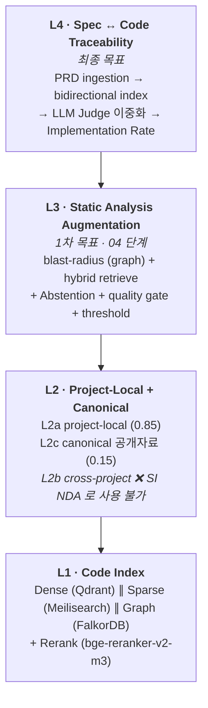
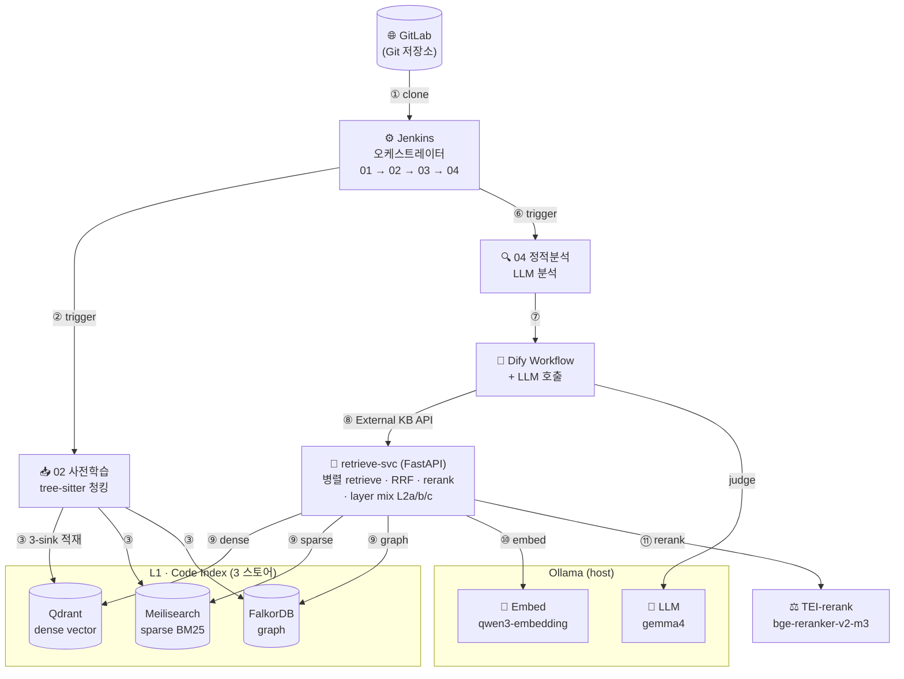
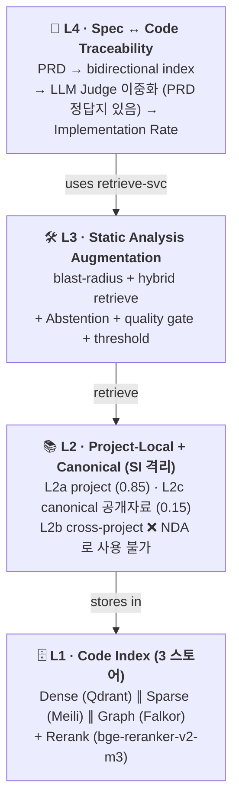
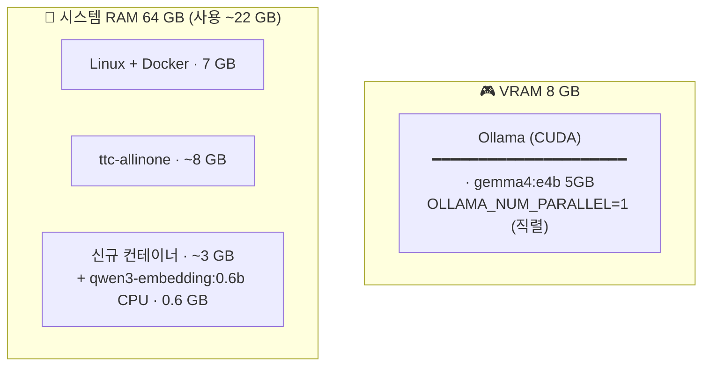
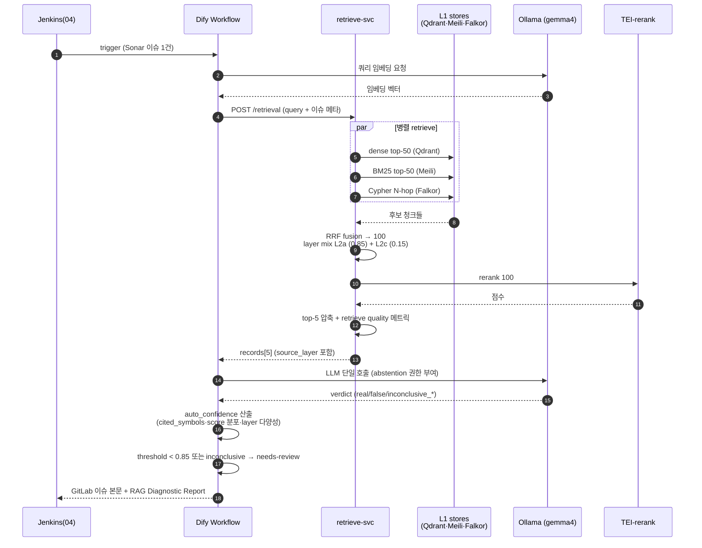
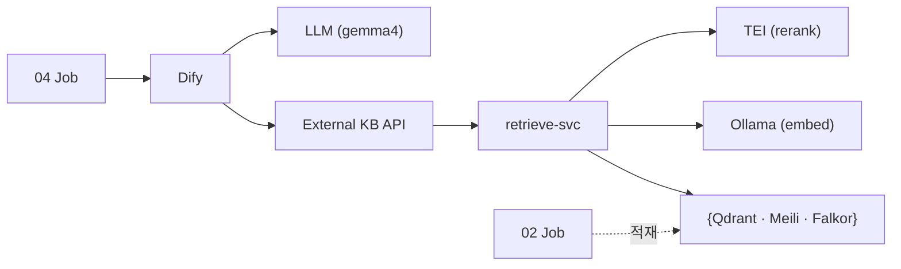

# 코드 RAG 강화 & Spec ↔ Code 추적성 — 계획·결정 로그

> **이 문서가 무엇인가**
> 02 코드 사전학습 파이프라인의 진화 방향에 대한 **살아있는 결정 로그** 다.
> 새 의사결정·실험·구현 변경은 모두 [§11 변경 이력](#11-변경-이력) 에 누적한다.
> 코드 변경은 git log 가 추적하므로, 여기에는 *왜* 와 *어떻게 결정했는가* 만 남긴다.

## 한 페이지 요약 (TL;DR)

- **무엇을 하는가** — 02 가 만든 코드 청크를 **Dense·Sparse·Graph** 3 스토어에 동시 적재해두고,
  04 가 이슈를 분석할 때 자체 `retrieve-svc` 가 3축 병렬 retrieve → 리랭크 → top-5 를 Dify 의 LLM
  에 넘긴다.
- **왜** — 임베딩만으론 *"이 함수의 호출자 / 인터페이스 구현체 / 요구사항의 구현 위치"* 를 못 찾는다.
  구조 신호(graph) 가 별도 retrieve 경로로 필요하다.
- **무엇이 바뀌나** — 04 의 **layer-별 citation rate** 가 분리 측정되고, 이후 PRD ↔ 코드 매핑으로
  확장돼 **Implementation Rate** (요구사항 구현률) 까지 자동 측정된다.
- **운영 환경** — 폐쇄망 단일 머신 (M4 Pro 48GB unified / Intel 185H + RTX 4070 8GB). 외부 API 호출 0.
- **모델 (2026-04 검증)** — LLM `gemma4` family (현행 `e4b` 유지 + M4 Pro 는 `26b` 추가),
  임베딩 `qwen3-embedding`, 리랭커 `bge-reranker-v2-m3`.
- **언제 끝나나** — 1차 목표 (정적분석 보조 RAG) **3~4 주**, 최종 목표 (Spec↔Code 추적성) **약 3 개월**.

---

## 목차

1. [목표](#1-목표)
2. [현재 상태 진단](#2-현재-상태-진단-2026-04-26-기준)
3. [4-Layer 아키텍처 (제안)](#3-4-layer-아키텍처-제안)
4. [3.5 시스템 다이어그램 (다중 뷰)](#35-시스템-다이어그램-다중-뷰) — **시각으로 이해하기**
5. [도구 매트릭스](#4-도구-매트릭스)
6. [단계적 마이그레이션 로드맵](#5-단계적-마이그레이션-로드맵)
7. [폐쇄망 단일머신 상세 구성 (Dify 통합)](#6-폐쇄망-단일머신-상세-구성-dify-통합)
8. [미해결 / 결정 필요 항목](#7-미해결--결정-필요-항목)
9. [참고 문헌](#8-참고-문헌-research-근거)
10. [용어집](#9-용어집)
11. [구축 절차 (step-by-step)](#10-구축-절차-step-by-step) — **실제로 짓는 순서**
12. [변경 이력](#11-변경-이력)

---

## 1. 목표

두 단계 목표가 있다 — **1차** 는 지금 굴러가는 정적분석을 더 똑똑하게, **최종** 은 PRD 가 실제로
얼마나 구현됐는지 자동 측정.

### 1차 목표 — 정적분석 보조 강화

> 코드를 RAG 화하여, 04 가 이슈 1건을 LLM 으로 분석할 때 *호출자·구현체·유사 패턴* 까지 컨텍스트로
> 받게 한다.

**측정 KPI**:

| KPI | 의미 |
|---|---|
| layer-별 citation rate | LLM 답변이 어느 KB layer (project / cross / canonical) 의 청크를 인용했는지 |
| false-positive 강등률 | LLM 이 "이건 오탐" 으로 강등시킨 이슈 비율 |
| partial_citation 강등률 | 인용은 있지만 50% 미만이라 confidence 강등된 비율 |

### 최종 목표 — 요구사항 구현률 자동 측정

> PRD / 기능 명세 / acceptance criteria 의 각 요구사항이 코드 어디에 구현돼 있는지 (또는 빠져 있는지)
> 자동 매핑하고, 빌드마다 **Implementation Rate** 를 갱신한다.

**측정 KPI**:

| KPI | 의미 |
|---|---|
| Implementation Rate | 전체 요구사항 중 `implemented / partial / not / n/a / needs-review` 분포 |
| 사람 검수 일치율 | 자동 판정과 사람의 ground truth 가 얼마나 맞아떨어지나 |

---

## 2. 현재 상태 진단 (2026-04-26 기준)

> **TL;DR** — 02 사전학습은 *2024 초기형 RAG* 에 머물러 있다. 5개 축에서 2026 SOTA 와 격차가 명확.

### 2.1 현재 구성 (`02 코드 사전학습.jenkinsPipeline`)

| 단계 | 동작 | 도구 |
|---|---|---|
| 청킹 | Git clone → 함수/메서드 단위 AST 청킹 | tree-sitter (`repo_context_builder.py`, 2,400+ lines) |
| 의미 보강 (옵션) | 청크 요약을 본문 앞에 prepend | `gemma4:e4b` enricher |
| 적재 | 단일 Dify Dataset (full 모드는 `--purge` 후 재업로드) | Dify Knowledge Base |
| 인덱싱 | 임베딩 + 벡터 색인 | bge-m3 (범용) → Qdrant |
| 리포트 | PM 친화 HTML (TL;DR / verdict / 8 카드) | publishHTML |

### 2.2 SOTA 와의 격차 5축

| 축 | 현재 | 2026 SOTA | 격차가 만드는 결과 |
|---|---|---|---|
| **임베딩** | 범용 `bge-m3` | 코드 특화 (`qwen3-embedding`, Codestral Embed) | 코드 retrieval 정확도 ↓ |
| **Retrieve 경로** | 단일 dense | Hybrid (BM25 + dense + rerank) | 심볼·고유식별자 정확 매칭 실패 |
| **구조 신호** | 청크 footer 텍스트 | Code Property Graph / Cypher 쿼리 | "호출자·구현체·writer" 관계 질의 불가 |
| **다중 프로젝트** | 없음 (purge 로 우회) | 다층 KB (project / cross / canonical) | "다른 서비스 패턴 인용" 불가 |
| **측정** | 단일 citation rate 75% | layer 별 인용 분리 | 어느 KB 가 실효적인지 모름 |

### 2.3 핵심 통찰

> **"의미상 비슷한 것"** 과 **"구조상 연결된 것"** 은 다르다.
>
> 임베딩만으론 *"이 함수의 호출자 / 이 인터페이스의 구현체 / 이 요구사항의 구현 위치"* 를 못 찾는다.
> 그래프 retrieve 경로가 별도로 필요한 이유다.

비유로 보면 — 도서관에서 *"비슷한 주제의 책"* 을 찾는 것 (임베딩) 과 *"이 책을 인용한 다른 책들"*
을 찾는 것 (그래프) 은 다른 기능이다. 정적분석 보조에는 *후자* 가 더 자주 필요하다 (이슈 함수의
영향 반경 파악).

---

## 3. 4-Layer 아키텍처 (제안)

> **TL;DR** — 4 층 구조로 쌓는다. 아래에서 위로 의존: L1 (저장소) → L2 (다층 KB) → L3 (정적분석
> 강화) → L4 (구현률 측정).
>
> *왜 4 층인가* — 한 층이 한 가지만 책임지게 하면, 위 층을 추가/제거할 때 아래 층은 흔들리지 않는다.



각 층은 *역할 / 핵심 결정 / 비유* 3종으로 정리한다.

### L1 · Code Index — 트리플 스토어

| | |
|---|---|
| **역할** | 02 가 만든 코드 청크를 **3가지 다른 시각** 으로 동시 저장 — 의미·키워드·관계. |
| **핵심 결정** | Dense (의미) · Sparse (키워드) · Graph (관계) 를 병렬 retrieve 후 cross-encoder 로 top-5 압축. |
| **비유** | 도서관의 *주제별 분류* (의미) + *제목 색인* (키워드) + *인용 네트워크* (관계). 셋 다 있어야 책을 빨리 찾는다. |

| 컴포넌트 | 도구 | 책임 |
|---|---|---|
| Dense vector | Qdrant (Dify 내장) + `qwen3-embedding` | "이 함수와 의미상 비슷한 함수" |
| Sparse BM25 | Meilisearch | "이 심볼명·고유 식별자가 등장하는 청크" |
| Graph | FalkorDB (Cypher) | "이 함수의 호출자·구현체·테스트" |
| Rerank | TEI + `bge-reranker-v2-m3` | top-100 후보 중 진짜 관련 top-5 골라내기 |

### L2 · Project-Local KB + Canonical Reference — 2 층 (SI 제약)

> **SI 환경 제약 (2026-04-26 정정)** — 본 시스템은 SI 프로젝트 컨텍스트로, 고객사 코드/문서는
> **다른 고객의 분석에 retrieve 되어선 안 된다** (NDA/계약상 절대 제약). 따라서 `L2b cross-project`
> (사내 유사 도메인 레포) 는 **사용 불가**.
>
> L2 는 **L2a (현재 분석 대상 한 프로젝트) + L2c (고객사-무관 공개 자료)** 2 층으로 단순화한다.

| | |
|---|---|
| **역할** | 분석 대상 1 프로젝트의 코드 + 고객사-무관 공개 표준만 묶어 retrieve. |
| **핵심 결정** | dataset 을 customer/프로젝트별로 **완전 격리**. 빌드 종료 시 또는 빌드 시작 시 purge. |
| **비유** | 의사가 *환자 본인 차트* (L2a) + *공개 의학 교과서* (L2c) 만 본다. 다른 환자 차트 절대 금지. |

| Layer | 내용 | 가중치 | 격리 정책 |
|---|---|---|---|
| **L2a · project-local** | 분석 대상 프로젝트 (현재 빌드 1회 한정) | 0.85 | dataset per project, 다음 customer 분석 전 purge 의무 |
| ~~L2b · cross-project~~ | ~~사내 유사 도메인 레포~~ | — | **❌ 사용 불가 (SI NDA)** |
| **L2c · canonical** | 프레임워크 공식 docs · OWASP / CWE · PEP · design pattern 카탈로그 · 사내 코딩 표준 (고객사-무관) | 0.15 | 정적·공유 OK |

> **L2c 에서 절대 들어가면 안 되는 것**: 고객사 commit 이력 / 고객사 issue 트래커 / 고객사 PR 코멘트
> / 고객사 도메인 모델 / 고객사 fix commit. CodeCureAgent 가 fix commit 으로 96.8% plausible fix
> 를 만든 패턴은 매력적이지만, SI 환경에선 **그 commit 들의 출처가 customer-agnostic 인지 검증
> 가능한 경우만** 채택. (예: 오픈소스 프레임워크 GitHub issue 는 OK, 고객사 GitLab 은 NO.)

**기존 단일 dataset + 매 빌드 `--purge` 의 재해석**: *multi-tenant 부재의 우회로* 가 아니라 **SI
정책상 필수 격리 메커니즘** 이었다. 02 jenkinsfile 의 `--purge` 는 그대로 유지·강화.

**격차 보상**: L2b 부재로 *"다른 서비스 패턴 인용"* 이 불가능해진 만큼, L1 의 그래프 retrieve
(blast-radius) 와 L2c (공개 표준) 비중을 더 키워 컨텍스트 양을 보충해야 한다.

### L3 · Static Analysis Augmentation — 04 강화

| | |
|---|---|
| **역할** | Sonar 가 만든 이슈 1 건을 LLM 이 판정할 때, 그래프와 KB 에서 컨텍스트를 끌어옴. |
| **핵심 결정** | LLM 한 번 호출 + **자기 판정에 신뢰도 calibration** (이중 Judge 가 아님 — 데이터 한정 시 효과 작음). |
| **비유** | 의사가 진단할 때 *"이건 자신 있다 / 이건 자료 부족이라 모르겠다"* 를 스스로 표시하게 한다. 세컨드 오피니언 부르는 비용 대신 *abstention* (판정 거부) 권한을 줌. |

#### 처리 흐름

1. **Blast-radius 추출** — 이슈 함수 → 그래프에서 N-hop 호출자 + 도메인 객체 + 연관 테스트.
2. **Hybrid retrieve** — L2a (0.85) + L2c (0.15) 가중치로 mix. SI 격리로 cross-project 없음.
   `fail-soft` (일부 layer 비어도 통과).
3. **LLM 단일 호출 + abstention 권한 부여**
   - 프롬프트가 LLM 에게 4 가지 선택지를 명시: `real_issue / false_positive / inconclusive_low_context / inconclusive_ambiguous_rule`.
   - LLM 이 *컨텍스트 부족* 을 직접 인식하고 `inconclusive` 를 선택할 수 있게 함.
4. **Retrieve quality gate** — 자동 메트릭으로 신뢰도 보정:
   - cited symbols 수 (1 개 이하면 ↓)
   - retrieve top-5 의 score 분포 (1 위 score 가 임계 미만이면 ↓)
   - source_layer 다양성 (dense/sparse/graph 중 1 개만 hit 시 ↓)
   - 결과: `auto_confidence ∈ [0, 1]`
5. **Conservative threshold** — `auto_confidence < 0.85` 또는 LLM 자체가 `inconclusive_*` 반환 시
   **무조건 needs-review** 큐로. 통과한 케이스만 자동 마감.
6. **측정** — citation rate 를 L2a / L2c **layer 별로 분리**. 추가로 `inconclusive 비율` 을 KPI 로
   추가 (이 비율이 낮을수록 컨텍스트가 충분하다는 신호).

#### 왜 이중 Judge 를 빼는가 (정직)

| 시나리오 | 이중 Judge 효과 |
|---|---|
| 컨텍스트 풍부 + 명확한 케이스 | 거의 무의미 (둘 다 정답 합의). 시간만 2 배. |
| 컨텍스트 풍부 + 애매한 케이스 | 효과 큼. 합의/불일치가 진짜 신호. |
| **컨텍스트 빈약** (SI 환경 흔함) | **효과 제한적.** 둘 다 같은 빈약한 추측. False positive 위험 ↑. |
| 컨텍스트 거의 없음 | 무용. LLM 이 hallucinate 하면 사이좋게 같이 hallucinate. |

게다가 단일 머신 + `OLLAMA_MAX_LOADED_MODELS=1` 환경에서 다른 LLM 으로 이중화 시 model swap
발생 → 시간 2 배보다 더 걸림. **Abstention + quality gate + conservative threshold** 가 SI 환경
(데이터 한정 + 단일 머신) 에 더 적합.

> **여전히 이중 Judge 가 필요한 시점**: Phase 7 (Spec↔Code 추적성) 의 `Implementation Rate` 판정.
> 거기는 PRD 라는 "정답지" 가 있어 합의/불일치 신호가 강하므로 이중 Judge 가 가치 있음. L3 (이슈
> 판정) 에선 빼고, L4 (구현률) 에서만 사용 — §10 Phase 7 참조.

### L4 · Spec ↔ Code Traceability — 최종 목표

| | |
|---|---|
| **역할** | PRD 의 N 개 요구사항이 코드 어디에 구현돼 있는지 자동 매핑하고, 빌드마다 구현률 갱신. |
| **핵심 결정** | requirement 단위 청킹 + bidirectional 매핑 + LLM-as-Judge 3-state. |
| **비유** | 시험지 (PRD) 와 답안 (코드) 를 자동 채점. *맞음 / 부분점수 / 백지 / 채점불가* 4가지로 분류. |

**근거** — 자동차 도메인의 RAG 기반 trace link recovery 가 validation 99% / recovery 85.5% 를 보고했다.
Implementation Rate 메트릭이 2025~26 표준화 추세.

**파이프라인 6 단계**:

| # | 단계 | 산출물 |
|---|---|---|
| 1 | **Spec ingestion** — PRD 를 atomic requirement 단위로 청킹. ID (REQ-AUTH-003) / category / acceptance criteria. 가능 시 BDD Gherkin 변환. | `spec-kb-<project>` dataset |
| 2 | **Bidirectional index** — `req → code` (정방향) + `code → req` (역방향, 매핑 없는 게 정상) | 2개 인덱스 |
| 3 | **LLM-as-Judge (3-state)** — `{implemented \| partial \| not \| n/a}` + cited symbols + 신뢰도 | 판정 JSON |
| 4 | **Self-verification** — 다른 모델/프롬프트로 재판정. 일치 시 마감, 불일치는 `needs-review` | 판정 확정 또는 큐 |
| 5 | **Implementation Rate 리포트** — N/M/P/Q/R 분포 + 카테고리별 + 트레이스 매트릭스 | HTML 리포트 |
| 6 | **Drift 감지** — 다음 빌드에서 동일 PRD 재실행 → 변화 (회귀/신규) 알림 | diff 알림 |

**현실적 한계 — 정직하게**:

- *모호한 요구사항* (`"빠르게 동작해야 함"`) 은 자동 판정 불가. ingestion 단계에서 testable 여부
  분류 후, non-testable 은 별도 버킷으로 격리.
- 첫 측정치는 ground truth 와 **50~70% 일치도** 가 현실적 기대. 사람 검수 루프 필수.
- 임계값 튜닝 후 70%+ 도달이 목표.

---

## 3.5 시스템 다이어그램 (다중 뷰)

> **TL;DR** — 한 다이어그램으론 전체가 안 보인다. 4 가지 시각으로 본다 — *흐름 / 논리 / 배치 / 시간*.
> 각 다이어그램은 *답하는 질문* 이 다르다.

| 뷰 | 답하는 질문 | 어디 보면 됨 |
|---|---|---|
| 1. 데이터 흐름 | "뭐가 어디로 흘러가나" | §3.5.1 |
| 2. 논리 레이어 | "각 층 책임이 뭐고 누가 누구를 쓰나" | §3 + §3.5.2 |
| 3. 물리 배치 | "단일 머신 어디에 뭐가 뜨나" | §3.5.3 (요약) + §6.5 (정본) |
| 4. 런타임 시퀀스 | "이슈 1건 분석 시 시간 순서로 뭐가 일어나나" | §3.5.4 |

### 3.5.1 뷰 1 — 데이터 흐름

> 02 가 만든 청크가 3 스토어로 흘러가고, 04 가 그걸 hybrid 로 retrieve 해서 LLM 에 넘긴다.



**번호 흐름**: ① 사용자 트리거 → ② 02 시작 → ③ 청크 3-sink 적재 → (대기) → ⑥ 04 시작 → ⑦ Dify
호출 → ⑧ External KB API → ⑨ 병렬 retrieve → ⑩ 쿼리 임베딩 / ⑪ 리랭크 → LLM 판정 → GitLab 이슈 본문.

### 3.5.2 뷰 2 — 4-Layer 논리

> 위 층은 아래 층을 쓴다. 한 층씩 따로 만들 수 있도록 책임이 분리돼 있다.



### 3.5.3 뷰 3 — 물리 배치 (요약)

> 정본은 §6.5. 여기는 시각적 한 컷.

> **양 머신 동일 구성** (2026-04-27 확정). 차이는 단 하나 — Ollama parallel 옵션.

#### M4 Pro 48GB (macOS, Apple Silicon)

```mermaid
flowchart TB
    subgraph Host["🍎 macOS host (Metal 가속)"]
        Ollama["Ollama (host native)<br/>━━━━━━━━━━━━━━━━━━━━━━<br/>· gemma4:e4b 5GB (분석+enricher 공유)<br/>· qwen3-embedding:0.6b 0.6GB<br/>OLLAMA_NUM_PARALLEL=3 (동시 처리)"]
    end

    subgraph Docker["🐳 Docker Desktop (~12 GB 컨테이너)"]
        subgraph Existing["기존 ttc-allinone (~8 GB)"]
            Dify1["Dify · Postgres · Redis · Qdrant · Jenkins"]
        end
        subgraph New["신규 (~3 GB)"]
            Meili1[":7700 Meilisearch · 0.4GB"]
            Falkor1[":6380 FalkorDB · 0.5GB"]
            TEI1[":8081 TEI-rerank · 1.2GB"]
            RSvc1[":9000 retrieve-svc · 0.3GB"]
        end
    end

    Ollama -.host.docker.internal:11434.-> Existing
```

> **합계**: macOS 8 + Docker VM 3 + 컨테이너 12 + Ollama 6 (KV cache 포함) ≈ **24 GB / 48 GB**.
> **여유 24 GB** — Phase 7 야간 batch 에 `gemma4:26b` 옵션 활용 가능.

#### Intel 185H · 64GB RAM · RTX 4070 8GB VRAM



> **여유**: VRAM 3 GB · RAM 42 GB. 동일 모델로 결과 일관성 보장. Throughput 만 M4 Pro 보다 ~3배 느림.

### 3.5.4 뷰 4 — 04 분석 1 사이클 시퀀스

> 이슈 1 건 분석에 ~15~25 초 (RTX e4b 기준). 절반 이상은 LLM 2 회 호출.



**시간 분포** (RTX 4070 e4b 기준, abstention + quality gate 단일 호출):

| 구간 | 소요 |
|---|---|
| retrieve 단계 | ~1~2 초 |
| LLM 단일 판정 | ~5~10 초 |
| auto_confidence 산출 + threshold | ~0.1 초 |
| **합계** | **~7~12 초** (M4 Pro 26b 는 약 2배 — 15~25 초) |

> 이중 Judge 였던 이전 설계 (15~25 초) 대비 약 2 배 빠름. 단일 머신 직렬 처리에서 시간 절감 효과 큼.

### 3.5.5 의존성 한 줄 요약



---

## 4. 도구 매트릭스

| 컴포넌트 | 1순위 | 대안 | 비고 |
|---|---|---|---|
| 코드 임베딩 | Codestral Embed (32K) | Qodo-Embed-1-1.5B | airgap 이면 Qodo 1순위 (오픈) |
| 리랭커 | bge-reranker-v2-m3 | Jina Reranker v2 | 둘 다 오픈 cross-encoder |
| Vector DB | Qdrant (현행 유지) | — | Dify 내장 |
| Graph DB | Neo4j Community | FalkorDB | FalkorDB 가 RAG 워크로드에 가벼움 |
| CPG 빌더 | tree-sitter (현행) → graph 정규화 | Joern (formal CPG) | Joern 은 리소스 부담 — 점진 도입 |
| Sparse | OpenSearch BM25 | Elasticsearch | 사내 airgap 자산 점검 필요 |
| Spec ingestion | 자체 LLM 파이프라인 | LangExtract / unstructured.io | PRD 포맷 다양성 대응 |
| Trace LLM | TraceLLM 패턴 차용 | Claude / Gemini self-verification | 프레임워크보다 *패턴* 채택 |
| 측정 | Implementation Rate + LLM-as-Judge | DeepEval | 자체 구현이 단순 |

---

## 5. 단계적 마이그레이션 로드맵

| 단계 | 기간 | 작업 | 검증 KPI |
|---|---|---|---|
| **P1.6 (단기 임베딩)** | 1~2 주 | bge-m3 → Codestral 또는 Qodo 교체. bge-reranker-v2 도입. | 04 citation rate Δ, top-1 hit rate |
| **P2 (Hybrid 도입)** | 2~3 주 | BM25 sparse 경로 추가. RRF/weighted fusion. Dify 외부 hybrid layer. | 심볼 정확 매칭 hit rate |
| **P3 (Graph 도입)** | 3~4 주 | Neo4j 또는 FalkorDB 도입. tree-sitter 산출물을 정식 노드/엣지로 정규화. structural retrieve 경로 02→04 통합. | "callers of X" 류 쿼리 정확도 |
| **P3.5 (Cross-project)** | 1~2 주 | L2b 1개 reference repo 추가. 가중치 mix 실험. | layer별 citation rate 분리 |
| **P4 (Spec traceability)** | 4~6 주 | PRD ingestion + bidirectional index + LLM-as-Judge + Implementation Rate 리포트. ground truth 확보 후 정확도 측정. | 사람 검수 일치율 |

---

## 6. 폐쇄망 단일머신 상세 구성 (Dify 통합)

> **TL;DR** — 폐쇄망 + 단일 머신에서 §3 의 4-Layer 를 실제로 어떻게 띄울지 다룬다. 핵심은 **Dify 의
> retrieve 단계를 자체 `retrieve-svc` 로 교체** 하는 것 (Dify Workflow / LLM 은 그대로 활용).

### 대상 하드웨어 (둘 중 하나)

| 머신 | 사양 | OS |
|---|---|---|
| **A** | MacBook Pro M4 Pro · 48GB unified memory | macOS, Apple Silicon |
| **B** | Intel Core Ultra 9 185H · 64GB RAM · RTX 4070 Laptop 8GB VRAM | Linux 또는 WSL2 |

### 6.1 핵심 통합 전략 — Dify External Knowledge API

> Dify 의 retrieve 만 교체하고, 나머지 (Workflow · LLM · prompt 관리) 는 손대지 않는다.

**작동 원리**:

Dify 0.15+ 는 *External Knowledge API* 를 정식 지원한다. Workflow 의 Knowledge Retrieval 노드가
외부 HTTP 엔드포인트 (`POST /retrieval`) 를 호출해 검색 결과를 받아오는 구조다.

자체 서비스 **`retrieve-svc`** (FastAPI, 단일 컨테이너) 를 띄우고, 그 안에서 Qdrant + Meilisearch +
FalkorDB 를 hybrid 호출 → 리랭크 → 결과 반환을 처리한다. Dify 입장에서는 *외부 KB 1개* 로 보일
뿐이다.

**이 방식의 장점**:

| 장점 | 의미 |
|---|---|
| Dify 학습곡선 0 | Workflow / LLM / prompt 관리 그대로 |
| 점진적 적용 | retrieve-svc 죽으면 Dify 가 기존 내장 retrieve 로 fallback 가능 |
| 유연성 | 우리 마음대로 hybrid · graph · layer-mix 조합 |
| 02 흐름 유지 | Dify Dataset (= Qdrant) 적재 그대로 + Meili / Falkor sink 만 추가 |

### 6.2 시스템 다이어그램

```
                       ┌──────────────────────────────┐
                       │  Jenkins (기존)               │
                       │   02 사전학습 / 03 정적 / 04  │
                       └──────────────────────────────┘
                                  │
                ┌─────────────────┼──────────────────┐
                │ (02 적재)       │ (04 분석 호출)   │
                ▼                 ▼                  ▼
        ┌──────────────┐  ┌──────────────┐   ┌────────────────────┐
        │ Qdrant       │  │ Meilisearch  │   │ FalkorDB (graph)   │
        │ (Dify 내장)  │  │ (BM25 sparse)│   │ Cypher subset      │
        │ dense vector │  │ keyword      │   │ Function/Class/    │
        │              │  │ inverted idx │   │ CALLS/INHERITS/... │
        └──────────────┘  └──────────────┘   └────────────────────┘
                ▲                 ▲                  ▲
                └─────────┬───────┴────────┬─────────┘
                          │ (hybrid retrieve)
                          ▼
                ┌──────────────────────────────┐
                │  retrieve-svc (FastAPI)      │
                │   POST /retrieval            │  ← Dify External KB API
                │   ├ dense   (Qdrant)         │
                │   ├ sparse  (Meilisearch)    │
                │   ├ graph   (FalkorDB)       │
                │   ├ RRF fusion → top-100     │
                │   ├ rerank (TEI)  → top-5    │
                │   └ layer mix L2a/L2b/L2c    │
                └──────────────────────────────┘
                          ▲                 │
                          │                 ▼
                ┌─────────────────┐   ┌──────────────────────┐
                │ Dify (기존)     │   │ TEI (HF Text Embed   │
                │ Workflow + LLM  │   │ Inference) 1 인스턴스│
                │ orchestration   │──▶│  bge-reranker-v2-m3  │
                │                 │   │  (또는 jina-rerank-v3)│
                └─────────────────┘   └──────────────────────┘
                          │
                          ▼
                ┌─────────────────────────────────────┐
                │ Ollama (host) — LLM + 임베딩 통합   │
                │  • gemma4:26b-it-q4_K_M  (분석 LLM, M4 Pro) │
                │     또는 gemma4:e4b      (분석 + enricher, RTX) │
                │  • gemma4:e4b            (enricher 현행 유지) │
                │  • qwen3-embedding:4b    (M4 Pro)   │
                │     또는 qwen3-embedding:0.6b (RTX) │
                └─────────────────────────────────────┘
```

핵심 포인트:

- **Ollama 1개로 LLM + 임베딩 통합** 서빙. 별도 TEI-embed 컨테이너 불필요. Ollama 가 임베딩 모델
  (`qwen3-embedding`) 도 정식 서빙하므로 운영 단순화.
- **TEI 는 리랭커 전담** — Ollama 는 cross-encoder reranker 를 1급으로 다루지 못함. TEI 컨테이너 1개
  로 충분 (~1.2GB).
- **현행 자산 존중**: 02 enricher 의 `gemma4:e4b` 그대로 유지. 04 분석은 동일 family 안에서 메모리에
  맞는 변형 (M4 Pro `gemma4:26b`, RTX `gemma4:e4b` 공유).
- Ollama 는 M4 Pro 는 host native (Metal), RTX 4070 머신은 컨테이너 + nvidia-docker.

### 6.3 컴포넌트 명세

| 컴포넌트 | 이미지/바이너리 | 평상시 RAM | 피크 RAM | VRAM (옵션) | 포트 | 역할 |
|---|---|---|---|---|---|---|
| Dify (api+worker+nginx) | 기존 all-in-one | 4 GB | 6 GB | — | 5001 | Workflow + LLM orch |
| Postgres | 기존 | 0.5 GB | 1 GB | — | 5432 | Dify metadata |
| Redis | 기존 | 0.3 GB | 0.5 GB | — | 6379 | Dify queue |
| Qdrant | 기존 | 1 GB | 2 GB | — | 6333 | Dense vectors (L1·dense) |
| Jenkins | 기존 | 1 GB | 2 GB | — | 28080 | Pipeline runner |
| **Meilisearch** | `getmeili/meilisearch:v1.10` | 0.4 GB | 1 GB | — | 7700 | BM25 sparse (L1·sparse) |
| **FalkorDB** | `falkordb/falkordb:latest` | 0.5 GB | 2 GB | — | 6380 | Code KG (L1·graph) |
| **TEI-rerank** | `ghcr.io/huggingface/text-embeddings-inference:cpu-1.7` (또는 `cuda-1.7`) | 1 GB | 1.5 GB | 0.7 GB | 8081 | `bge-reranker-v2-m3` 또는 `jina-reranker-v3` |
| (임베딩) | Ollama 통합 (`qwen3-embedding:4b` / `:0.6b`) | 0.6~3 GB | — | 옵션 | 11434 | host Ollama 와 공유 |
| **retrieve-svc** | 자체 FastAPI (python:slim) | 0.3 GB | 0.5 GB | — | 9000 | hybrid retrieve + Dify Ext KB API |
| Ollama | host native (Mac) / container (Linux) | 1 GB | 1.5 GB (host) | LLM + Embed 사이즈 | 11434 | LLM + 임베딩 통합 serving |

**굵게** 표시한 4개가 신규 추가 컴포넌트 (TEI-embed 는 Ollama 통합으로 제거됨). 기존 컴포넌트는 그대로
유지. **임베딩은 Ollama 통합** — `qwen3-embedding:4b` (M4 Pro) 또는 `:0.6b` (RTX) 모델을 host Ollama
가 LLM 과 함께 서빙. TEI 컨테이너는 리랭커 1개만 운영.

### 6.4 모델 선정 — 양 머신 통일 (운영 표준화)

> **TL;DR (2026-04-27 정정)** — M4 Pro 와 RTX 4070 머신은 **모든 컴포넌트를 동일하게** 가져간다.
> 디버그 패턴 공유, 측정 비교 가능, 인력 학습 곡선 1 회의 운영 가치가 *큰 모델 활용* 보다 우선.

**원칙**:

1. **양 머신 동일 구성** — LLM·임베딩·리랭커·컨테이너 모두 동일.
2. **2026-04 검증된 오픈 모델만** (API 의존 X).
3. **현행 자산 (`gemma4:e4b`) 100% 재활용** — 재반입·재검증 비용 0.
4. M4 Pro 의 여유 메모리는 *throughput 향상* 또는 *Phase 7 야간 batch 옵션* 으로만 활용 (인터랙티브
   04 분석은 양쪽 동일).

#### 4.1 통합 모델 라인업

| 컴포넌트 | 모델 (양 머신 동일) | 메모리 | 비고 |
|---|---|---|---|
| **분석 LLM** (04 단계) | `gemma4:e4b-it-q4_K_M` | ~5 GB | 현행 enricher 와 동일 — 한 모델로 통합 |
| **Enricher LLM** (02 단계) | `gemma4:e4b-it-q4_K_M` | (분석과 공유) | 현행 그대로 |
| **임베딩** | `qwen3-embedding:0.6b-q4_K_M` | ~0.6 GB | MTEB Code 우위 + 가벼움 |
| **리랭커** | `bge-reranker-v2-m3` (Apache 2.0) | ~1.2 GB | 또는 `jina-reranker-v3` (CC-BY-NC, 라이선스 결정 후) |

#### 4.2 양 머신 차이는 단 하나 — Throughput

| 환경변수 | M4 Pro 48GB | RTX 4070 8GB | 효과 |
|---|---|---|---|
| `OLLAMA_NUM_PARALLEL` | **3** | **1** | M4 Pro 는 동시 3 이슈, RTX 는 직렬 |
| `OLLAMA_MAX_LOADED_MODELS` | 1 | 1 | swap 방지 |
| KV cache (`num_ctx`) | 8192 | 8192 | 동일 — 결과 일관성 위해 |

> 즉 **결과는 같고 처리 속도만 다르다**. 100 이슈 처리: M4 Pro ~7 분, RTX ~20 분.

#### 4.3 왜 큰 모델 (gemma4:26b) 을 안 쓰는가

옵션 비교 (2026-04-27 검토):

| 옵션 | 양쪽 동일성 | RTX 4070 fit | M4 Pro 활용 | 채택? |
|---|---|---|---|---|
| **A. e4b 통일** | ✅ 완전 동일 | ✅ 안전 | ⚠️ 메모리 여유 → parallel=3 | **✅ 채택** |
| B. 26b 통일 | ✅ 동일 | ❌ 8GB 에 안 들어감 (절반 CPU offload, 5~10 tok/s) | ✅ Metal 풀 활용 | ❌ RTX 사용 불가 |
| C. 중간 family 전환 (`qwen2.5-coder:7b`) | ✅ 동일 | ✅ fit | ⚠️ 여유 | ❌ gemma4 자산 폐기 비용 |
| D. e4b 통일 + M4 Pro 야간 batch 만 26b | ✅ 인터랙티브는 동일 | ✅ | ✅ batch 만 활용 | **🔄 Phase 7 옵션** |

**채택**: A + D. 인터랙티브 04 는 양쪽 e4b. Phase 7 (Implementation Rate batch, 야간) 만 M4 Pro 에서
26b 사용 옵션 — §10 Phase 7.4 참조.

#### 4.4 검토 후 보류된 대안

- `qwen3-coder-next`: SWE-bench 58.7% (오픈 1위) 이지만 24GB GPU 권장 → 양 머신 무리.
- `gemma4:26b-a4b` (MoE 활성 4B): RTX VRAM 안 맞음.
- `gemma3:12b` (Q4 ~7.5GB): RTX 8GB 에 빡빡 (KV cache 포함 9~10GB).
- `qwen3-embedding:4b/8b`: MTEB Code 더 높지만 0.6B 도 충분 + 메모리 절감.
- `voyage-code-3` / `Codestral Embed`: API 의존, airgap 불가.

#### 4.5 한눈 요약

```text
양 머신 동일:
  LLM      : gemma4:e4b-it-q4_K_M       (분석 + enricher 공유)
  Embed    : qwen3-embedding:0.6b
  Rerank   : bge-reranker-v2-m3
  Stores   : Qdrant + Meilisearch + FalkorDB
  Service  : retrieve-svc (FastAPI)
  + TEI rerank

차이 (throughput 만):
  M4 Pro      : OLLAMA_NUM_PARALLEL=3 (동시 처리)
  RTX 4070    : OLLAMA_NUM_PARALLEL=1 (직렬)

옵션 (Phase 7 야간 batch 한정):
  M4 Pro 만 gemma4:26b-it-q4_K_M 활용 가능 (Implementation Rate 정확도 ↑)
```

### 6.5 하드웨어별 메모리 배분

#### A. M4 Pro / 48GB unified memory

**제약**: macOS 의 Docker Desktop 은 Linux VM 안에서 동작. **컨테이너에서 Apple Silicon GPU(Metal)
가속을 못 씀.** 따라서 GPU 가속이 중요한 서비스는 host native 로 띄워야 한다.

| 분류 | 항목 | 위치 | RAM |
|---|---|---|---|
| OS | macOS + 백그라운드 | host | 8 GB |
| Docker | Docker Desktop VM | host | 3 GB |
| 컨테이너 그룹 1 | Dify api/worker/nginx + Postgres + Redis + Qdrant + Jenkins | container | 8 GB |
| 컨테이너 그룹 2 | Meilisearch + FalkorDB + retrieve-svc | container | 3 GB |
| 임베딩 | `qwen3-embedding:0.6b` (Ollama 통합) | host native | 0.6 GB |
| 리랭커 | `bge-reranker-v2-m3` (TEI CPU) | container | 1.2 GB |
| LLM (분석 + enricher 공유) | `gemma4:e4b-it-q4_K_M` (Metal) | **host native** | 5 GB |
| 버퍼 (parallel=3 시 LLM ×3 컨텍스트) | KV cache 추가 | — | 6 GB |
| 사용 합계 | | | **~24 / 48 GB** |
| **여유** | (Phase 7 batch 또는 향후 확장용) | | **~24 GB** |

핵심 결정:

- **양 머신 동일 모델** — `gemma4:e4b` 한 개로 분석·enricher 통합. RTX 머신과 결과 일관성 보장.
- **Ollama 는 host native** 설치 (`brew install ollama`). Docker 안에선 Metal 가속 불가. 컨테이너
  에서는 `host.docker.internal:11434` 로 접근.
- **임베딩은 Ollama 통합** — `qwen3-embedding:0.6b` 도 동일 Ollama 인스턴스가 서빙. TEI-embed
  컨테이너 불필요.
- **리랭커는 TEI 컨테이너** (Ollama 가 cross-encoder 미지원).
- **`OLLAMA_NUM_PARALLEL=3`**: M4 Pro 의 여유 메모리를 활용해 동시 이슈 3 건 처리 (throughput ↑,
  결과는 RTX 와 동일).
- **`OLLAMA_MAX_LOADED_MODELS=1`**: e4b 한 개만 로드 (분석·enricher 공유라 swap 없음).

#### M4 Pro 의 여유 24 GB 활용 옵션

| 옵션 | 효과 | 결과 일관성 |
|---|---|---|
| Throughput (`NUM_PARALLEL=3`) | 04 처리 속도 3배 | ✅ 동일 결과 |
| Phase 7 batch 에 `gemma4:26b` 옵션 | Implementation Rate 정확도 ↑ | ⚠️ batch 한정, 인터랙티브는 동일 |
| 향후 Phase 8+ 확장용 단순 여유 | 안정성 | — |

**피크 시나리오** (04 인터랙티브, parallel=3):

- 배경 11 GB + LLM 5 GB + KV cache 추가 6 GB + embed 0.6 GB + rerank 1.2 GB ≈ **24 GB**
- 48 GB 안에 큰 여유 (24 GB) — 안전

#### B. Intel 185H + RTX 4070 Laptop 8GB / 64GB RAM

**제약**: VRAM 8GB 가 병목. LLM 5.5GB 를 GPU 에 올리면 임베딩/리랭커는 GPU 에 함께 못 올림 (불안정).
시스템 RAM 은 64GB 로 풍족.

| 분류 | 항목 | 위치 | RAM | VRAM |
|---|---|---|---|---|
| OS | Linux/WSL2 + 백그라운드 | host | 6 GB | — |
| Docker | docker daemon | host | 1 GB | — |
| 컨테이너 그룹 1 | Dify 스택 + Postgres + Redis + Qdrant + Jenkins | container | 8 GB | — |
| 컨테이너 그룹 2 | Meilisearch + FalkorDB + retrieve-svc | container | 3 GB | — |
| 임베딩 | `qwen3-embedding:0.6b` (CPU, Ollama 또는 TEI) | container | 0.6 GB | 0 |
| 리랭커 | `bge-reranker-v2-m3` (CPU, TEI) | container | 1.2 GB | 0 |
| LLM (분석 + enricher 공유) | `gemma4:e4b-it-q4_K_M` (CUDA) — 분석/enricher 모두 같은 모델 | container | 1 GB | 5 GB |
| 버퍼 | | — | 42 GB | 3 GB |
| **합계** | | | **~22 / 64 GB · 42 GB 여유** | **5 / 8 GB · 3 GB 여유** |

핵심 결정:
- **8GB VRAM 한계로 26b 못 돌림** (Q4 16GB > 8GB). 따라서 분석 LLM 과 enricher LLM 을 같은
  `gemma4:e4b` 로 통합. 작은 모델의 약점은 RAG 컨텍스트 강화 (hybrid + graph + rerank) 로 보완하는
  설계. 이게 폐쇄망 단일머신 8GB GPU 의 현실적 최선.
- **GPU 는 LLM 전담.** 임베딩 (0.6B) · 리랭커 (568M) 는 16-core CPU 로 충분 (각 100~200ms/요청).
- WSL2 사용 시 nvidia-docker (CUDA passthrough) 정상 동작. Hyper-V 메모리 한도 (`.wslconfig`) 를
  최소 56GB 로 설정.
- 64GB 시스템 RAM 의 여유가 크므로, 향후 **L2b (cross-project KB) 추가 적재** 시 메모리 압박이
  M4 Pro 보다 적다.
- 추론 속도 부족 시: 임베딩 GPU 로 (Ollama CUDA, +0.6GB VRAM) → VRAM 5.6GB. 여전히 안전.

### 6.6 02 단계 (사전학습) 변경 사항

기존: tree-sitter 청킹 → Dify Dataset 1개 (Qdrant 인덱스).
신규: tree-sitter 청킹 → **3개 sink 동시 적재**.

`pipeline-scripts/repo_context_builder.py` 에 sink writer 3개 추가:

1. **`write_dify_dataset(...)`** — 현재 `doc_processor.py upload` 흐름 그대로 (Qdrant L1·dense).
2. **`write_meilisearch(chunks, index_name)`** — 신규. 청크 본문 + 메타 (path/symbol/lang/kind/
   callers/callees/endpoint/decorators) 를 단일 batch put. 자동 stemming + lang-aware 토크나이징.
3. **`write_falkordb_graph(chunks, graph_name)`** — 신규. 노드/엣지 일괄 생성:
   - 노드: `Module(path)`, `Function(symbol, path, lang, is_test)`, `Class(symbol, path)`,
     `Endpoint(method, path)`, `Domain(name)`.
   - 엣지: `(:Function)-[:CALLS]->(:Function)`,
     `(:Function)-[:HANDLES]->(:Endpoint)`,
     `(:Class)-[:INHERITS_FROM]->(:Class)`,
     `(:Function)-[:DEFINED_IN]->(:Module)`,
     `(:Function)-[:TESTS]->(:Function)`.
   - 기존 `_kb_intelligence.json` 사이드카가 노드/엣지 생성의 *정답* 으로 사용된다.

세 sink 는 **독립 실패 가능** (graceful — Dify 적재만 성공해도 파이프라인 통과). FalkorDB/Meilisearch
적재 실패 시 retrieve-svc 가 해당 path 만 비활성화하고 dense-only 로 fallback (§6.10 참조).

### 6.7 04 단계 (정적분석) 변경 사항

기존: Dify Workflow → Knowledge Retrieval 노드 (Dify 내장 dense) → LLM.
신규: Dify Workflow → **Knowledge Retrieval 노드를 External Knowledge 로 전환** → retrieve-svc 호출.

retrieve-svc 의 `POST /retrieval` 처리:

1. Dify 가 표준 포맷으로 query 송신 (knowledge_id, query, retrieval_setting, metadata).
2. `metadata` 에 04 가 추가 주입한 *이슈 메타* (이슈 함수의 path/symbol, severity, rule_id) 활용.
3. 병렬 실행:
   - Qdrant (dense top-50)
   - Meilisearch (sparse top-50)
   - FalkorDB Cypher (이슈 함수의 N-hop callers/callees/test_for, top-30)
4. **RRF fusion** (Reciprocal Rank Fusion, k=60) → 후보 ~100개로 합침.
5. **TEI-rerank** 호출 (cross-encoder) → top-5 압축.
6. Dify External KB API 응답 형식 (`records: [{content, score, title, metadata}]`) 으로 반환.
7. 각 record 의 `metadata.source_layer` 에 `dense | sparse | graph | l2b | l2c` 표시 →
   04 의 citation 측정 시 layer 분리 가능.

### 6.8 배포 — docker-compose 확장 예시

기존 `docker-compose.mac.yaml` / `docker-compose.wsl2.yaml` 에 추가 서비스만 발췌.

```yaml
services:
  meilisearch:
    image: getmeili/meilisearch:v1.10
    environment:
      - MEILI_MASTER_KEY=${MEILI_MASTER_KEY}
      - MEILI_NO_ANALYTICS=true
      - MEILI_ENV=production
    volumes:
      - ./data/meili:/meili_data
    ports: ["7700:7700"]
    deploy:
      resources:
        limits: { memory: 1g }
    restart: unless-stopped

  falkordb:
    image: falkordb/falkordb:latest
    ports: ["6380:6379"]   # 기존 Dify Redis(6379) 와 충돌 회피
    volumes:
      - ./data/falkor:/var/lib/falkordb/data
    deploy:
      resources:
        limits: { memory: 2g }
    restart: unless-stopped

  # 임베딩: Ollama 통합 옵션 (권장)
  #   ollama pull qwen3-embedding:4b   # M4 Pro
  #   ollama pull qwen3-embedding:0.6b # RTX 4070
  #   별도 컨테이너 불필요 — Ollama 1개가 LLM + Embed 모두 서빙.
  #   Dify / retrieve-svc 는 http://host.docker.internal:11434/api/embeddings 호출.

  # 리랭커: Ollama 미지원이므로 TEI 필수
  tei-rerank:
    image: ghcr.io/huggingface/text-embeddings-inference:cpu-1.7   # RTX 4070: cuda-1.7 가능 (선택)
    command:
      - --model-id=BAAI/bge-reranker-v2-m3   # 또는 jinaai/jina-reranker-v3 (라이선스 결정 후)
      - --port=80
      - --max-client-batch-size=32
    ports: ["8081:80"]
    volumes:
      - ./data/tei-cache:/data
    environment:
      - HF_HUB_OFFLINE=1   # 폐쇄망 — 모델 metadata 조회 시도 차단
    deploy:
      resources:
        limits: { memory: 1500m }
    restart: unless-stopped

  retrieve-svc:
    build: ./retrieve-svc
    environment:
      - QDRANT_URL=http://qdrant:6333
      - DIFY_DATASET_ID=${DIFY_DATASET_ID}
      - MEILI_URL=http://meilisearch:7700
      - MEILI_KEY=${MEILI_MASTER_KEY}
      - FALKOR_URL=redis://falkordb:6379
      - OLLAMA_URL=http://host.docker.internal:11434     # 임베딩 호출 (Ollama 통합 시)
      - OLLAMA_EMBED_MODEL=qwen3-embedding:4b            # RTX: qwen3-embedding:0.6b
      - TEI_RERANK_URL=http://tei-rerank/rerank
      - LAYER_WEIGHTS=l2a=0.85,l2c=0.15   # SI 격리: l2b 항목 없음 (cross-project 금지)
      - RRF_K=60
      - TOP_N_PER_PATH=50
      - TOP_K_FINAL=5
    ports: ["9000:9000"]
    depends_on: [meilisearch, falkordb, tei-rerank]
    extra_hosts:
      - "host.docker.internal:host-gateway"   # Linux 에서 host Ollama 접근
    deploy:
      resources:
        limits: { memory: 512m }
    restart: unless-stopped
```

### 6.9 폐쇄망 모델 weight 반입 절차

> **양 머신 동일** — 한 번 다운받은 bundle 을 두 머신에 똑같이 적용. 분기 없음.

#### 외부망 PC (한 번만)

```bash
# Ollama 모델 (LLM + 임베딩 통합)
ollama pull gemma4:e4b-it-q4_K_M         # 분석 + enricher 공유 (현행이면 skip)
ollama pull qwen3-embedding:0.6b         # 임베딩

# TEI 리랭커 (HF 직접)
huggingface-cli download BAAI/bge-reranker-v2-m3 \
  --local-dir ./bundle/models/bge-reranker-v2-m3

# (옵션) Phase 7 야간 batch 에서 M4 Pro 가 활용할 수 있는 큰 LLM
# ollama pull gemma4:26b-it-q4_K_M       # 약 16GB 추가 — 필수 아님
```

#### 반입

사내 보안 절차 (USB / 사내 파일 서버) 로 `bundle/` 디렉터리 이전.

#### 양 머신 공통 적용

```bash
# Ollama 모델
mkdir -p ~/.ollama
cp -r bundle/ollama-models/{blobs,manifests} ~/.ollama/models/
ollama list   # gemma4:e4b, qwen3-embedding:0.6b 확인

# TEI 캐시
mkdir -p ./data/tei-cache
cp -r bundle/models/bge-reranker-v2-m3 ./data/tei-cache/

# 환경변수 (양 머신 공통)
export OLLAMA_MAX_LOADED_MODELS=1
export HF_HUB_OFFLINE=1

# 머신별 차이 (단 1 줄)
# M4 Pro :  export OLLAMA_NUM_PARALLEL=3
# RTX    :  export OLLAMA_NUM_PARALLEL=1
```

#### 머신별 Ollama 기동 차이

| 머신 | 방식 | 비고 |
|---|---|---|
| **M4 Pro** | host native (`brew install ollama`, `ollama serve`) | Docker 안 Metal 가속 불가 |
| **RTX 4070** | host native 또는 컨테이너 + nvidia-docker | 컨테이너 모드 시 `~/.ollama` 를 호스트에서 마운트하면 모델 공유 |

#### 검증 (양 머신 동일 명령)

```bash
# LLM 호출
curl http://localhost:11434/api/generate -d '{
  "model": "gemma4:e4b-it-q4_K_M",
  "prompt": "Explain Python decorators in 3 sentences."
}'

# 임베딩 호출
curl http://localhost:11434/api/embeddings -d '{
  "model": "qwen3-embedding:0.6b",
  "prompt": "def authenticate(user, password):"
}'

# 리랭커 호출 (TEI)
curl http://localhost:8081/rerank -X POST -H "Content-Type: application/json" -d '{
  "query": "user authentication",
  "texts": ["def login(user, pw):", "def calculate_tax(amount):"]
}'
```

> 양 머신에서 **위 3개 응답이 동일 형식 + 같은 차원/스키마** 여야 함. 결과 값 자체는 양자화 미세
> 차이로 ε 수준 다를 수 있으나 의미상 동일.

### 6.10 폴백·축소 시나리오 (degradation)

부하·메모리 압박·서비스 장애 시 retrieve-svc 의 환경변수 토글로 단계적 축소:

| 레벨 | 조치 | 효과 |
|---|---|---|
| L1 | `LAYER_WEIGHTS=l2a=1.0` (canonical off) | L2c 무시. 초기 단계 기본값. ※ L2b 는 SI 격리로 *항상* off. |
| L2 | `DISABLE_GRAPH=1` (FalkorDB 호출 skip) | 구조 신호 손실. dense+sparse 만. |
| L3 | `DISABLE_RERANK=1` (TEI-rerank skip) | RRF top-K 직접 사용. 정밀도 ↓. |
| L4 | LLM 모델 다운그레이드 (Modelfile 교체) | 14B → 7B → 3B. 추론 속도 ↑, 품질 ↓. |
| L5 | `DISABLE_SPARSE=1` (Meilisearch skip) | dense only. 현재 구조와 동급. |
| L6 | retrieve-svc 자체 down → Dify Workflow 가 기존 내장 retrieve 로 fallback | "최후의 보루". 청크 인덱싱은 Dify Dataset 에 그대로 있음. |

각 레벨은 *독립적 ON/OFF*. 즉 L3 만 끄고 L2 는 살릴 수 있음.

### 6.11 운영 한계 — 정직한 평가

- **다중 프로젝트 동시 분석 불가**: 단일 머신 메모리 한계로 04 가 동시에 두 레포 분석 시 LLM swap
  발생. **직렬 처리 권장**. 동시 실행은 Jenkins 의 build queue 로 자연 직렬화.
- **LLM 응답 속도** (양 머신 동일 모델 `gemma4:e4b` Q4 기준):
  - M4 Pro Metal: 80~120 tok/s · 1 이슈 분석 (~1500 토큰) ≈ 12~18초 (직렬).
  - M4 Pro Metal `OLLAMA_NUM_PARALLEL=3`: throughput 3 배 → 1 이슈 평균 4~6초.
  - RTX 4070 CUDA: 70~100 tok/s · 1 이슈 ≈ 15~25초.
  - 대량 이슈 (100+) 처리: **M4 Pro 7~10분 / RTX 25~40분** (모델 동일, 처리 속도만 차이).
- **Phase 7 야간 batch 에 옵션으로 `gemma4:26b` 사용 시** (M4 Pro 한정):
  - Metal `gemma4:26b` Q4: 20~35 tok/s · 1 PRD 항목 ≈ 45~75초.
  - Implementation Rate 정확도가 측정에서 명확히 우위일 때만 활성화.
- **graph DB 한계**: FalkorDB 는 Cypher subset (대부분의 OpenCypher 지원, 일부 고급 패턴 미지원).
  변수 길이 path (`*1..N`) 같은 패턴은 Neo4j Community 가 더 안정. 필요 시 마이그레이션 가능.
- **Meilisearch 의 한계**: 한국어 형태소 분석 기본 미지원 (lang detect 만). 한글 청크 비중이 큰
  레포에서는 정확도 ↓. 대안: `kuromoji-ko` 플러그인 가능한 OpenSearch (단, 메모리 +2GB).
- **PRD 큰 경우 (L4)**: spec ingestion 이 LLM 호출 다수 → 100+ requirements PRD 는 batch 시간이
  길어짐. M4 Pro 26b 기준 100 reqs ≈ 75~125분. RTX e4b 기준 25~40분 (작은 모델이 오히려 빠름 —
  단 판정 신뢰도는 26b 가 우위).
- **HF TEI 의 폐쇄망 첫 부팅**: `HF_HUB_OFFLINE=1` 미설정 시 metadata 조회 시도로 30~60초 멈춤
  → timeout 후 정상 진행. 환경변수 설정으로 회피.

### 6.12 즉시 점검 체크리스트 (P1.6 착수 전)

다음 항목들이 OK 여야 P1.6 (임베딩 교체) 착수 가능:

- [ ] **Docker memory limit**: Mac 은 Docker Desktop 설정에서 메모리 *최소 24GB* 할당 (`Settings →
      Resources → Memory`). WSL2 는 `~/.wslconfig` 에 `memory=56GB`.
- [ ] **외부망 모델 다운로드 + 반입** (§6.9 참조, **양 머신 동일**):
      - `gemma4:e4b-it-q4_K_M` (현행이면 skip)
      - `qwen3-embedding:0.6b`
      - `bge-reranker-v2-m3` (또는 라이선스 OK 시 `jina-reranker-v3`)
      - (선택) `gemma4:26b-it-q4_K_M` — Phase 7 야간 batch 옵션. M4 Pro 만 활용 가능, 16GB 추가.
- [ ] **포트 충돌 확인**: 7700 (Meili), 6380 (Falkor — 기존 6379 와 충돌 회피), 8081 (TEI rerank),
      9000 (retrieve-svc), 11434 (Ollama 기존) 사용 가능.
- [ ] **Ollama host 설치 (Mac)** 또는 **nvidia-docker 동작 (RTX 4070)**.
- [ ] **Ollama 임베딩 모델 동작 확인**: `ollama pull qwen3-embedding:0.6b` + `/api/embeddings` 호출
      테스트 (§6.9 검증 스크립트).
- [ ] **환경변수 설정** (양 머신 공통 + 차이 1 줄):
      - 공통: `OLLAMA_MAX_LOADED_MODELS=1`, `HF_HUB_OFFLINE=1`
      - **M4 Pro**: `OLLAMA_NUM_PARALLEL=3` (여유 메모리 활용)
      - **RTX 4070**: `OLLAMA_NUM_PARALLEL=1` (VRAM 한계로 직렬)
- [ ] **Dify 버전 확인**: External Knowledge API 지원은 0.15+. 현재 사용 중 1.13.3 은 OK.
- [ ] **리랭커 라이선스 결정** (§7 미해결 항목): bge (Apache 2.0, default) vs jina-v3 (CC-BY-NC,
      비상용 한정). 본 시스템의 사용 범위 (사내 R&D / 상용 제품 임베드) 에 따라 확정.

---

## 7. 미해결 / 결정 필요 항목

- [x] ~~**L2b cross-project KB 가능 여부**~~ → **불가 결정 (2026-04-26 후속 정정)**: SI 프로젝트
      특성상 고객사 코드는 다른 고객 분석에 retrieve 될 수 없음 (NDA/계약 절대 제약). L2b 항목 영구
      삭제. L2c 도 *고객사-무관 공개 자료* (프레임워크 docs / OWASP / PEP / 사내 코딩 표준) 만 허용.
- [ ] **L2c canonical 자료 큐레이션** (신규): 어떤 자료가 *고객사-무관* 인지 1차 검증 절차 정립.
      예시 후보: 프레임워크 공식 docs, OWASP Top 10 / CWE, PEP, design pattern 카탈로그, 사내 코딩
      표준 (단 고객사 도메인 언급 없는 것). **결정자**: 사용자 + 컴플라이언스.
- [ ] **고객사 데이터 격리 운영 절차** (신규): dataset/index 명명 규칙 (`code-kb-<customer>-<project>`),
      빌드 종료 시 또는 다음 customer 분석 진입 시 purge 의무, retrieve-svc 호출 시 customer_id
      header 검증, 로그에서 customer 식별자 마스킹 등. **결정자**: 사용자.
- [x] ~~**임베딩 모델 라이선스·airgap 호환**~~ → **해소 (2026-04-26 저녁 정정)**: Codestral Embed
      / Voyage code-3 / Gemini Embedding 모두 API 의존 → 후보 제외. 오픈 SOTA `qwen3-embedding`
      family 채택 (Apache 2.0, Ollama 정식). M4 Pro `:4b`, RTX 4070 `:0.6b`.
- [ ] **리랭커 라이선스 정책 결정** (신규): `bge-reranker-v2-m3` (Apache 2.0, 상용 자유) 가 안전 default.
      `jina-reranker-v3` (CC-BY-NC 4.0, 비상용 한정, 성능 우위) 채택 가능 여부는 본 시스템의 사용
      범위 (사내 R&D / 제품 임베드) 에 따라 결정. **결정자**: 사용자.
- [~] **Graph DB 선정**: §6 에서 **FalkorDB 잠정 채택** (Redis 기반 경량). Cypher subset 한계
      (변수 길이 path 등) 발견 시 Neo4j Community 마이그레이션 옵션 명기. PoC 결과 후 확정.
- [x] ~~**OpenSearch 자산 유무**~~ → **우회 결정 (2026-04-26 오후)**: §6 에서 **Meilisearch 채택**
      (경량, 단일 머신 친화). 한국어 형태소 분석 한계는 §6.11 에 명시 — 한글 청크 비중 큰 레포에서
      정확도 ↓ 확인 시 OpenSearch + kuromoji-ko 마이그레이션 검토.
- [ ] **PRD 포맷 표준화**: 측정 대상 PRD/기획서의 포맷이 통일돼 있는가? Confluence / Markdown /
      Word 혼재 시 ingestion 코스트 ↑.
- [ ] **Ground truth 확보 전략**: L4 정확도 측정용 라벨링된 (요구사항 ↔ 코드) 매핑 데이터셋
      확보 방법. 1차로 작은 사내 프로젝트 1~2개로 시작 권장.
- [ ] **02 의 정체성 재정의**: 현 "사전학습" 명명은 misleading. "코드 인덱싱" 또는 "코드 지식화"
      로 리브랜딩 시점·범위.

---

## 8. 참고 문헌 (research 근거)

### Code RAG / Repository-level retrieval
- [Retrieval-Augmented Code Generation: A Survey with Focus on Repository-Level Approaches (arXiv:2510.04905)](https://arxiv.org/abs/2510.04905)
- [CodeRAG: Finding Relevant and Necessary Knowledge for Retrieval-Augmented Repository-Level Code Completion (arXiv:2509.16112)](https://arxiv.org/abs/2509.16112)
- [CodeRAG-Bench](https://code-rag-bench.github.io/)
- [Practical Code RAG at Scale (arXiv:2510.20609)](https://arxiv.org/html/2510.20609)

### Code embedding models (2026)
- [Codestral Embed | Mistral AI](https://mistral.ai/news/codestral-embed)
- [State-of-the-Art Code Retrieval with Qodo-Embed-1](https://www.qodo.ai/blog/qodo-embed-1-code-embedding-code-retrieval/)
- [6 Best Code Embedding Models Compared (Modal)](https://modal.com/blog/6-best-code-embedding-models-compared)

### Graph-based code RAG / CPG
- [Code Property Graph Specification 1.1 (Joern)](https://cpg.joern.io/)
- [Joern Code Property Graph Documentation](https://docs.joern.io/code-property-graph/)
- [Building a Graph-Augmented RAG System for Code Intelligence (CodeGraph CLI)](https://medium.com/@muhammadalinasir00786/building-a-graph-augmented-rag-system-for-code-intelligence-lessons-from-codegraph-cli-21da25553ee7)
- [Graph RAG for Code: How Knowledge Graphs Fix AI Code Generation](https://cerebrolabs.tech/blog/graphrag-code-knowledge-graph/)
- [code-review-graph (6.8× fewer tokens)](https://github.com/tirth8205/code-review-graph)

### Hybrid retrieval / Reranking
- [Hybrid Search for RAG: BM25, SPLADE, Vector (PremAI)](https://blog.premai.io/hybrid-search-for-rag-bm25-splade-and-vector-search-combined/)
- [Production Retrievers in RAG: Hybrid Search + Reranking](https://machine-mind-ml.medium.com/production-rag-that-works-hybrid-search-re-ranking-colbert-splade-e5-bge-624e9703fa2b)

### Static analysis + LLM
- [CodeCureAgent: Automatic Classification and Repair of Static Analysis Warnings (arXiv:2509.11787)](https://arxiv.org/pdf/2509.11787)
- [SonarQube 2026.2 Release: Unified Security & Reporting](https://www.sonarsource.com/products/sonarqube/whats-new/2026-2/)
- [LLMs vs Static Code Analysis Tools: Systematic Benchmark (arXiv:2508.04448)](https://arxiv.org/html/2508.04448v1)

### Multi-repo code intelligence
- [Sourcegraph Cody — How Cody provides remote repository awareness](https://sourcegraph.com/blog/how-cody-provides-remote-repository-context)
- [Cross-repository code navigation (Sourcegraph)](https://sourcegraph.com/blog/cross-repository-code-navigation)
- [Repository Intelligence in AI Coding Tools (2026)](https://www.buildmvpfast.com/blog/repository-intelligence-ai-coding-codebase-understanding-2026)

### Spec ↔ Code Traceability
- [TraceLLM: LLM Traceability Framework](https://www.emergentmind.com/topics/tracellm)
- [Embedding Traceability in LLM Code Generation (FSE 2025)](https://dl.acm.org/doi/10.1145/3696630.3730569)
- [Evaluating LLMs for Documentation-to-Code Traceability (arXiv:2506.16440)](https://arxiv.org/html/2506.16440v1)
- [Requirements-to-Code Traceability Link Recovery](https://www.emergentmind.com/topics/requirements-to-code-traceability-link-recovery-tlr)
- [CoverUp: Coverage-Guided LLM-Based Test Generation (arXiv:2403.16218)](https://arxiv.org/html/2403.16218v3)
- [How to write a good spec for AI agents (Addy Osmani)](https://addyosmani.com/blog/good-spec/)
- [Behavior-Driven Requirements Traceability via Automated Acceptance Tests](https://webspace.science.uu.nl/~dalpi001/papers/luca-dalp-werf-brin-zowg-17-jitre.pdf)

---

## 9. 용어집

- **CPG (Code Property Graph)**: AST + CFG (Control Flow) + DDG (Data Dependence) 를 단일
  property graph 로 통합한 표현. Joern 이 표준화.
- **Hybrid retrieve**: sparse (BM25) + dense (embedding) 병렬 retrieve 후 fusion. 코드처럼 정확
  심볼 매칭이 중요한 도메인에서 dense 단독보다 우위.
- **Cross-encoder reranker**: query·document 쌍을 함께 인코딩해 단일 score 산출. dense retrieve
  의 top-N 을 압축하는 데 쓰임 (top-50 → top-5 표준).
- **Implementation Rate**: 요구사항 N개 중 LLM-as-Judge 가 implemented 로 마감한 비율. spec
  coverage 의 정량 지표.
- **L2a / L2b / L2c**: 본 문서의 다층 KB 구분 — project-local / cross-project / canonical.

---

## 10. 구축 절차 (step-by-step)

> **TL;DR** — §3 + §6 을 *실제로 짓는 순서* 8 단계 (Phase 0~7). 각 Phase 는 **산출물 / 검증 기준 /
> 롤백 방법** 을 명시 — 어디서 멈춰도 운영 가능.
>
> Phase 1~5 가 **1차 목표 (정적분석 보조 RAG)**, Phase 6~7 이 **최종 목표 (Spec↔Code 추적성)**.

**전제**: §6.12 체크리스트 (Docker memory, 포트, Ollama, Dify 버전) 모두 OK.

### Phase 별 한눈에

| Phase | 기간 | 핵심 산출물 |
|---|---|---|
| 0 · 사전 준비 (외부망) | 0.5~1일 | `bundle/` (모델·이미지·wheels) |
| 1 · 인프라 기동 | 0.5일 | Meili + Falkor + TEI-rerank healthy |
| 2 · retrieve-svc 구현 | 3~5일 | FastAPI `/retrieval` + RRF + rerank |
| 3 · 02 파이프라인 확장 | 2~3일 | Meili / Falkor sink 2 개 |
| 4 · Dify Workflow 전환 | 1~2일 | External KB 등록 + datasource 교체 |
| 5 · 측정·튜닝 | 1~2주 | A/B 회귀 비교 리포트 |
| 6 · Cross-project (선택) | 1~2주 | L2b/L2c layer mix 활성화 |
| 7 · Spec↔Code 추적성 | 4~6주 | Implementation Rate 리포트 |

---

### Phase 0 — 사전 준비 (외부망 작업) [0.5~1일]

> 폐쇄망 반입은 **한 번에 모아서**. 이후 Phase 들이 모두 이 bundle 에 의존.

폐쇄망 반입은 한 번에 모아서 진행. 외부망에서:

**P0.1 모델 weight 다운로드** (양 머신 동일)

```bash
# Ollama 모델 (LLM + 임베딩 통합)
ollama pull gemma4:e4b-it-q4_K_M           # 분석 + enricher 공유 (현행이면 skip)
ollama pull qwen3-embedding:0.6b           # 임베딩

# TEI 리랭커 (HF 직접)
huggingface-cli download BAAI/bge-reranker-v2-m3 \
  --local-dir ./bundle/models/bge-reranker-v2-m3

# (옵션) Phase 7 야간 batch 에 M4 Pro 가 활용할 큰 LLM
# ollama pull gemma4:26b-it-q4_K_M         # +16GB. RTX 4070 은 사용 불가, M4 Pro 만.
```

**P0.2 Docker 이미지 export**

```bash
docker pull getmeili/meilisearch:v1.10
docker pull falkordb/falkordb:latest
docker pull ghcr.io/huggingface/text-embeddings-inference:cpu-1.7
docker save -o ./bundle/images/airgap-extras.tar \
  getmeili/meilisearch:v1.10 \
  falkordb/falkordb:latest \
  ghcr.io/huggingface/text-embeddings-inference:cpu-1.7
```

**P0.3 retrieve-svc 의존성 wheel 화**

```bash
mkdir -p ./bundle/wheels
pip download \
  fastapi uvicorn httpx redis qdrant-client meilisearch \
  -d ./bundle/wheels --platform manylinux2014_x86_64 --only-binary=:all:
```

**P0.4 반입 패키지 구성**

```text
bundle/
├── models/                       # TEI 모델 (HF 캐시 형식)
├── ollama-models/                # ~/.ollama/models 통째 복사
├── images/airgap-extras.tar      # 신규 Docker 이미지 3개
├── wheels/                       # Python wheels
└── retrieve-svc/                 # 자체 FastAPI 소스 (Phase 2 산출물)
```

- **산출물**: 위 `bundle/` 디렉터리.
- **검증**: 외부망에서 모든 `docker run` / `ollama run` 정상 동작.
- **롤백**: 없음 (read-only 작업).

---

### Phase 1 — 인프라 기동 (단일 머신) [0.5일]

> retrieve-svc 없이 백엔드 4 개 (Meili · Falkor · TEI-rerank · Ollama 임베딩) 만 먼저 띄워 health
> 확인. 각 backend 가 단독으로 살아있어야 Phase 2 에서 통합 가능.

**P1.1 모델 반입 적용**

```bash
mkdir -p ~/.ollama
cp -r bundle/ollama-models/* ~/.ollama/
ollama list   # gemma4:26b, gemma4:e4b, qwen3-embedding:4b 확인

docker load -i bundle/images/airgap-extras.tar

mkdir -p ./data/tei-cache
cp -r bundle/models/bge-reranker-v2-m3 ./data/tei-cache/
```

**P1.2 docker-compose.yaml 확장**

기존 `docker-compose.mac.yaml` (또는 `wsl2.yaml`) 에 §6.8 의 4개 서비스 (Meilisearch / FalkorDB /
TEI-rerank, retrieve-svc 는 Phase 2 까지 placeholder) 추가. `.env` 에 `MEILI_MASTER_KEY` 추가.

**P1.3 부분 기동 + 헬스체크**

```bash
docker compose up -d meilisearch falkordb tei-rerank
docker compose ps     # 모두 healthy 확인

# Meilisearch
curl -s http://localhost:7700/health | grep -q "available"

# FalkorDB
docker exec -it $(docker compose ps -q falkordb) \
  redis-cli GRAPH.QUERY test "RETURN 1"

# TEI rerank
curl -X POST http://localhost:8081/rerank \
  -H "Content-Type: application/json" \
  -d '{"query":"login","texts":["def authenticate(u,p)","def calc_tax(a)"]}'

# Ollama embed
curl -s http://localhost:11434/api/embeddings \
  -d '{"model":"qwen3-embedding:4b-q4_K_M","prompt":"def login()"}' \
  | python3 -c "import sys,json; print(len(json.load(sys.stdin)['embedding']))"
# → 임베딩 차원 (예: 2560) 출력
```

- **산출물**: 4개 서비스 healthy. `OLLAMA_MAX_LOADED_MODELS=1` 적용.
- **검증**: 위 4개 curl 모두 200/유효 응답.
- **롤백**: `docker compose down meilisearch falkordb tei-rerank`. 기존 02/03/04 영향 없음.

---

### Phase 2 — `retrieve-svc` 구현 [3~5일]

> Dify External Knowledge API 호환 FastAPI 서비스 (~400 LOC). 4 backend 호출 → RRF → rerank 의
> 단일 책임. Phase 3 과 **병렬 진행 가능** (독립 코드베이스).

**P2.1 디렉터리 구조**

```text
code-AI-quality-allinone/retrieve-svc/
├── Dockerfile
├── requirements.txt          # fastapi, uvicorn, httpx, redis, qdrant-client, meilisearch
├── app/
│   ├── main.py               # FastAPI app + /retrieval 엔드포인트
│   ├── config.py             # 환경변수 파싱
│   ├── backends/
│   │   ├── qdrant.py         # dense retrieve
│   │   ├── meilisearch.py    # sparse retrieve
│   │   ├── falkor.py         # graph cypher retrieve
│   │   ├── ollama_embed.py   # 쿼리 임베딩 호출
│   │   └── tei_rerank.py     # 리랭커 호출
│   ├── fusion.py             # RRF + layer weighting
│   └── schema.py             # Dify External KB API 응답 모델
└── tests/
    ├── test_fusion.py
    └── test_dify_api.py
```

**P2.2 Dify External KB API 스키마 (schema.py)**

Dify 가 보내는 요청:

```json
POST /retrieval
{
  "knowledge_id": "code-kb-realworld",
  "query": "user authentication flow",
  "retrieval_setting": {"top_k": 5, "score_threshold": 0.25},
  "metadata_condition": {...}
}
```

응답 (Dify 가 기대하는 형식):

```json
{
  "records": [
    {
      "content": "def authenticate(user, password): ...",
      "score": 0.87,
      "title": "src/auth/login.py::authenticate",
      "metadata": {
        "path": "src/auth/login.py",
        "symbol": "authenticate",
        "source_layer": "graph",
        "match_reason": "1-hop caller of issue function"
      }
    }
  ]
}
```

**P2.3 hybrid retrieve 핵심 로직 (fusion.py)**

```python
async def hybrid_retrieve(query, metadata, top_k_final=5):
    qvec = await ollama_embed(query)

    dense_hits, sparse_hits, graph_hits = await asyncio.gather(
        qdrant_search(qvec, top_n=50),
        meili_search(query, top_n=50),
        falkor_blast_radius(metadata.get("issue_path"),
                            metadata.get("issue_symbol"), n_hop=2, top_n=30),
    )

    fused = rrf_fuse(
        [dense_hits, sparse_hits, graph_hits],
        weights=[0.4, 0.3, 0.3],
        k=60,
    )
    fused = apply_layer_weights(fused, LAYER_WEIGHTS)

    top_100 = fused[:100]
    rerank_scores = await tei_rerank(query, [h["content"] for h in top_100])
    reranked = sorted(zip(top_100, rerank_scores), key=lambda x: -x[1])[:top_k_final]

    return [to_dify_record(h, score) for h, score in reranked]
```

**P2.4 단위 테스트 + 컨테이너 기동**

```bash
docker compose up -d --build retrieve-svc
curl -X POST http://localhost:9000/retrieval \
  -H "Content-Type: application/json" \
  -d '{"knowledge_id":"code-kb-test","query":"login","retrieval_setting":{"top_k":3}}'
```

- **산출물**: `retrieve-svc` 컨테이너 healthy + 단위 테스트 통과.
- **검증**: 위 curl 이 200 + 스키마 valid (인덱스 비어있어 records 빈 배열인 게 정상; Phase 3 에서
  데이터 채워짐).
- **롤백**: `docker compose stop retrieve-svc`. 기존 02/03/04 무영향.

---

### Phase 3 — 02 사전학습 파이프라인 확장 [2~3일]

> 청크를 *추가 sink 2 개* 에도 적재. 기존 Dify upload 흐름은 그대로 — try/except 로 graceful 추가
> 라 sink 실패해도 02 는 통과한다.

**P3.1 sink 모듈 신설**

```text
pipeline-scripts/
├── repo_context_builder.py     # 기존 — sink 호출만 추가
└── sinks/
    ├── __init__.py
    ├── meili_sink.py           # 신규 — write_meilisearch()
    └── falkor_sink.py          # 신규 — write_falkordb_graph()
```

**P3.2 Meilisearch sink (핵심)**

```python
def write_meilisearch(chunks: list[dict], index_name: str, master_key: str):
    client = meilisearch.Client("http://meilisearch:7700", master_key)
    idx = client.index(index_name)
    idx.update_searchable_attributes(["content", "symbol", "path", "endpoint"])
    idx.update_filterable_attributes(["lang", "kind", "is_test", "path"])

    docs = [
        {
            "id": f"{c['path']}::{c['symbol']}::{c.get('start_line', 0)}",
            "content": c["content"],
            "path": c["path"], "symbol": c["symbol"],
            "lang": c["lang"], "kind": c["kind"],
            "is_test": c.get("is_test", False),
            "endpoint": c.get("endpoint", ""),
            "callers": c.get("callers", []),
            "callees": c.get("callees", []),
        }
        for c in chunks
    ]
    task = idx.add_documents(docs, primary_key="id")
    client.wait_for_task(task.task_uid, timeout_in_ms=120_000)
```

**P3.3 FalkorDB sink (핵심)**

tree-sitter 산출물을 노드/엣지로 정규화. `_kb_intelligence.json` 사이드카가 정답지.

```python
def write_falkordb_graph(chunks: list[dict], graph_name: str):
    import redis
    r = redis.Redis(host="falkordb", port=6379)

    # 1. Module 노드
    for p in {c["path"] for c in chunks}:
        r.execute_command("GRAPH.QUERY", graph_name,
            f"MERGE (:Module {{path: '{p}'}})")

    # 2. Function/Class 노드 + DEFINED_IN 엣지
    for c in chunks:
        label = "Function" if c["kind"] in ("function", "method") else "Class"
        r.execute_command("GRAPH.QUERY", graph_name, f"""
            MERGE (n:{label} {{path: '{c['path']}', symbol: '{c['symbol']}'}})
            SET n.lang = '{c['lang']}', n.is_test = {str(c.get('is_test', False)).lower()}
            WITH n
            MATCH (m:Module {{path: '{c['path']}'}})
            MERGE (n)-[:DEFINED_IN]->(m)
        """)

    # 3. CALLS 엣지 (callees)
    for c in chunks:
        for callee in (c.get("callees") or []):
            r.execute_command("GRAPH.QUERY", graph_name, f"""
                MATCH (a {{symbol: '{c['symbol']}', path: '{c['path']}'}})
                MATCH (b {{symbol: '{callee}'}})
                MERGE (a)-[:CALLS]->(b)
            """)

    # 4. HANDLES 엣지 (endpoint), TESTS / INHERITS_FROM 도 같은 패턴
```

**P3.4 `repo_context_builder.py` 통합 + Jenkinsfile 환경변수**

기존 함수 끝부분 (현 `write_html_report` 호출 직전) 에 sink 호출 2개 추가 (graceful, try/except).

[02 코드 사전학습.jenkinsPipeline](../jenkinsfiles/02%20코드%20사전학습.jenkinsPipeline) 의
`environment` 블록에:

```groovy
environment {
    MEILI_URL = 'http://meilisearch:7700'
    FALKOR_URL = 'redis://falkordb:6379'
    // MEILI_MASTER_KEY 는 Jenkins credentials 로 주입
}
```

**P3.5 검증 (작은 레포 1개)**

```bash
# Jenkins 02 빌드 (예: realworld-tiny — 100 청크) 종료 후:
curl -s "http://localhost:7700/indexes/code-kb-realworld-tiny/stats" \
  -H "Authorization: Bearer $MEILI_MASTER_KEY"
# → numberOfDocuments == 청크 수

docker exec falkordb redis-cli GRAPH.QUERY code-kb-realworld-tiny \
  "MATCH (f:Function) RETURN count(f)"
```

- **산출물**: 02 빌드 1회 후 Meili / Falkor 데이터 적재 확인.
- **검증**: Meili `numberOfDocuments` ≈ 청크 수, Falkor 함수 노드 수 ≈ Dify Dataset 청크 수.
- **롤백**: try/except 로 감쌌으므로 기존 흐름 영향 없음.

---

### Phase 4 — Dify Workflow 전환 [1~2일]

> 04 Workflow 의 Knowledge Retrieval 노드만 datasource 교체 (Dify 내장 → External KB → retrieve-svc).
> **롤백 비용 매우 낮음** (한 클릭으로 원복).

**P4.1 Dify Studio 등록**

1. Dify Studio → Knowledge → External Knowledge API → "Add API"
2. URL: `http://retrieve-svc:9000/retrieval`
3. API Key: 임시 토큰
4. External Knowledge Base 1개 생성, knowledge_id (예: `code-kb-realworld`) 부여.

**P4.2 04 Workflow 수정**

기존 Knowledge Retrieval 노드 → External Knowledge Base 로 datasource 교체. retrieval_setting
파라미터 (top_k=5, score_threshold=0.25) 동일 유지.

**P4.3 End-to-end 검증**

`01-코드-분석-체인` 트리거 → 01→02→03→04 전체 흐름 후 GitLab 이슈 본문 확인. 04 의 RAG Diagnostic
Report 탭에서 `source_layer` 분포 (`dense / sparse / graph`) 모두 0 이상 비율 확인.

- **산출물**: 04 의 LLM 분석 응답에 retrieve-svc 가 반환한 청크가 인용됨.
- **검증**: source_layer 분포에 3축 모두 0 이상. citation rate 가 기존 (단일 dense) 대비 동급 이상.
- **롤백**: Dify Workflow datasource 를 기존 내장 Knowledge 로 되돌림 (다른 서비스는 살려둬도 무관).

---

### Phase 5 — 측정 + 튜닝 [1~2주, 반복]

> 성공/실패 정의를 *숫자* 로 못 박는다. 이게 빠지면 Phase 6/7 효용을 못 측정한다.
> KPI: layer-별 citation rate · false-positive 강등률 · partial_citation 비율.

**P5.1 layer-별 citation rate 측정 도입**

04 의 RAG Diagnostic Report 에 source_layer 별 분리:

```text
Total citation rate: 78%
├─ dense layer  : 45%
├─ sparse layer : 18%
└─ graph layer  : 35%   ← 1-hop callers/callees 인용
partial_citation: 8%
```

**P5.2 RRF 가중치 튜닝**

초기 `[0.4, 0.3, 0.3]` 에서 시작. layer 별 citation rate 보고 조정. graph 인용 많으면 → graph 가중↑.
sparse 인용 거의 0 이면 → BM25 토크나이저 / stopwords 점검 (한국어 비중 클 때 흔함).

**P5.3 회귀 비교 (A/B)**

같은 레포 + 같은 이슈 셋:
- Branch A: 기존 단일 dense
- Branch B: 신규 hybrid

KPI: citation rate (전체 + 부분) / 오탐 강등률 / partial_citation 자동 강등 비율.

**P5.4 반복 회로**

P5.2 ↔ P5.3 을 1~2주 반복. 신규가 *명확히* 우위 (예: citation rate +10pp 이상) 일 때 운영 default 로 승격.

- **산출물**: A/B 측정 리포트 (Markdown 1쪽).
- **검증**: KPI 개선이 통계적으로 유의 (이슈 셋 100+ 기준).
- **롤백**: Phase 4 의 Workflow 만 기존 datasource 로 되돌림.

---

### Phase 6 — L2c Canonical 큐레이션 + Confidence Calibration 강화 [1~2주, 선택]

> Phase 5 의 hybrid 가 안정 운영된 *후* 진입. **L2b cross-project 는 SI 격리로 영구 제외**.
> 대신 **L2c (고객사-무관 공개 자료)** 를 1 차 큐레이션하고, retrieve quality gate 정밀도를 높인다.

#### P6.1 L2c 큐레이션 — 고객사-무관 자료만

**채택 기준**: 자료 출처가 *고객사가 아닌* 것이 검증 가능해야 함.

| 카테고리 | 채택 OK | 채택 NO |
|---|---|---|
| 프레임워크 docs | Spring / Django / Express 공식 docs | 고객사 wrap 라이브러리 docs |
| 보안 표준 | OWASP Top 10, CWE, NIST | 고객사 보안 규정 (도메인 노출 시) |
| 언어 표준 | PEP, Java JEP, ECMAScript spec | — |
| Design pattern | GoF, refactoring.guru | — |
| 사내 코딩 표준 | 일반 컨벤션 (네이밍 / 들여쓰기) | 고객사 도메인 언급된 표준 |
| Bug fix 이력 | 오픈소스 GitHub issue / PR | 고객사 GitLab issue / PR |

#### P6.2 별도 dataset 로 적재

```bash
# canonical 자료를 단일 정적 dataset 으로
DIFY_DATASET_ID=$CANONICAL_DATASET_ID \
  REPO_URL=file:///var/canonical-corpus \
  jenkins-cli build "02-코드-사전학습"
```

`code-kb-canonical` 명명. 한 번 빌드 후 정적 운영 (고객 변경되어도 그대로).

#### P6.3 retrieve-svc layer mix 활성화

```bash
docker compose exec retrieve-svc \
  /app/set_env.sh LAYER_WEIGHTS=l2a=0.85,l2c=0.15
```

#### P6.4 Confidence calibration 정밀화

Phase 5 에서 도입한 retrieve quality gate 를 더 정밀하게:

- **cited_symbols_count**: 1 개 이하 → confidence 0.5 cap
- **top1_score_threshold**: 1 위 score < 0.4 → confidence 0.6 cap
- **layer_diversity**: dense·sparse·graph 중 1 개만 hit → confidence 0.7 cap
- **inconclusive_rate_per_rule**: 특정 Sonar rule 에서 inconclusive 비율 ≥ 50% → 룰별 자동 disable
  권고 (재학습 필요 신호)

#### P6.5 측정

- L2c 인용 비율 (전체 retrieve 결과 중)
- L2c 도입 전후의 inconclusive 비율 변화
- needs-review 비율의 변화 (감소가 목표 — calibration 효과)

- **산출물**: canonical dataset 1 개 + 강화된 confidence calibration.
- **검증**: source_layer 분포에 `l2c` 인용이 0% 초과. inconclusive 비율 감소 (Phase 5 baseline 대비).
- **롤백**: `LAYER_WEIGHTS=l2a=1.0` 으로 즉시 무력화.

---

### Phase 7 — Spec ↔ Code Traceability (최종 목표) [4~6주]

> Phase 5 의 hybrid 인프라 위에서 PRD ↔ 코드 매핑 + LLM-as-Judge 로 **Implementation Rate** 자동
> 측정. 별도 Jenkins Job (`06-구현률-측정` 가칭) 으로 분리 — 기존 02/03/04 영향 0.

**P7.1 PRD ingestion 파이프라인**

```text
pipeline-scripts/
├── spec_ingest.py         # 신규 — PRD → atomic requirement units
├── spec_to_gherkin.py     # 신규 — LLM 보조 BDD 변환 (선택)
└── spec_index.py          # 신규 — requirement → Meili/Qdrant 적재
```

처리 단계:
1. PRD 파일 입력 (Markdown / Confluence export → md).
2. LLM (gemma4) 으로 *atomic requirement* 추출. ID (REQ-XXX) / category / acceptance criteria 부착.
3. (선택) Gherkin (Given/When/Then) 변환 → testable target 정규화.
4. 별도 dataset (`spec-kb-<project>`) 적재.

**P7.2 Bidirectional index 빌드**

```python
# req → code
for req in requirements:
    req.code_candidates = retrieve_svc.search(
        query=req.text + " " + req.acceptance_criteria,
        top_k=10, source="code-kb-<project>")

# code → req (역매핑, sparse — 매핑 없는 게 정상)
for chunk in all_code_chunks:
    chunk.req_candidates = [
        r for r in retrieve_svc.search(query=chunk.summary, top_k=3, source="spec-kb-<project>")
        if r.score > 0.5
    ]
```

**P7.3 LLM-as-Judge (3-state)**

```python
def judge_implementation(req, candidates, llm):
    prompt = f"""요구사항:
{req.text}

후보 코드:
{format_candidates(candidates)}

판정: implemented / partial / not_implemented / n/a
응답 JSON: {{"verdict":..., "cited_symbols":[...], "confidence":0~1, "reason":"..."}}
"""
    return llm.judge(prompt)
```

**P7.4 Self-verification loop**

L4 (Implementation Rate) 는 PRD 라는 *정답지* 가 있어 이중 Judge 가 의미 있음 — L3 와 다름.

```python
# 양 머신에서 동일하게 e4b 두 번 (다른 prompt) 호출 — 기본
verdict_a = judge_implementation(req, candidates, llm="gemma4:e4b", prompt=prompt_a)
verdict_b = judge_implementation(req, candidates, llm="gemma4:e4b", prompt=prompt_b)

# (옵션) M4 Pro 야간 batch 에 한해 26b 한 번 + e4b 한 번 — 정확도 ↑
# verdict_a = judge_implementation(req, candidates, llm="gemma4:26b", prompt=prompt_a)
# verdict_b = judge_implementation(req, candidates, llm="gemma4:e4b", prompt=prompt_b)

if verdict_a.verdict == verdict_b.verdict and verdict_a.confidence >= 0.75:
    final = verdict_a
else:
    final = {"verdict": "needs-review", "needs_human": True}
```

#### P7.4.옵션 — M4 Pro 의 26b 활용 가능 여부

> **대원칙**: 인터랙티브 04 분석은 양 머신 동일 (e4b). Phase 7 의 야간 batch 만 *옵션* 으로 차등.

| 케이스 | LLM 구성 | 정확도 | 시간 (100 reqs) |
|---|---|---|---|
| **기본** (양쪽 동일 e4b ×2) | e4b prompt_a + e4b prompt_b | baseline | M4 ~15분 / RTX ~50분 |
| **M4 Pro 야간 옵션** (26b + e4b) | 26b prompt_a + e4b prompt_b | +5~10pp 추정 | M4 ~50분 (RTX 사용 불가) |
| **양쪽 동일 + 더 많은 sampling** | e4b ×3 self-consistency 다수결 | +2~5pp 추정 | M4 ~22분 / RTX ~75분 |

**추천 진행**: 기본(e4b ×2) 으로 ground truth 정확도 측정 → 70% 미달 시 (a) 26b 옵션 또는 (b)
self-consistency 시도. 처음부터 26b 로 가지 않음 (운영 일관성 우선).

**P7.5 Implementation Rate 리포트**

```text
전체 요구사항: 47
├─ implemented      : 28 (60%)
├─ partial          : 7  (15%)
├─ not_implemented  : 6  (13%)
├─ n/a              : 4  (8%)
└─ needs-review     : 2  (4%)

Category 분포
├─ auth      : 8/10 (80%)
├─ payment   : 6/12 (50%) ⚠ 가장 낮음
└─ ops       : 9/10 (90%)

주의 항목 (needs-review)
├─ REQ-PAY-007: judge 불일치 (a=implemented, b=partial)
└─ REQ-AUTH-013: cited_symbols 신뢰도 0.62 (< 0.75)
```

**P7.6 Drift 감지 + Ground truth 확보**

다음 빌드에서 동일 PRD 재실행 → 변화 알림. 작은 사내 프로젝트 (10~20 reqs) 로 ground truth 수동
매핑 → 자동 결과와 비교 → precision/recall/F1 산출 → 임계 튜닝.

- **산출물**: Implementation Rate 리포트 (HTML, Jenkins publishHTML) + 정확도 측정.
- **검증**: 첫 측정에서 사람 검수 일치율 50~70%. 임계 튜닝 후 70% 이상 목표.
- **롤백**: 본 Phase 는 *추가* Job 이라 기존 02/03/04 영향 없음.

---

### Phase 별 의존성 / 병렬화

```text
Phase 0  ──┐
           ▼
Phase 1  ──▶ Phase 2  ──┐
                        ▼
Phase 3 ────────────▶ Phase 4 ──▶ Phase 5 ──┐
                                             ▼
                                        Phase 6 (선택)
                                             │
                                             ▼
                                        Phase 7 (최종 목표)
```

- Phase 2 (retrieve-svc) 와 Phase 3 (sink 추가) 는 **병렬 진행 가능** (독립 코드베이스).
- Phase 6 은 Phase 5 의 측정 안정 후 진입.
- Phase 7 은 Phase 5 까지 인프라 위에서 별도 Job 으로 분리 진행.

### 단일 머신 자원 점유 시나리오

| 시점 | 사용 자원 | 가능한 작업 |
|---|---|---|
| 평상시 | 컨테이너 11GB + Ollama idle 1GB = 12GB | 개발·문서 작업 |
| 02 빌드 중 | + 청킹 4GB + Embed 일시 3GB = 19GB | 다른 빌드 무리 |
| 04 빌드 중 | + LLM 16GB (M4) / 5GB (RTX) = 28GB / 17GB | 02 와 병렬 불가 (Jenkins queue 직렬화) |
| Phase 7 batch 중 | + LLM judge 반복 = 28GB / 17GB 지속 | 다른 Job 미실행 권장 |

→ **권장**: 운영 정착 후 Phase 7 의 배치 작업은 야간 cron 으로 분리.

### Phase 별 예상 일정 합산

| Phase | 기간 | 누적 |
|---|---|---|
| 0. 사전 준비 | 0.5~1 일 | 1 일 |
| 1. 인프라 기동 | 0.5 일 | 1.5 일 |
| 2. retrieve-svc | 3~5 일 | ~6 일 |
| 3. 02 sink 확장 | 2~3 일 | ~9 일 (병렬 시 ~6 일) |
| 4. Workflow 전환 | 1~2 일 | ~11 일 |
| 5. 측정·튜닝 | 1~2 주 | ~3.5 주 |
| 6. Cross-project | 1~2 주 (선택) | ~5.5 주 |
| 7. Spec 추적성 | 4~6 주 | ~11.5 주 |

**1차 목표 완료 (Phase 5 끝)**: 약 **3~4 주**.
**최종 목표 완료 (Phase 7 끝)**: 약 **3 개월**.

---

## 11. 변경 이력

### 2026-04-27 (오후) — 양 머신 (M4 Pro / RTX 4070) 구성 통일

**컨텍스트**: 사용자 결정 — *"동일한 LLM, 동일한 임베더, 기타 모든 컴포넌트가 동일하게 쓰여지길
바람"*. 운영 표준화의 가치 (디버그 패턴 공유 / 측정 비교 / 학습 곡선 1 회) 가 *큰 모델 활용* 보다
우선.

**4 가지 옵션 비교** (검토 후 결정):

| 옵션 | 양쪽 LLM | RTX fit | M4 Pro 활용 | 평가 |
|---|---|---|---|---|
| **A. e4b 통일** | `gemma4:e4b` (~5 GB) | ✅ 안전 | parallel=3 | **✅ 채택** |
| B. 26b 통일 | `gemma4:26b` (~16 GB) | ❌ CPU offload, 5~10 tok/s | ✅ Metal | RTX 사용 불가 |
| C. 중간 family 전환 | `qwen2.5-coder:7b` | ✅ | ⚠️ | gemma4 자산 폐기 비용 |
| D. e4b 통일 + Phase 7 batch 만 26b | e4b 양쪽 + 26b M4 Pro 야간 | ✅ | ✅ batch | **🔄 옵션** |

**결정**: A (인터랙티브 e4b 양쪽 통일) + D (Phase 7 야간 batch 옵션).

**변경 사항**:

| 항목 | 이전 | 이후 |
|---|---|---|
| 분석 LLM (M4 Pro) | `gemma4:26b-it-q4_K_M` (~16 GB) | **`gemma4:e4b-it-q4_K_M`** (~5 GB) — RTX 와 동일 |
| 분석 LLM (RTX 4070) | `gemma4:e4b` | 동일 — 변경 없음 |
| 임베딩 (M4 Pro) | `qwen3-embedding:4b` (~3 GB) | **`qwen3-embedding:0.6b`** (~0.6 GB) — RTX 와 동일 |
| 임베딩 (RTX 4070) | `qwen3-embedding:0.6b` | 동일 — 변경 없음 |
| TEI-rerank | 양쪽 동일 | 변경 없음 |
| **차이** | LLM·임베딩 양쪽 다름 | **`OLLAMA_NUM_PARALLEL` 한 값만 다름** (M4=3, RTX=1) |

**M4 Pro 의 여유 24 GB 활용 방안**:

| 옵션 | 효과 | 결과 일관성 |
|---|---|---|
| Throughput (`NUM_PARALLEL=3`) | 04 처리 속도 3 배 | ✅ 동일 결과 (운영 표준화 유지) |
| Phase 7 야간 batch 에 `gemma4:26b` 옵션 | Implementation Rate 정확도 ↑ | ⚠️ batch 한정. 인터랙티브는 동일 |
| 향후 Phase 8+ 확장 여유 | 안정성 | — |

**기대 효과**:

- 100 이슈 처리: **M4 Pro 7~10 분 / RTX 25~40 분** (모델 동일, 처리 속도만 차이).
- 모델 반입 절차 분기 제거 — 한 번에 한 bundle 로 양쪽 머신 적용.
- 측정 결과 직접 비교 가능 (동일 baseline).
- 한 머신 디버그 패턴이 다른 머신에 그대로 적용 가능.

**보류 / 향후 검증**:

- e4b 가 04 분석에 충분한가? — 측정 후 부족 시 `qwen2.5-coder:7b` 양쪽 통일 (옵션 C) 재검토.
- Phase 7 야간 batch 의 `gemma4:26b` 옵션은 e4b 기본 측정 후 정확도 70% 미달 시 활성화.

**갱신 위치**: §6.4 모델 선정 / §6.5 M4 Pro 메모리 배분 / §3.5 뷰 3 / §6.9 모델 반입 절차 / §6.11
운영 한계 / §6.12 체크리스트 / §10 Phase 0 / §10 Phase 7 (P7.4.옵션 추가).

**교훈**: SI / 운영 환경에선 *큰 모델 활용* 보다 *동일성·예측가능성* 이 더 큰 가치. 첫 설계에서
머신별 메모리 차이를 *극대화* 하려 했지만, 사용자 의도는 *최소화*. 다음부터 운영 통일성 가능 여부를
첫 질문으로.

---

### 2026-04-27 — SI 격리 + LLM-as-Judge 이중화 재평가

**컨텍스트**: 사용자 지적 두 가지.
1. L2b cross-project KB 는 SI 프로젝트 특성상 **사용 불가** — 고객사 코드를 다른 고객 분석에
   retrieve 하면 NDA 위반. (이전 §3 L2 의 `사내 유사 도메인 레포` 예시는 부적절했음.)
2. LLM-as-Judge 이중화의 실효성 — 컨텍스트가 한정된 환경 (RAG 결과 빈약) 에서 두 Judge 가 같은
   빈약한 컨텍스트로 같은 추측을 할 가능성. 데이터 한정 시 효과 제한적.

**결정 1: L2b 영구 삭제 + L2c 재정의**

| 변경 항목 | 이전 | 신규 (SI 격리) |
|---|---|---|
| L2a · project-local | 0.6 | **0.85** (가중치 ↑) |
| L2b · cross-project | 0.3 | **❌ 영구 제외** |
| L2c · canonical | 0.1 | **0.15** (고객사-무관 자료만) |
| L2c 채택 기준 | "사내 코딩 표준 + 과거 fix commit" | **고객사-무관 검증 가능한 자료만** (프레임워크 docs / OWASP / CWE / PEP / 사내 일반 컨벤션) |
| dataset 격리 | 운영 권고 | **정책상 필수** — `code-kb-<customer>-<project>` 명명 + 다음 customer 진입 전 purge 의무 |

**기존 단일 dataset + 매 빌드 `--purge` 의 재해석**: *multi-tenant 부재의 우회로* 가 아니라 SI
격리 메커니즘이었다. 02 의 `--purge` 는 그대로 유지·강화.

**결정 2: L3 (이슈 판정) 의 LLM-as-Judge 이중화 → Abstention + Quality Gate + Threshold**

| 시나리오 | 이중 Judge 효과 | 결론 |
|---|---|---|
| 컨텍스트 풍부 + 명확 | 거의 무의미. 시간 2 배. | 이중화 무가치 |
| 컨텍스트 풍부 + 애매 | 효과 큼 (합의·불일치가 신호). | 이중화 가치 있음 |
| **컨텍스트 빈약** (SI 흔함) | **효과 제한적.** 둘 다 같은 빈약한 추측. | 이중화 무가치 |
| 컨텍스트 거의 없음 | 무용. 사이좋게 같이 hallucinate. | 이중화 해롭기까지 |

게다가 단일 머신 + `OLLAMA_MAX_LOADED_MODELS=1` 환경에서 다른 LLM 으로 이중화 시 model swap →
시간 2 배 이상.

**대체 설계 (L3 단일 호출 + 자기 신뢰도 검증)**:

1. **Abstention 권한**: LLM 프롬프트에 4 선택지 명시 — `real_issue / false_positive /
   inconclusive_low_context / inconclusive_ambiguous_rule`. LLM 이 컨텍스트 부족을 직접 인식해
   `inconclusive` 선택 가능.
2. **Retrieve quality gate**: cited_symbols 수 / top1 score / source_layer 다양성으로
   `auto_confidence ∈ [0,1]` 자동 산출.
3. **Conservative threshold**: `auto_confidence < 0.85` 또는 `inconclusive_*` → **무조건 needs-review**.

**L4 (Implementation Rate) 에서는 이중 Judge 유지**: PRD 라는 "정답지" 가 있어 합의/불일치 신호가
강함. L3 와 L4 를 구분 적용.

**다른 변경 사항**:
- §3.5 다이어그램 (4-Layer Mermaid · 시퀀스) 모두 가중치·시퀀스 갱신.
- §6.8 docker-compose `LAYER_WEIGHTS=l2a=0.85,l2c=0.15` 로 변경.
- §6.10 폴백 시나리오의 "L2b off" 항목 제거 (애초에 항상 off).
- §7 미해결 항목에 (a) L2c 큐레이션 절차, (b) 고객사 데이터 격리 운영 절차 2 개 신규 추가.
- §10 Phase 6 을 *cross-project 추가* 에서 **L2c 큐레이션 + confidence calibration 정밀화** 로
  재정의.
- §3.5 시퀀스 다이어그램의 시간 분포: 이중 Judge 제거로 RTX e4b 기준 *15~25 초 → 7~12 초* (약 2 배
  빠름).

**교훈 (자기 비판)**:
- 사용자 환경 (SI 프로젝트) 의 비즈니스 제약을 첫 설계에서 묻지 않은 잘못. "다층 KB" 류 일반 RAG
  패턴을 SI 환경에 그대로 적용하면 NDA 위반 위험. 다음부터 *데이터 출처와 격리 요구사항* 을 첫 질문
  으로.
- "이중 Judge" 같은 robustness 패턴은 *컨텍스트 충분* 가정에서만 효과 있음. 컨텍스트가 한정된
  환경에선 abstention 이 더 효과적. 일반 best practice 를 환경 제약 검증 없이 가져오지 말 것.

---

### 2026-04-26 (심야) — 가독성 전반 개선

**컨텍스트**: 사용자 지적 — 문서가 길어지면서 *전체 구조* 가 한 번에 들어오지 않음. 문장은 압축
적이고 다이어그램은 ASCII 박스 위주라 시각 구조가 약함.

**개선 적용**:

- **TOC + 한 페이지 요약** 신설 (문서 맨 앞).
- **§1 목표** — 1차/최종 목표 박스 분리, KPI 표로 정리.
- **§2 진단** — TL;DR + 표 2 개 (현재 구성 / 격차 5 축) + "도서관 비유" 박스.
- **§3 4-Layer** — 각 Layer 를 *역할 / 핵심 결정 / 비유* 3 종 세트 표로 통일. ASCII 다이어그램을
  Mermaid flowchart 로 교체.
- **§3.5 시스템 다이어그램** — ASCII 4 뷰 → Mermaid 5 개 (flowchart + sequenceDiagram). 각 다이어
  그램 위에 "답하는 질문" 캡션. 도입부에 4 뷰 비교 표.
- **§6 폐쇄망 구성** — TL;DR + 하드웨어 표 + "이 방식의 장점" 표.
- **§10 구축 절차** — TL;DR + Phase 한눈에 표 (8 phase 1 줄씩) + 각 Phase 인트로에 1 줄 TL;DR.

**원칙 (앞으로)**:

| 원칙 | 적용 |
|---|---|
| 각 섹션 첫 줄 = TL;DR (blockquote) | 무거운 본문 진입 전 한 호흡 |
| bullet 폭풍 → 표 또는 짧은 단락 | 시각 무게 분산 |
| 다이어그램은 Mermaid 우선 | 폐쇄망 사내 wiki 도 대부분 지원 |
| 어려운 개념엔 비유 1 줄 | 추상 → 구체 |
| "왜" 와 "무엇" 구분 | "왜" 는 callout 으로 강조 |

---

### 2026-04-26 (밤) — §10 구축 절차 (step-by-step) 신설

**컨텍스트**: §3·§6 의 설계를 *실제로 짓는 순서* 로 풀어달라는 요청.

**결정**:
- Phase 0 (사전 준비) ~ Phase 7 (Spec↔Code 추적성) 의 8 phase 정의.
- 각 Phase 마다 **산출물 / 검증 기준 / 롤백 방법** 명시 — 중간 단계 어디서 멈춰도 운영 가능.
- Phase 2 (retrieve-svc) 와 Phase 3 (02 sink 추가) 는 **병렬 가능** (독립 코드베이스).
- Phase 5 (측정·튜닝) 를 명시 단계로 격상 — KPI 정량화 없이 Phase 6/7 진입하지 않는 원칙.
- 단일 머신 자원 점유 시나리오 표로 *언제 어떤 작업이 동시 가능/불가* 명문화.
- 1차 목표 ~3~4 주, 최종 목표 ~3 개월 일정 합산.

**다음 행동**:
- Phase 0 의 외부망 다운로드 패키지 구성 + 사내 반입 일정 협의.
- Phase 2 의 `retrieve-svc/` 디렉터리 스켈레톤 + 첫 단위 테스트 작성 시점 협의.

---

### 2026-04-26 — 문서 신설 (P0)

**작성자**: 협업 세션 (Kyungsuk Lee · Claude Opus 4.7).
**컨텍스트**: 02 코드 사전학습 파이프라인의 verdict 가 자기 참조적이라는 진단에서 출발해, 1차 목표
(정적분석 보조 RAG) + 최종 목표 (Spec↔Code 구현률 측정) 를 달성하기 위한 4-layer 아키텍처 초안 작성.

**결정**:
- 4-layer 아키텍처 (L1 듀얼 스토어 → L2 다층 KB → L3 04 강화 → L4 spec 추적성) 을 큰 그림으로 채택.
- 단계적 마이그레이션은 P1.6 (임베딩 교체) 부터 시작하기로 합의.

**다음 행동**:
- §7 미해결 항목 중 (a) 임베딩 모델 airgap 호환성 확인, (b) Graph DB 후보 선정, (c) OpenSearch
  자산 유무 점검을 우선 처리. 결과를 본 §10 에 후속 항목으로 기록.

### 2026-04-26 (저녁) — §6 모델 라인업 정정 (gemma4 family + Qwen3-Embedding)

**컨텍스트**: 사용자 지적 — (1) 첫 §6 의 추천 모델들이 2026 최신이 아니라 2024~2025 초 모델이었음
(qwen2.5-coder, Qodo-Embed-1-1.5B, bge-reranker-v2-m3 일부). (2) 현재 운영 중인 `gemma4:e4b`
([02 코드 사전학습.jenkinsPipeline:93](../jenkinsfiles/02%20코드%20사전학습.jenkinsPipeline) 의
contextual_enricher) 를 무시하고 family 변경을 가볍게 제안한 잘못.

**근거 검증** (2026-04-26 추가 검색):
- Ollama 라이브러리에 `gemma4` family 정식 등록 — `e2b / e4b / 26b / 31b / 26b-a4b` (멀티모달, 함수
  호출 지원, 코딩 벤치마크 개선 명시).
- `qwen3-embedding` 시리즈 Ollama 정식 — `0.6b / 4b / 8b`. 8B 가 MTEB Code 80.68 (오픈 1위).
  0.6b 도 BGE-M3 (현행) 대비 우위.
- `jina-reranker-v3` (0.6B, 131K context, BEIR 61.94) — CC-BY-NC 4.0 (비상용 한정).
- `bge-reranker-v2-m3` 는 여전히 Apache 2.0 default 로 유효.
- `qwen3-coder-next` 는 SWE-bench 58.7% 오픈 1위지만 24GB GPU 권장 → 본 환경 (M4 Pro 통합 메모리,
  RTX 4070 8GB) 에 무리.

**정정 결정**:
- **분석 LLM**: M4 Pro `gemma4:26b-it-q4_K_M` (~16GB, Metal), RTX 4070 `gemma4:e4b-it-q4_K_M`
  (~5GB, CUDA, 분석+enricher 공유). qwen2.5-coder 추천 철회.
- **02 enricher**: `gemma4:e4b` 현행 그대로 유지 (재반입 비용 없음).
- **임베딩**: M4 Pro `qwen3-embedding:4b` (Q4 ~3GB), RTX 4070 `qwen3-embedding:0.6b` (CPU). Qodo-Embed
  추천 철회.
- **리랭커**: `bge-reranker-v2-m3` (Apache 2.0) default + `jina-reranker-v3` (성능 우위, CC-BY-NC) 옵션.
  라이선스 결정은 §7 에 추가.
- **Ollama 통합**: 임베딩도 Ollama 가 서빙하므로 TEI-embed 컨테이너 제거. TEI 는 리랭커 1개만 운영
  (운영 단순화).
- §6.2 다이어그램, §6.3 컴포넌트 표, §6.4 모델 선정, §6.5 메모리 배분, §6.8 docker-compose 예시,
  §6.9 모델 반입 절차, §6.11 운영 한계 (응답 속도), §6.12 체크리스트 모두 본 정정에 맞춰 갱신.

**교훈** (자기 비판):
- 사용자의 운영 자산 (`gemma4:e4b`) 을 02 jenkinsfile 에서 명시 확인 가능했는데도 family 자체를
  바꾸자고 가볍게 제안. 폐쇄망 환경에서 모델 반입 비용은 결코 가볍지 않다. 다음부터 운영 자산
  존중을 첫 원칙으로.
- "최신 SOTA" 추천 시 *실제로 2026 시점에 검증* 하는 단계를 빠뜨림. 추천하기 전에 검색 필수.

---

### 2026-04-26 (오후) — §6 폐쇄망 단일머신 구성 신설

**컨텍스트**: §3 의 4-Layer 아키텍처를 폐쇄망 + 단일 머신 (M4 Pro 48GB / Intel 185H + RTX 4070 8GB)
환경에서 어떻게 띄울지 구체화 요청.

**결정**:
- **Dify External Knowledge API** 를 통합 진입점으로 채택. retrieve 단계 전체를 자체 `retrieve-svc`
  (FastAPI) 로 교체하되, Dify Workflow / LLM orchestration 은 그대로 활용.
- 신규 컴포넌트 5개 확정: **Meilisearch** (BM25 sparse), **FalkorDB** (code knowledge graph),
  **TEI-embed** (Qodo-Embed-1-1.5B), **TEI-rerank** (bge-reranker-v2-m3), **retrieve-svc** (custom).
- LLM 모델: M4 Pro 는 `qwen2.5-coder-14b-instruct Q4_K_M` (Ollama Metal host native), RTX 4070 은
  `qwen2.5-coder-7b-instruct Q4_K_M` (Ollama CUDA container).
- 임베딩·리랭커는 **GPU 공유 안 함** (8GB VRAM 한계 + 안정성). CPU 모드로도 충분히 빠름.
- **Codestral Embed 는 폐쇄망 불가** (API 의존) → Qodo-Embed-1-1.5B 1순위로 확정.
- 6.10 의 6단계 폴백 (L1~L6) 으로 메모리 압박·서비스 장애 대응 정책화.

**점검 책임**:
- §6.12 체크리스트 (Docker memory, 모델 반입, 포트 충돌, Ollama/nvidia-docker, Dify 버전) 5개 항목
  P1.6 착수 전 사전 점검.
- §7 미해결 항목 중 (a) 임베딩 airgap 호환성은 Qodo 채택으로 해소. (b) Graph DB 후보는 FalkorDB
  로 잠정 확정 (Cypher subset 한계 시 Neo4j 마이그레이션 옵션 명기). (c) OpenSearch 자산 유무는
  Meilisearch 채택으로 우회 (한국어 형태소 분석 한계는 §6.11 에 정직하게 명시).

**다음 행동**:
- `retrieve-svc` 의 FastAPI 스켈레톤 + Dify External KB API 호환 응답 포맷 구현 (P1.6 착수의 첫 step).
- 02 사전학습 파이프라인의 sink writer 2개 신설 (Meilisearch / FalkorDB) — `repo_context_builder.py`
  의 기존 청크 흐름을 재활용.
- M4 Pro · RTX 4070 양쪽 머신에서 `docker-compose.mac.yaml` / `docker-compose.wsl2.yaml` 에 §6.8
  발췌의 5개 서비스 추가 PoC.

<!-- 새로운 결정·실험·구현은 아래에 역순(최신 위)으로 추가 -->
