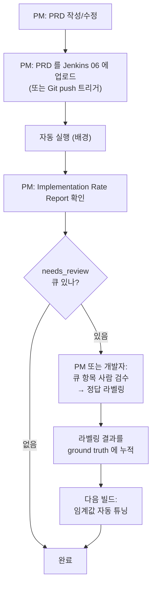
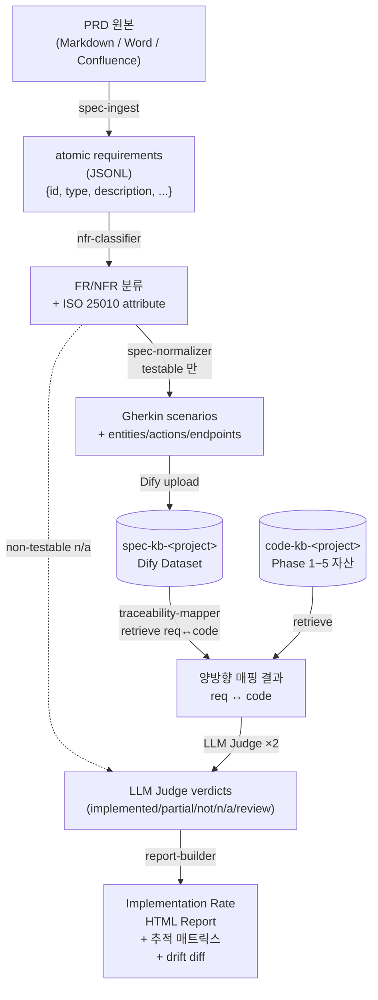

# Spec ↔ Code Traceability — 상세 설계

> **이 문서가 무엇인가**
> [PLAN_CODE_RAG_AND_SPEC_TRACEABILITY.md §10 Phase 7](PLAN_CODE_RAG_AND_SPEC_TRACEABILITY.md#phase-7--spec--code-traceability-최종-목표-46주) 의 상세 설계.
> 최종 목표 — *PRD 의 각 요구사항이 코드 어디에 구현돼 있는지* 자동 측정 — 을 어떻게 짓는지.
>
> 5 개 섹션 — **원리 → 구조 → 시스템 → 플로우 → 구현 계획**.

## 한 페이지 요약 (TL;DR)

- **무엇을** — PRD/기획서의 N 개 요구사항 중 *몇 개가 코드에 실제 구현됐는지* 자동 측정.
- **어떻게** — 요구사항을 atomic unit + Gherkin 으로 정규화 → 4 신호 (semantic / structural /
  behavioral / cross-validation) 로 코드와 매핑 → LLM-as-Judge 가 `implemented / partial / not /
  n/a` 판정 → Implementation Rate 리포트.
- **왜 작동하나** — 2026 SOTA 가 RAG-based TLR 로 recall 93%+ 보고. 핵심은 *Gherkin 을 intermediate
  representation* 으로 쓰는 Phoenix 패턴.
- **재활용** — Phase 1~5 의 retrieve-svc 인프라 그대로 사용. 신규 컴포넌트는 `spec-svc` 1 개.
- **기간** — 4~6 주. ground truth 확보 + 임계 튜닝 포함.

## 목차

1. [원리 — 어떻게 구현 여부를 판단하나](#1-원리--어떻게-구현-여부를-판단하나)
2. [구조와 솔루션 — 무엇이 필요한가](#2-구조와-솔루션--무엇이-필요한가)
3. [시스템 아키텍처](#3-시스템-아키텍처)
4. [User Flow / Data Flow](#4-user-flow--data-flow)
5. [상세 구현 계획](#5-상세-구현-계획)
6. [참고 문헌](#6-참고-문헌)

---

## 1. 원리 — 어떻게 구현 여부를 판단하나

> **TL;DR** — 한 가지 신호로는 못 잡는다. *4 가지 독립 신호* 의 합의로 판정한다.

### 1.1 핵심 통찰 — "구현됨" 의 4 가지 증거

요구사항이 *구현됨* 이라고 말하려면 4 가지 신호 중 **최소 2~3 가지** 가 양성이어야 한다.

| 신호 | 본질 | 어떻게 측정 |
|---|---|---|
| **S1. Semantic similarity** | 요구사항 텍스트와 코드의 *의미상 가까움* | retrieve-svc dense (Qdrant) 호출, top-k 후보 |
| **S2. Structural mapping** | 요구사항이 언급한 *엔티티·엔드포인트·도메인 객체* 가 코드에 존재 | retrieve-svc graph (FalkorDB) 호출, Cypher |
| **S3. Behavioral verification** | Gherkin given/when/then 시나리오에 *대응되는 테스트* 가 통과 | 코드의 test 청크 + (가능 시) 실행 결과 |
| **S4. Cross-validation** | LLM 이 두 다른 프롬프트로 *동일 결론* 에 도달 | LLM-as-Judge ×2 (PRD 정답지 있음 → 의미 큼) |

**왜 4 가지인가**:

- S1 만으론 *over-implementation* (요구사항에 없는 코드) 와 *false match* (다른 도메인 같은 단어) 못
  거른다.
- S2 만으론 *partial implementation* (엔티티는 있지만 동작 안 함) 못 거른다.
- S3 는 가장 강력하지만 *테스트 부족* 인 프로젝트에 적용 불가.
- S4 는 데이터 한정 환경에서 효과 작지만, *PRD 라는 정답지가 있으면* L3 와 달리 의미 있다 (메인
  PLAN §3 L3 의 LLM-as-Judge 이중화 재평가 참조).

### 1.2 매핑 방향 — 양방향이 필요하다

| 방향 | 답하는 질문 | 산출 |
|---|---|---|
| **req → code** (정방향) | "이 요구사항이 어디에 구현돼 있나?" | requirement ID 별 cited file:line |
| **code → req** (역방향) | "이 함수는 어떤 요구사항 때문에 존재하나?" | function ID 별 매핑된 req IDs |

**역방향이 왜 중요한가** — 두 가지를 잡는다:

1. **Over-implementation 탐지**: 어떤 요구사항에도 매핑 안 되는 코드 → "왜 있는지 검토 필요" 큐
2. **Coverage gap 탐지**: 어떤 코드에도 매핑 안 되는 요구사항 → `not_implemented` 후보

### 1.3 판정 분류 — 5-state

| 판정 | 정의 | 신호 패턴 |
|---|---|---|
| **`implemented`** | 명확히 구현됨 | S1+S2 강 합의 + LLM Judge ×2 일치 + 신뢰도 ≥ 0.85 |
| **`partial`** | 일부만 구현 / 의도는 보이나 불완전 | S1 강 + S2 약 또는 S3 일부만 통과 |
| **`not_implemented`** | 매칭 코드 없음 | 모든 신호 약함 + LLM Judge 합의 |
| **`n/a`** | 자동 판정 불가 (NFR / 모호) | nfr-classifier 가 non-testable 로 분류 |
| **`needs_review`** | 신호 충돌 / 신뢰도 부족 | LLM Judge 불일치 또는 신뢰도 < 0.85 |

> **임계 0.85 의 근거** — 2026 TLR 벤치마크에서 Claude 3.5 Sonnet Macro-F1 58.75% (가장 어려운
> 케이스), ProReFiCIA recall 93.3% (잘 정의된 데이터셋). 우리는 **합리적 confidence threshold +
> human-in-the-loop** 로 보정 — 자동 판정의 정확도가 70% 라도 사람 검수 큐가 잡으면 운영상 90%+ 가능.

### 1.4 NFR (Non-Functional Requirement) 의 분리

NFR 은 *행위* 가 아닌 *품질 속성* (성능 / 보안 / 가용성 / 확장성 ...) 이라 코드 매핑이 어렵다. 별도
처리:

1. **분류 단계**: nfr-classifier 가 ISO/IEC 25010:2023 quality attribute 8 종 (Functional Suitability
   / Performance Efficiency / Compatibility / Usability / Reliability / Security / Maintainability /
   Portability) 으로 자동 라벨링.
2. **변환 가능 여부 판단**: testable 조건 (예: "응답시간 200ms 이하" → 측정 가능) vs 모호 (예:
   "사용자 친화적이어야 함" → 측정 불가).
3. **변환 가능한 NFR**: Gherkin 으로 변환해 실행 환경 (load test / SAST / lint) 출력과 매핑 가능 →
   `implemented` 판정 가능.
4. **변환 불가능한 NFR**: `n/a` 로 분류 + 사람 검수 큐.

연구 근거: LLM 기반 NFR 자동 elicitation 에서 ISO/IEC 25010 분류 정확도 80%+ (2025).

### 1.5 Gherkin 을 중간 표현으로 — Phoenix 패턴 차용

요구사항을 그냥 자연어로 두면 *모호성·다의성* 이 누적된다. **Gherkin (Given/When/Then)** 으로
변환하면:

| Gherkin 부분 | 매핑 대상 |
|---|---|
| `Given <state>` | 코드의 setup / fixture / DB state |
| `When <action>` | 코드의 함수 호출 / API endpoint |
| `Then <outcome>` | 코드의 return value / state change / 테스트 assertion |

이 변환이 있으면 매핑이 *symbolic* 으로 가능해진다 — 자연어 ambiguity 를 1 회만 해소하면 됨.

> **참고** — Phoenix (2025 multi-agent) 가 vulnerability detection 에서 Gherkin 을 IR 로 써 **semantic
> ambiguity 해소** 효과 입증. 우리는 같은 패턴을 spec traceability 에 적용.

### 1.6 작동 한계 (정직)

| 한계 | 영향 | 대응 |
|---|---|---|
| **모호한 요구사항** ("빠르게 동작") | 자동 판정 불가 | nfr-classifier 가 `n/a` 로 분류 + 명시 |
| **분산된 구현** (1 req → N files) | retrieve top-k 가 일부만 잡음 | top_k 늘리거나 사람 검수 큐 |
| **암묵 요구사항** (PRD 에 없지만 당연한 것) | 코드에 있어도 매핑 못 함 | 역방향 매핑이 *over-implementation* 으로 분류 |
| **다른 언어 PRD ↔ 코드 주석** | 임베딩 정확도 ↓ | 다국어 임베딩 (Qwen3-Embedding) 사용 |
| **첫 측정 정확도** | 50~70% 일치 (2026 TLR 벤치 baseline) | ground truth 확보 → 임계 튜닝 → 70%+ 도달 |

---

## 2. 구조와 솔루션 — 무엇이 필요한가

> **TL;DR** — 6 개 신규 컴포넌트. Phase 1~5 의 `retrieve-svc` 와 L1~L3 인프라는 그대로 재사용.

### 2.1 컴포넌트 한눈에

```text
PRD (Markdown / Confluence export / Word→md)
    │
    ▼
[1] spec-ingest        — 청킹 + atomic requirement 추출
    │
    ▼
[2] nfr-classifier     — FR vs NFR 분류 + ISO 25010 attribute
    │
    ▼
[3] spec-normalizer    — Gherkin 변환 (testable 한 것만)
    │
    ▼  (적재)
[4] spec-kb-<project>  — Dify dataset (별도)
    │
    ▼
[5] traceability-mapper — req↔code bidirectional retrieve + LLM Judge
    │                     (retrieve-svc 재사용)
    │
    ▼
[6] report-builder     — Implementation Rate HTML
```

### 2.2 컴포넌트별 명세

#### [1] `spec-ingest` — PRD → atomic requirement

| 항목 | 내용 |
|---|---|
| **역할** | 다양한 PRD 포맷을 단일 표준 (atomic requirement list) 로 변환 |
| **입력** | Markdown / Confluence export / Word → md / PDF → md |
| **출력** | `requirements.jsonl` (각 줄 = 1 atomic req) |
| **구현** | LLM (gemma4:e4b) 보조 + 사람 검수 옵션 |

**Atomic requirement schema**:

```jsonc
{
  "id": "REQ-AUTH-003",
  "category": "authentication",
  "title": "사용자 비밀번호 변경",
  "description": "사용자는 자신의 비밀번호를 변경할 수 있어야 한다.",
  "type": "FR",          // FR | NFR
  "source": {            // 추적성
    "doc": "PRD-v2.3.md",
    "section": "3.2.1",
    "line": 145
  },
  "acceptance_criteria": [
    "현재 비밀번호 입력 후에만 변경 가능",
    "새 비밀번호는 8자 이상",
    "변경 후 모든 세션 무효화"
  ],
  "_raw": "...원본 텍스트..."
}
```

**INVEST 검증**: 각 atomic req 가 Independent / Negotiable / Valuable / Estimable / Small /
Testable 인지 LLM 이 자체 평가. 실패 시 *splitting* 제안 (아래 예).

```text
원본: "사용자가 회원가입하고 로그인하고 프로필을 편집할 수 있어야 한다"
↓ atomic 분해
REQ-001: 사용자 회원가입
REQ-002: 사용자 로그인
REQ-003: 사용자 프로필 편집
```

#### [2] `nfr-classifier` — FR/NFR 분류 + ISO 25010

| 항목 | 내용 |
|---|---|
| **역할** | FR(기능) vs NFR(비기능) 자동 분류 + NFR 은 ISO/IEC 25010:2023 attribute 라벨 |
| **입력** | atomic requirement 1 개 |
| **출력** | `{type: FR\|NFR, attribute: <ISO 25010>, testable: bool, reason: ...}` |

**ISO/IEC 25010:2023 8 attribute** (NFR 인 경우 1 개 라벨):

| Attribute | 예시 NFR |
|---|---|
| Functional Suitability | (드물게) "결제 정확도 100%" |
| **Performance Efficiency** | "응답시간 200ms 이하" |
| Compatibility | "Chrome / Safari / Edge 지원" |
| Usability | "신규 사용자 5분 내 작업 완료" |
| **Reliability** | "가용성 99.9%" |
| **Security** | "비밀번호 bcrypt 12 round" |
| Maintainability | "코드 커버리지 80%" |
| Portability | "Linux / Windows 동작" |

**Testable 판단**:
- *Testable*: "응답시간 200ms 이하" → 측정 가능, Gherkin 변환 가능
- *Non-testable*: "사용자 친화적이어야 함" → 주관적, `n/a` 분류

#### [3] `spec-normalizer` — Gherkin 변환

| 항목 | 내용 |
|---|---|
| **역할** | testable requirement 를 Gherkin Given/When/Then 으로 변환 |
| **입력** | atomic requirement (FR 또는 testable NFR) |
| **출력** | Gherkin scenario 1 개 + intermediate metadata |

**예시 변환**:

```gherkin
# REQ-AUTH-003 (사용자 비밀번호 변경)
Feature: 비밀번호 변경
  Scenario: 정상 변경
    Given 사용자가 로그인 상태이다
    And 현재 비밀번호 "OldPass123!" 를 안다
    When 사용자가 새 비밀번호 "NewPass456!" 로 변경 요청
    Then 비밀번호가 변경되었다는 응답을 받는다
    And 모든 기존 세션이 무효화된다
    And 다음 로그인 시 새 비밀번호로만 가능하다
```

**Intermediate metadata** (LLM 매핑 시 hint):
```json
{
  "entities": ["User", "Password", "Session"],
  "actions": ["change_password", "invalidate_session"],
  "endpoints_hint": ["POST /api/users/password", "/auth/logout-all"],
  "test_keywords": ["change_password", "session_invalidation"]
}
```

#### [4] `spec-kb-<project>` — Dify Dataset (별도)

| 항목 | 내용 |
|---|---|
| **역할** | Gherkin 정규화된 requirement 의 임베딩·검색 인덱스 |
| **저장소** | Dify Dataset (Qdrant 백엔드) |
| **명명** | `spec-kb-<customer>-<project>` (SI 격리 정책 준수) |

각 청크 = 1 requirement (description + Gherkin + metadata). 002 사전학습이 만든 `code-kb-<...>` 와
**별도 dataset**.

#### [5] `traceability-mapper` — 양방향 매핑 + LLM Judge

| 항목 | 내용 |
|---|---|
| **역할** | req ↔ code 양방향 매핑 + 4 신호 종합 + LLM Judge |
| **재사용** | Phase 1~5 의 `retrieve-svc` (hybrid retrieve) + Ollama (LLM) 그대로 |

**처리 단계**:

```python
def trace_one_requirement(req: Requirement) -> Verdict:
    # 1. req → code (top-k 후보)
    code_candidates = retrieve_svc.search(
        query=req.gherkin_text + " " + " ".join(req.entities + req.actions),
        kb="code-kb-<project>",
        top_k=10,
    )

    # 2. 4 신호 산출
    s1_semantic = avg(c.score for c in code_candidates)              # dense score
    s2_structural = match_entities(req.entities, code_candidates)    # graph
    s3_behavioral = check_test_coverage(req.gherkin, code_candidates) # tests
    # s4_cross_validation 은 아래 LLM Judge 합의로

    # 3. LLM-as-Judge ×2 (다른 prompt)
    verdict_a = llm.judge(req, code_candidates, prompt=PROMPT_VARIANT_A)
    verdict_b = llm.judge(req, code_candidates, prompt=PROMPT_VARIANT_B)
    s4_cross = (verdict_a.label == verdict_b.label)

    # 4. 4 신호 종합 → 최종 판정
    confidence = weighted_score(s1, s2, s3, s4_cross)
    if not s4_cross or confidence < 0.85:
        return Verdict(label="needs_review", ...)

    return Verdict(
        label=verdict_a.label,
        confidence=confidence,
        cited_symbols=verdict_a.cited,
        signals={s1, s2, s3, s4_cross},
    )
```

**역방향 매핑** (별도 batch):

```python
def trace_one_code(code_chunk: CodeChunk) -> list[ReqMatch]:
    req_candidates = retrieve_svc.search(
        query=code_chunk.summary + " " + code_chunk.symbol,
        kb="spec-kb-<project>",
        top_k=3,
    )
    # 매핑 score 0.5 미만은 drop (over-implementation 후보)
    return [r for r in req_candidates if r.score >= 0.5]
```

#### [6] `report-builder` — Implementation Rate 리포트

**산출물 1 — 요약**:

```text
Implementation Rate Report — PRD-v2.3 vs main@a1b2c3
─ 측정일시: 2026-05-15 14:32
─ 전체 요구사항: 47

  ┌─────────────────────────────────────────────┐
  │ implemented      │ 28 ████████████████ 60%  │
  │ partial          │  7 ████          15%     │
  │ not_implemented  │  6 ███           13%     │
  │ n/a              │  4 ██             8%     │
  │ needs_review     │  2 █              4%     │
  └─────────────────────────────────────────────┘

─ Category 분포 (FR only):
  ├─ auth          : 8/10  (80%)  ✅
  ├─ payment       : 6/12  (50%)  ⚠️ 가장 낮음
  ├─ ops           : 9/10  (90%)  ✅
  └─ user          : 5/7   (71%)

─ Over-implementation 후보 (코드는 있는데 PRD 매핑 없음):
  ├─ src/legacy/auditor.py::collect_metrics  (검토 필요)
  └─ src/utils/cleanup_orphans.py            (검토 필요)
```

**산출물 2 — 추적 매트릭스**:

```text
| REQ-AUTH-003 | implemented | 0.91 | src/auth/handler.py:45 ┐
                                       src/auth/session.py:88 ┘
| REQ-PAY-007  | partial     | 0.72 | src/payment/processor.py:120
                                       (3-DS 미구현)
| REQ-PAY-008  | needs_review| 0.62 | (2 후보, judge 불일치)
| REQ-OPS-002  | n/a         | —    | NFR (가용성 99.9%) — 측정 불가
| ...
```

**산출물 3 — drift diff** (이전 빌드 대비):

```text
Δ vs 빌드 #142
  ✅ REQ-AUTH-005: not_implemented → implemented   (신규 구현)
  ⚠️ REQ-PAY-009: implemented     → partial         (회귀 의심)
  + 신규 over-implementation: src/legacy/cleanup.py
```

### 2.3 솔루션 매트릭스

| 컴포넌트 | 신규/재사용 | 기술 스택 | 라이선스 |
|---|---|---|---|
| spec-ingest | 신규 | Python + Ollama (gemma4:e4b) | — |
| nfr-classifier | 신규 | Python + Ollama | — |
| spec-normalizer | 신규 | Python + Ollama | — |
| spec-kb | 재사용 | Dify Dataset (Qdrant) | — |
| traceability-mapper | 신규 + 재사용 | Python + retrieve-svc + Ollama | — |
| report-builder | 신규 | Python + Jinja2 (HTML) | — |

신규 코드 ~1,500 LOC 예상, 모두 Python.

---

## 3. 시스템 아키텍처

> **TL;DR** — 별도 Jenkins Job (`06-구현률-측정`) + ttc-allinone 단일 이미지 안에 **신규 supervisor
> program `spec-svc` 1 개**. 별도 컨테이너 0. 기존 02/03/04 영향 0.

### 3.1 운영 모델 — 단일 이미지 통합 (절대 보존)

본 시스템은 **단일 이미지 `ttc-allinone:<tag>`** + supervisor 프로세스 + `docker save` → `.tar.gz`
→ 폐쇄망 `offline-load.sh` 패턴이 운영의 근간이다 (메인 PLAN §6.8 참조). **`spec-svc` 도 별도
컨테이너가 아니라 ttc-allinone 안의 supervisor program** 으로 통합한다.

| 통합 방식 | 적용 대상 |
|---|---|
| Dockerfile 의 `COPY spec-svc /opt/spec-svc` + `pip install -r requirements.txt` | spec-svc 코드 |
| supervisord.conf 의 `[program:spec-svc]` (priority 500, port 9001 컨테이너 내부 전용) | spec-svc 기동 |

### 3.2 컴포넌트 배치

```mermaid
flowchart TB
    subgraph TTC["ttc-allinone 단일 이미지 (15 → 16 supervisor 프로세스)"]
        subgraph Existing["기존 (Phase 1~5)"]
            Dify[Dify]
            Qdrant[Qdrant]
            Meili[Meilisearch]
            Falkor[FalkorDB]
            Retrieve["retrieve-svc :9000<br/>(rerank 내장:<br/>sentence-transformers<br/>+ bge-reranker-v2-m3)"]
            Jenkins[Jenkins]
        end

        subgraph New["신규 (Phase 7)"]
            SpecSvc["spec-svc :9001<br/>━━━━━━━━━━━━━━━━<br/>· spec-ingest<br/>· nfr-classifier<br/>· spec-normalizer<br/>· traceability-mapper<br/>· report-builder"]
        end

        SpecKB[(spec-kb-&lt;project&gt;<br/>Dify Dataset = Qdrant)]
    end

    Host["Ollama (host)<br/>gemma4:e4b + qwen3-embedding:0.6b"]
    PRD["PRD<br/>(Markdown / Confluence)"]
    Job06["06-구현률-측정 Job"]
    Report["Implementation<br/>Rate Report"]

    PRD -->|업로드| Job06
    Job06 -->|trigger| SpecSvc
    SpecSvc -.127.0.0.1:9000.-> Retrieve
    SpecSvc -.127.0.0.1:5001.-> Dify
    SpecSvc -.host.docker.internal:11434.-> Host
    Retrieve --> Qdrant
    Retrieve --> Meili
    Retrieve --> Falkor
    SpecSvc --> SpecKB
    Job06 --> Report
    Jenkins -.- Job06
```

### 3.3 메모리 영향 (단일 이미지 안)

| 컴포넌트 | 추가 메모리 | 비고 |
|---|---|---|
| `spec-svc` supervisor program | ~0.5 GB | FastAPI + LLM client (이미지 안) |
| `spec-kb-<project>` Dataset | Qdrant 내 추가 (벡터만) | 100 reqs ≈ 1 MB |
| LLM 호출 | (host Ollama 기존 활용) | 동시 실행 시 04 와 swap — 야간 batch 권장 |

이미지 크기 영향: spec-svc Python 의존성 약 50 MB 추가. 무시할 수준.

> **운영 정책**: 인터랙티브 04 분석과 야간 배치 06 은 **시간대 분리**. 06 은 cron `0 2 * * *` (새벽
> 2 시) 같은 식으로 분리 실행. host Ollama 는 단일 머신 자원이라 시간대 분리 필수.

### 3.3 Jenkins Job 구조 (`06-구현률-측정`)

```groovy
pipeline {
    agent any

    parameters {
        string(name: 'PRD_PATH', defaultValue: 'data/prd/PRD-latest.md')
        string(name: 'PROJECT_ID', defaultValue: 'realworld')
        string(name: 'COMMIT_SHA', defaultValue: '')
        choice(name: 'MODE', choices: ['full', 'incremental', 'drift_check'])
    }

    stages {
        stage('1. Spec Ingestion') {
            // PRD → atomic requirements
            // → spec-svc /ingest
        }
        stage('2. NFR Classification & Gherkin') {
            // → spec-svc /classify-and-normalize
        }
        stage('3. Spec KB 적재') {
            // → spec-svc /index (Dify Dataset)
        }
        stage('4. Traceability Mapping') {
            // → spec-svc /trace-all (LLM Judge ×2 per req)
        }
        stage('5. Reverse Mapping (over-impl 탐지)') {
            // → spec-svc /reverse-trace
        }
        stage('6. Report Build') {
            // → spec-svc /report
        }
    }

    post {
        always {
            publishHTML(target: [reportName: 'Implementation Rate Report', ...])
            archiveArtifacts artifacts: 'reports/impl-rate/**'
        }
    }
}
```

### 3.4 데이터 격리 (SI 정책)

- spec-kb dataset 명명: `spec-kb-<customer>-<project>` — 02 의 code-kb 와 **동일 격리 규칙** 적용.
- 06 시작 시 다른 customer 의 spec-kb 가 같은 Dify 인스턴스에 존재하면 **purge 의무**.
- 로그 마스킹: customer 식별자는 hash 처리.

---

## 4. User Flow / Data Flow

> **TL;DR** — User (PM) 는 PRD 업로드 → 검수 큐 처리 2 가지만 한다. 데이터는 PRD 에서 시작해
> 5 단계 변환 후 리포트로 도착.

### 4.1 User Flow



**PM 의 작업 시간**:

| 단계 | 시간 |
|---|---|
| PRD 업로드 | ~1 분 |
| 자동 실행 대기 | ~30~90 분 (100 req 기준) |
| 리포트 확인 + drift 검토 | ~10 분 |
| needs_review 큐 검수 (있을 때) | 항목당 ~2~5 분 |

### 4.2 Data Flow



### 4.3 입력 → 출력 매핑 1 사이클

| 단계 | 입력 | 출력 | 시간 (100 req) |
|---|---|---|---|
| 1. Spec ingestion | PRD.md (~30KB) | requirements.jsonl (100 lines) | ~5 분 (LLM) |
| 2. NFR 분류 | requirements.jsonl | classified.jsonl | ~3 분 |
| 3. Gherkin 변환 | classified.jsonl (testable 만) | gherkin.jsonl | ~10 분 |
| 4. Spec KB 적재 | gherkin.jsonl | Dify dataset 100 chunks | ~2 분 |
| 5. 매핑 + Judge ×2 | each req | verdicts.jsonl | ~30~50 분 (e4b) |
| 6. 역매핑 | code chunks | reverse-trace.jsonl | ~10 분 |
| 7. Report build | verdicts + reverse-trace | report.html | ~1 분 |
| **합계** | | | **~60~90 분** |

(M4 Pro 의 26b 옵션 사용 시 5 단계가 ~90~120 분으로 증가)

---

## 5. 상세 구현 계획

> **TL;DR** — 4~6 주, 7 sprint 로 분해. 기존 retrieve-svc 재사용으로 신규 개발은 `spec-svc` 1 개와
> Jenkins Job 1 개에 집중.

### 5.1 디렉터리 구조

```text
code-AI-quality-allinone/
├── spec-svc/                          # 신규 (Phase 7)
│   ├── Dockerfile
│   ├── requirements.txt
│   ├── app/
│   │   ├── main.py                    # FastAPI app
│   │   ├── config.py
│   │   ├── ingest/
│   │   │   ├── parsers.py             # md/word/confluence → text
│   │   │   ├── splitter.py            # text → atomic requirements
│   │   │   └── invest_check.py        # INVEST 검증
│   │   ├── classify/
│   │   │   ├── fr_nfr.py              # FR vs NFR 분류
│   │   │   └── iso25010.py            # ISO 25010 attribute 라벨
│   │   ├── normalize/
│   │   │   ├── gherkin.py             # natural lang → Gherkin
│   │   │   └── metadata.py            # entities/actions 추출
│   │   ├── trace/
│   │   │   ├── forward.py             # req → code
│   │   │   ├── reverse.py             # code → req
│   │   │   ├── signals.py             # S1~S4 산출
│   │   │   └── judge.py               # LLM-as-Judge ×2
│   │   ├── report/
│   │   │   ├── builder.py             # data → context
│   │   │   ├── templates/
│   │   │   │   ├── report.html.j2
│   │   │   │   └── matrix.html.j2
│   │   │   └── drift.py               # 이전 빌드 대비 diff
│   │   └── schema.py                  # pydantic models
│   └── tests/
│       ├── test_ingest.py
│       ├── test_classify.py
│       ├── test_gherkin.py
│       ├── test_signals.py
│       ├── test_judge.py
│       ├── test_reverse.py
│       └── fixtures/
│           ├── sample_prd.md
│           ├── golden_atomic.jsonl
│           └── ground_truth_mapping.jsonl
├── jenkinsfiles/
│   └── 06 구현률 측정.jenkinsPipeline   # 신규
├── docs/
│   ├── PLAN_CODE_RAG_AND_SPEC_TRACEABILITY.md   # 메인 PLAN (기존)
│   └── SPEC_TRACEABILITY_DESIGN.md              # 본 문서
└── data/
    ├── prd/                           # 입력 PRD
    └── ground_truth/                  # 정답 라벨링
```

### 5.2 모듈별 LOC 견적 + 책임

| 모듈 | LOC | 핵심 책임 |
|---|---|---|
| `ingest/parsers.py` | 80 | 4 포맷 → 통일 text |
| `ingest/splitter.py` | 150 | LLM 으로 atomic 분해 |
| `ingest/invest_check.py` | 100 | INVEST 6 기준 자체 검증 |
| `classify/fr_nfr.py` | 120 | FR vs NFR 이진 분류 |
| `classify/iso25010.py` | 100 | NFR → 8 attribute 라벨 |
| `normalize/gherkin.py` | 150 | LLM 으로 Given/When/Then |
| `normalize/metadata.py` | 80 | entities / actions / endpoints 추출 |
| `trace/forward.py` | 200 | req → code 매핑 + 신호 종합 |
| `trace/reverse.py` | 120 | code → req 역매핑 |
| `trace/signals.py` | 180 | S1~S4 산출 + weighted_score |
| `trace/judge.py` | 200 | LLM-as-Judge ×2 + 합의 |
| `report/builder.py` | 150 | 데이터 → Jinja2 context |
| `report/drift.py` | 100 | 이전 빌드 diff |
| `report/templates/*.j2` | (HTML) | PM 친화 리포트 |
| `main.py` (FastAPI) | 150 | 6 endpoint |
| `schema.py` | 80 | pydantic 모델 |
| **합계** | **~1,960 LOC** | |
| 테스트 | ~1,000 LOC | 단위 + 통합 |

### 5.3 Sprint 분해 (4~6 주)

#### Sprint 1 — Spec Ingestion (1 주)

- [ ] `parsers.py` — Markdown / Confluence export / Word→md
- [ ] `splitter.py` — LLM atomic 분해 + INVEST 검증
- [ ] FastAPI `/ingest` endpoint
- [ ] **테스트**: 작은 PRD (10 req) 로 수동 검수
- **산출물**: `requirements.jsonl` 자동 생성 검증

#### Sprint 2 — Classification & Normalization (1 주)

- [ ] `fr_nfr.py` + `iso25010.py`
- [ ] `gherkin.py` + `metadata.py`
- [ ] FastAPI `/classify`, `/normalize` endpoint
- [ ] **테스트**: 10 req 의 분류·Gherkin 변환 수동 검수

#### Sprint 3 — Spec KB 적재 + Forward Mapping (1 주)

- [ ] Dify dataset 생성 + Gherkin 청크 적재 (`code-kb` 패턴 차용)
- [ ] `trace/forward.py` + `signals.py`
- [ ] `trace/judge.py` (LLM-as-Judge ×2)
- [ ] FastAPI `/trace-all` endpoint
- [ ] **테스트**: ground truth 10 req 로 정확도 측정

#### Sprint 4 — Reverse Mapping + Report (1 주)

- [ ] `trace/reverse.py` (over-implementation 탐지)
- [ ] `report/builder.py` + Jinja2 템플릿
- [ ] `report/drift.py` (이전 빌드 diff)
- [ ] FastAPI `/reverse-trace`, `/report` endpoint
- [ ] **테스트**: 전체 e2e

#### Sprint 5 — Jenkins Job + 통합 (3~5일)

- [ ] `06 구현률 측정.jenkinsPipeline` 작성
- [ ] publishHTML + archiveArtifacts
- [ ] retrieve-svc 와 e2e 통합 테스트
- [ ] **산출물**: 작은 사내 프로젝트 1 개로 e2e 1 회 성공

#### Sprint 6 — Ground Truth 확보 + 정확도 측정 (1~2 주)

- [ ] 작은 사내 프로젝트 (10~20 req) 수동 매핑 — 정답지
- [ ] 자동 결과 vs 정답 비교 → precision / recall / F1
- [ ] 임계값 (confidence threshold) 튜닝
- [ ] needs_review 비율 vs 자동 판정 정확도 trade-off 결정
- **목표**: 사람 검수 일치율 70%+

### 5.4 단위 테스트 전략

| 모듈 | 테스트 입력 | 검증 |
|---|---|---|
| `splitter` | 알려진 PRD 10 개 | 분해 개수가 ground truth ±20% 내 |
| `fr_nfr` | NFR/FR 라벨링된 100 sample | 분류 정확도 ≥ 85% |
| `iso25010` | NFR 50 sample | attribute 정확도 ≥ 80% |
| `gherkin` | testable FR 30 sample | given/when/then 형식 + LLM 자체 평가 |
| `forward` | (req, code) 정답 매핑 50 쌍 | top-3 안에 정답 포함 ≥ 80% |
| `reverse` | 모든 code chunk | over-impl 후보가 사람 검수에서 70% 동의 |
| `judge` | 알려진 verdict 30 케이스 | 자동 판정 일치율 ≥ 75% |
| `drift` | 동일 PRD 빌드 ×2 | 변화 0 (idempotent 검증) |

### 5.5 Ground Truth 확보 전략

1. **1 차 (Sprint 6 초)**: 가장 작은 사내 프로젝트 1 개 (10~20 req) 선정. PM 1 명 + 개발자 1 명이
   페어로 (req → file:line) 매핑 손으로 작성. 1~2 일 작업.
2. **2 차 (Sprint 6 중)**: 자동 결과 vs 정답 diff 분석. 어떤 패턴이 틀리는지 분류
   (semantic-only-fail / structural-only-fail / NFR 처리 / multi-file 등).
3. **3 차 (Sprint 6 말)**: 임계값 튜닝 + 룰 추가. 70%+ 도달 후 더 큰 프로젝트 (50~100 req) 로 검증.
4. **운영 후**: needs_review 큐 의 사람 라벨링이 자동으로 ground truth 누적. 분기마다 재튜닝.

### 5.6 위험 요소와 대응

| 위험 | 가능성 | 대응 |
|---|---|---|
| PRD 포맷 다양성 | 높음 | Sprint 1 에서 4 포맷 모두 검증 |
| atomic 분해 정확도 부족 | 중간 | INVEST 자체 평가 + 사람 1 차 검수 옵션 |
| LLM Judge 정확도 부족 (e4b 한계) | 중간 | Ground truth 70% 미달 시 26b 옵션 활성화 (M4 Pro 야간) |
| Ground truth 확보 지연 | 높음 | Sprint 6 를 1 주 → 2 주로 여유 |
| spec-svc 메모리 누수 | 낮음 | FastAPI lifespan + memory profile |
| 04 인터랙티브와 LLM 충돌 | 중간 | 06 을 cron `0 2 * * *` 야간 분리 |

### 5.7 운영 정착 후 모니터링

| 메트릭 | 임계 | 액션 |
|---|---|---|
| 사람 검수 일치율 | < 70% | 임계값 재튜닝 |
| `n/a` 비율 | > 30% | PRD 작성 가이드 강화 (NFR 명확화) |
| `needs_review` 비율 | > 25% | LLM 모델 업그레이드 검토 (26b 활성화) |
| Over-implementation 후보 수 | 증가 추세 | 코드 리뷰 / 정리 작업 트리거 |
| Drift 빈도 | (정보) | PM 빌드 회의 자료 |

### 5.8 Phase 7 완료 기준 (Definition of Done)

- [ ] spec-svc 6 endpoint 모두 정상 동작
- [ ] Jenkins 06 Job 이 PRD 입력 → HTML 리포트 출력 e2e 성공
- [ ] 1 개 이상의 실제 사내 프로젝트로 ground truth 측정 완료
- [ ] 사람 검수 일치율 70%+ 달성 (또는 미달 시 원인 분석 + 후속 계획)
- [ ] needs_review 큐 라벨링 → ground truth 누적 운영 절차 문서화
- [ ] drift 감지 1 회 이상 검증 (코드 변경 후 재실행)

---

## 6. 참고 문헌

### Atomic Requirements / INVEST
- [Atomic User Stories — ISPI](https://www.ispi-llc.com/blog/2018/5/8/atomic-user-stories)
- [INVEST Criteria For User Stories In SAFe (2026)](https://www.leanwisdom.com/blog/crafting-high-quality-user-stories-with-the-invest-criteria-in-safe/)
- [Establishing Metrics for Atomic Requirements (ACM SIGSOFT)](https://dl.acm.org/doi/10.1145/3672089.3672096)
- [Atomic Requirements 101 (QRA)](https://qracorp.com/atomic-requirements-101-a-comprehensive-guide-with-examples/)

### Code↔Spec Mapping / Reverse
- [ClarifyGPT (ACM 2024) — code consistency for ambiguity detection](https://dl.acm.org/doi/10.1145/3660810)
- [CodableLLM — decompiled-to-source mapping (arXiv:2507.22066)](https://arxiv.org/html/2507.22066)
- [Phoenix multi-agent — Behavioral Contract Synthesis with Gherkin IR](https://blog.talosintelligence.com/using-llm-as-a-reverse-engineering-sidekick/) (참조: 같은 패턴)

### NFR Automation
- [Automated NFR Generation with LLMs (arXiv:2503.15248)](https://arxiv.org/abs/2503.15248)
- [ISO/IEC 25010:2023 quality model](https://www.iso.org/standard/78176.html)
- [Deep learning for NFR classification (Nature 2024)](https://www.nature.com/articles/s41598-024-52802-0)

### Traceability Link Recovery (TLR)
- [TraceLLM (2026 Feb) — Trace Link Generation/Completion/Expansion](https://www.emergentmind.com/topics/tracellm)
- [Requirements Traceability Link Recovery via RAG (KIT 2025)](https://publikationen.bibliothek.kit.edu/1000178589/156854596)
- [TVR — Automotive Traceability via RAG (arXiv:2504.15427)](https://arxiv.org/html/2504.15427)
- [NL-PL Traceability Beyond Textual Similarity (arXiv:2509.05585)](https://arxiv.org/html/2509.05585)
- [Synergistic enhancement of req-to-code TLR (ScienceDirect 2026)](https://www.sciencedirect.com/science/article/abs/pii/S0950584926000340)
- [Requirements-to-Code TLR overview (Emergent Mind)](https://www.emergentmind.com/topics/requirements-to-code-traceability-link-recovery-tlr)

### CoverUp 패턴 (LLM coverage-guided)
- [CoverUp: Coverage-Guided LLM Test Generation (arXiv:2403.16218)](https://arxiv.org/html/2403.16218v3)

---

## 변경 이력

### 2026-04-27 (저녁) — 문서 신설

**컨텍스트**: Phase 7 (Spec ↔ Code Traceability) 의 상세 설계. 메인 PLAN 의 §10 Phase 7 은 *작업
순서* 만 다루고, 본 문서는 *원리·구조·구현* 을 다룬다.

**작성**: 협업 세션 (Kyungsuk Lee · Claude Opus 4.7).

**다음 행동**:
- Sprint 1 (Spec Ingestion) 시작 시점 협의.
- 1 차 ground truth 확보용 사내 프로젝트 1 개 선정.
- 메인 PLAN 의 §10 Phase 7 에서 본 문서 reference 링크 추가.
